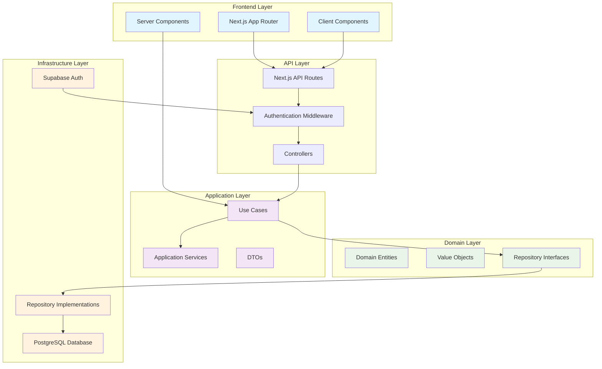
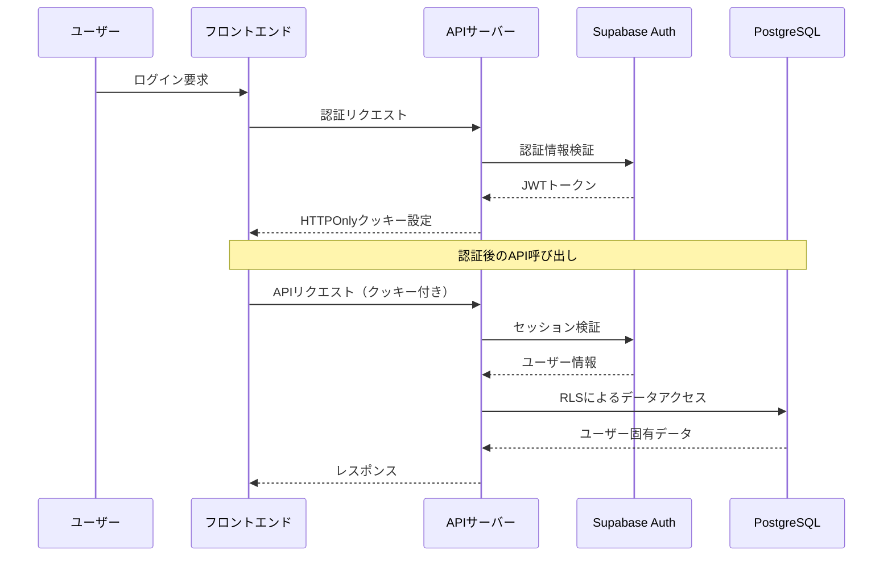
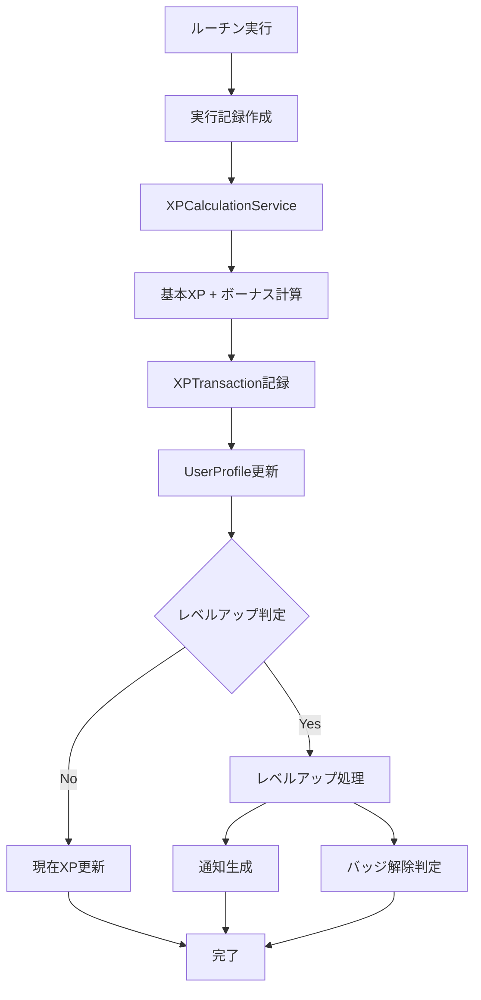
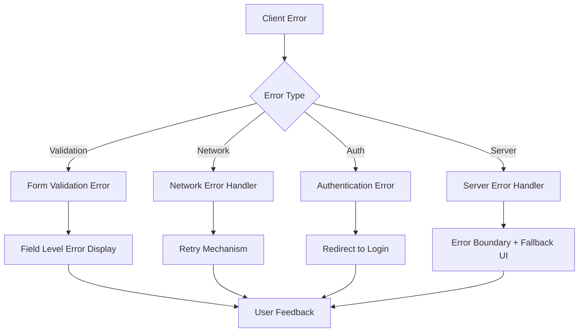

# Routine Record アーキテクチャ設計

## システム概要

**システム名**: Routine Record  
**目的**: ユーザーが日常的なルーティンを管理・追跡し、継続的な習慣形成を支援する包括的なゲーミフィケーション型習慣管理プラットフォーム  
**設計日時**: 2025年8月29日  
**設計根拠**: 要件定義書に基づく技術設計

## アーキテクチャパターン

**パターン**: Clean Architecture + Domain Driven Design (DDD)  
**理由**: 
- ビジネスロジックとインフラストラクチャの分離により、保守性と拡張性を確保
- 複雑なゲーミフィケーション機能の管理が容易
- テスタビリティの向上
- 将来的なマイクロサービス化への対応

## システム全体構成



## コンポーネント構成

### フロントエンド

**フレームワーク**: Next.js 15.4.5 (App Router)  
**状態管理**: 
- React Context API (AuthContext, ThemeContext, SnackbarContext)
- Server State: 直接データフェッチングによる最新状態管理  
**理由**: 
- Server Components による初期データの効率的な取得
- Client Components による動的なユーザーインタラクション
- Context API による軽量な状態管理

**主要コンポーネント**:
- 認証関連: SignIn, SignUp画面
- ダッシュボード: メインの習慣管理画面
- ルーチン管理: CRUD機能
- ゲーミフィケーション: レベル、バッジ、ミッション表示
- 統計・分析: カレンダー、進捗グラフ

### バックエンド

**フレームワーク**: Next.js API Routes  
**認証方式**: Supabase Auth (JWT + Session管理)  
**理由**:
- フルスタック開発による開発効率の向上
- Supabaseによるセキュアな認証システム
- Row Level Security (RLS) による自動的なデータ分離

**アーキテクチャレイヤー**:
- **Presentation Layer**: API Routes, Controllers
- **Application Layer**: Use Cases, Application Services  
- **Domain Layer**: Business Logic, Entities
- **Infrastructure Layer**: Database Access, External Services

### データベース

**DBMS**: PostgreSQL (Supabase)  
**キャッシュ**: 未実装（将来拡張: Redis）  
**理由**:
- ACID特性による強い整合性
- 複雑なリレーションと集計処理への対応
- Row Level Security (RLS) の標準サポート

## 技術スタック詳細

### フロントエンド技術

| 技術 | バージョン | 用途 |
|------|------------|------|
| Next.js | 15.4.5 | メインフレームワーク |
| React | 18.x | UIライブラリ |
| TypeScript | 5.x | 型安全性 |
| Tailwind CSS | 4.x | スタイリング |
| Radix UI | - | UIコンポーネント |
| Zod | - | スキーマバリデーション |

### バックエンド技術

| 技術 | バージョン | 用途 |
|------|------------|------|
| Next.js API Routes | 15.4.5 | RESTful API |
| Drizzle ORM | - | データベースORM |
| class-validator | - | 入力検証 |
| Inversify | - | 依存性注入 |

### インフラストラクチャ

| 技術 | 用途 |
|------|------|
| Supabase | データベース、認証 |
| Vercel | ホスティング |
| PostgreSQL | メインデータベース |

## セキュリティ設計

### 認証・認可



### データ保護

**Row Level Security (RLS)**:
- 全テーブルでユーザーID による自動フィルタリング
- SQLインジェクション対策をORMレベルで実装
- 認証されていないユーザーのデータアクセスを完全ブロック

**入力検証**:
- フロントエンド: Zod スキーマ
- バックエンド: class-validator
- データベース: 制約とトリガー

## パフォーマンス設計

### フロントエンド最適化

**Server Components 活用**:
- 初期データの事前取得
- JavaScriptバンドルサイズの削減
- SEO対応

**Client Components**:
- 動的なユーザーインタラクション
- 状態管理による即座なUI更新

### データベース最適化

**インデックス戦略**:
```sql
-- 頻繁なクエリパターンに対応
CREATE INDEX idx_routines_user_active ON routines(user_id, is_active);
CREATE INDEX idx_execution_records_user_date ON execution_records(user_id, executed_at);
CREATE INDEX idx_user_missions_progress ON user_missions(user_id, is_completed);
```

**クエリ最適化**:
- JOIN クエリの最小化
- 集計クエリの効率化
- ページネーション実装（将来）

## ゲーミフィケーション設計

### XP・レベリングシステム



### ミッション・チャレンジシステム

**ミッション進捗更新フロー**:
1. ルーチン実行時に自動的にミッション進捗を更新
2. 達成条件チェック（ストリーク、回数、バラエティ、一貫性）
3. 完了時にXP報酬とバッジ付与
4. 新しいミッションの自動割り当て

## エラーハンドリング設計

### 階層別エラーハンドリング



### エラー種別と対応

| エラー種別 | HTTPステータス | 対応方法 |
|------------|---------------|----------|
| 入力検証エラー | 400 | フィールド別エラー表示 |
| 認証エラー | 401 | ログイン画面へリダイレクト |
| 認可エラー | 403 | アクセス拒否メッセージ |
| リソース未発見 | 404 | 404ページ表示 |
| サーバーエラー | 500 | エラー境界による回復 |

## 拡張性設計

### 水平スケーリング

**現在のアーキテクチャ制約**:
- モノリス構成（単一Next.jsアプリ）
- 状態管理: React Context API
- データベース: 単一PostgreSQLインスタンス

**スケーリング戦略**:
1. **短期**: Supabaseによる自動スケーリング
2. **中期**: API層の分離とマイクロサービス化
3. **長期**: データベースシャーディング

### 機能拡張ポイント

**ゲーミフィケーション強化**:
- リアルタイム対戦機能
- ソーシャル要素の拡大
- AI による個人最適化

**分析機能強化**:
- 高度な統計分析
- 機械学習による推奨システム
- 外部サービス連携

## 運用・監視設計

### ログ・監視

**現在実装済み**:
- 基本的なエラーログ
- Supabase 組み込み監視

**推奨追加実装**:
```typescript
// 構造化ログ例
logger.info({
  event: 'routine_completed',
  userId: 'user-123',
  routineId: 'routine-456',
  xpGained: 25,
  timestamp: new Date().toISOString()
});
```

### バックアップ・災害復旧

**データベース**:
- Supabase 自動バックアップ（日次）
- Point-in-time recovery 対応

**アプリケーション**:
- Vercel による自動デプロイ
- Git による完全なソース管理

## 品質保証設計

### テスト戦略

**3層テスト構成**:
1. **Unit Tests**: ビジネスロジック（Domain Layer）
2. **Integration Tests**: API エンドポイント
3. **E2E Tests**: ユーザージャーニー

**テストピラミッド**:
```
    E2E Tests (少数)
   ─────────────────
  Integration Tests (中程度)
 ─────────────────────────────
Unit Tests (多数)
```

### コード品質

**静的解析**:
- TypeScript strict mode
- ESLint + Prettier
- 型カバレッジ 95%以上

## 設計原則とベストプラクティス

### SOLID原則の適用

1. **単一責任の原則**: 各Use Caseは単一の責任
2. **開放閉鎖の原則**: インターフェースによる拡張可能設計
3. **リスコフの置換原則**: Repository パターンによる実装交換可能性
4. **インターフェース分離の原則**: 小さなインターフェースの組み合わせ
5. **依存性逆転の原則**: DIコンテナによる依存性注入

### Clean Architecture の利点

**テスタビリティ**: 
- ビジネスロジックの独立性
- モックによる効率的テスト

**保守性**:
- レイヤー間の疎結合
- 変更影響の局所化

**拡張性**:
- 新機能追加の容易性
- インフラストラクチャの変更対応

---

## 総評

この設計は、要件定義書に基づいて企業レベルの習慣管理プラットフォームとして必要な要素を包括的にカバーしています。Clean Architecture + DDDの採用により、複雑なゲーミフィケーション機能を管理しやすい形で実装し、将来の拡張に備えた堅牢なアーキテクチャを実現しています。

**強み**:
- 型安全性を重視した開発体験
- セキュリティ・バイ・デザイン
- スケーラブルなアーキテクチャ
- 包括的なゲーミフィケーション設計

**今後の課題**:
- キャッシュ戦略の実装
- 監視・運用体制の強化
- パフォーマンスの継続的改善