# データフロー図

## システム全体データフロー概要

### 主要なデータフローパターン

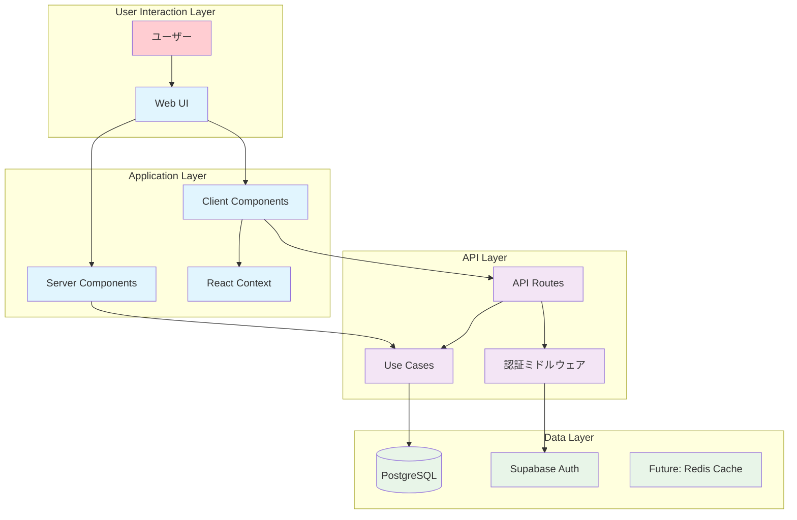

## ユーザーインタラクションフロー

### 認証フロー

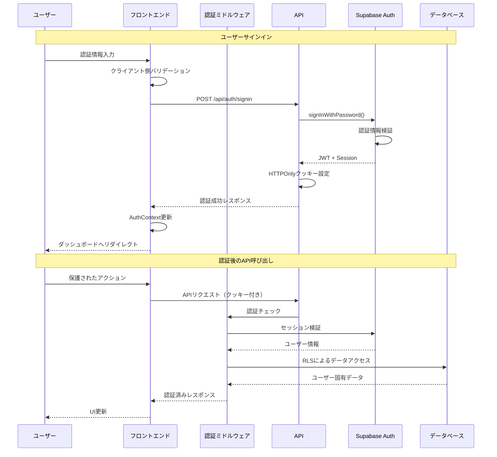

### ルーチン管理フロー

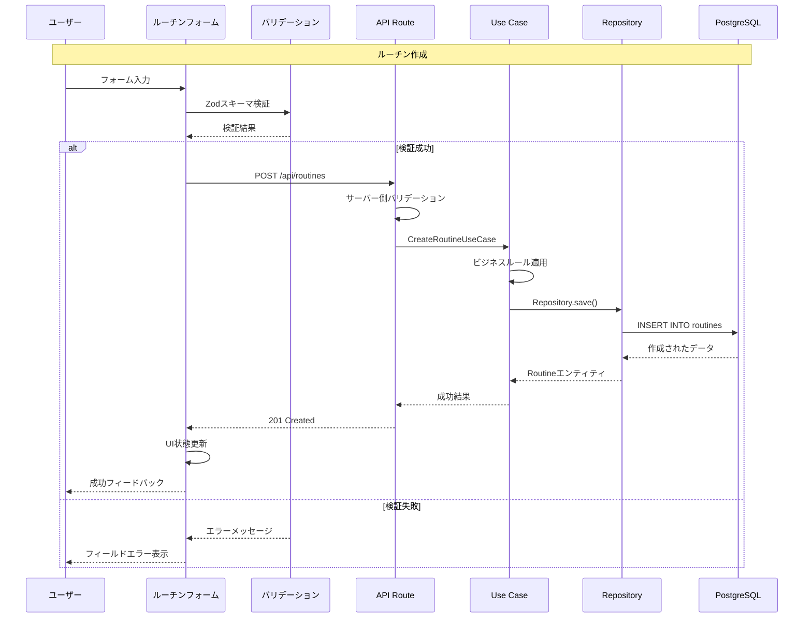

## データ処理フロー

### ルーチン実行とゲーミフィケーション連携

```mermaid
flowchart TD
    A[ユーザーアクション: ルーチン実行] --> B[実行記録作成]
    B --> C[ExecutionRecordService]
    C --> D[データベース保存]
    D --> E[XPCalculationService]
    
    E --> F[基本XP計算]
    F --> G[ボーナス計算]
    G --> H[XPTransaction記録]
    
    H --> I[ユーザープロフィール更新]
    I --> J{レベルアップ?}
    J -->|Yes| K[レベルアップ処理]
    J -->|No| L[現在XP更新]
    
    K --> M[レベルアップ通知]
    K --> N[バッジ解除チェック]
    L --> O[ミッション進捗更新]
    M --> O
    N --> O
    
    O --> P[チャレンジ進捗更新]
    P --> Q[通知システム]
    Q --> R[フロントエンド状態更新]
    R --> S[ユーザーへのフィードバック]
    
    classDef action fill:#ffcdd2
    classDef service fill:#e1f5fe
    classDef data fill:#e8f5e8
    classDef notification fill:#fff3e0
    
    class A action
    class C,E,F,G,H,I service  
    class D,B,L,O,P data
    class M,N,Q,R,S notification
```

### XP獲得とレベリングフロー詳細

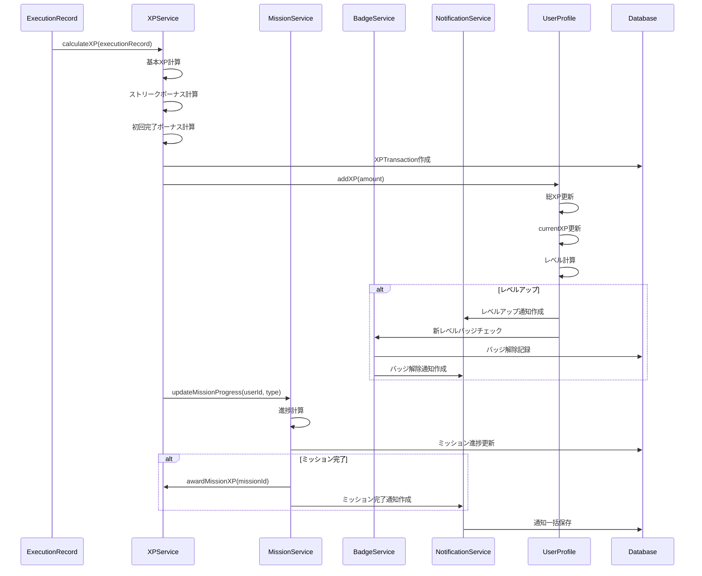

## リアルタイムデータ同期フロー（将来実装）

### WebSocket接続によるリアルタイム更新

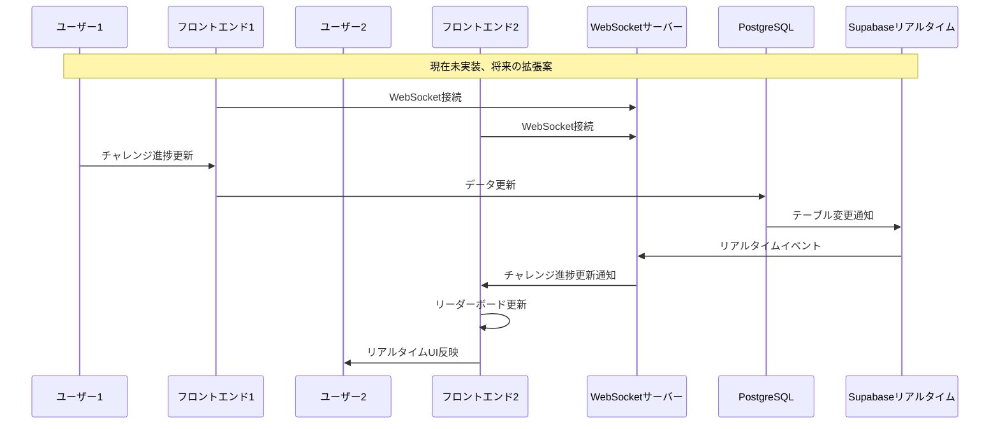

## エラーハンドリングフロー

### 階層別エラー処理

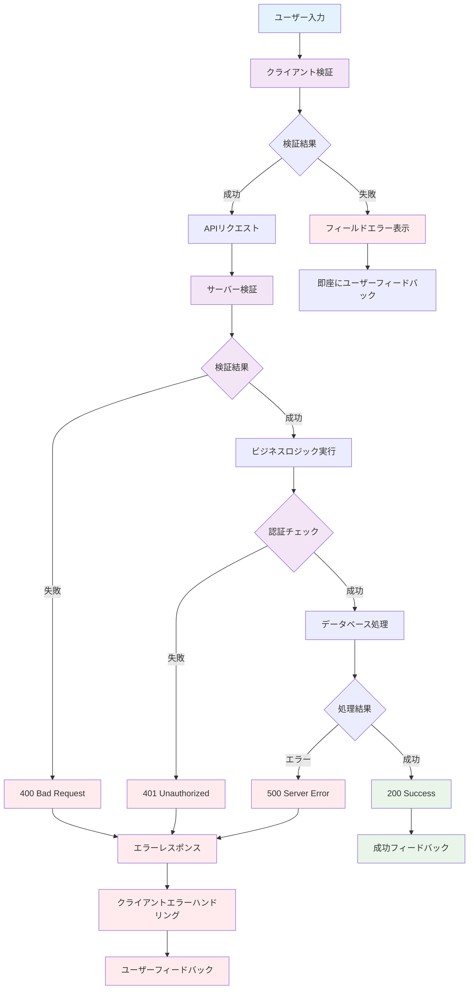

## 状態管理フロー

### React Context状態管理

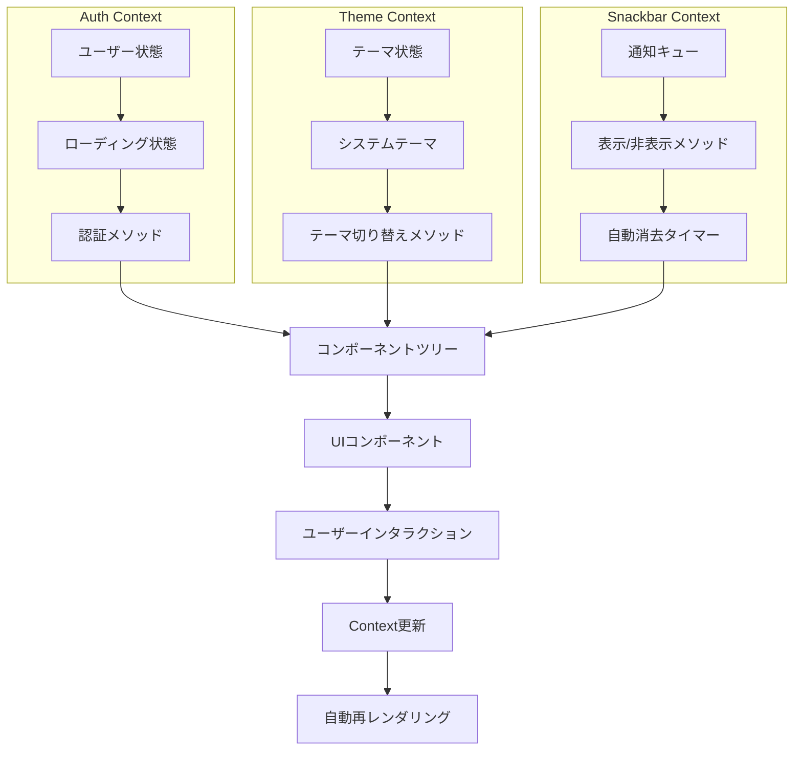

### Server/Client状態同期

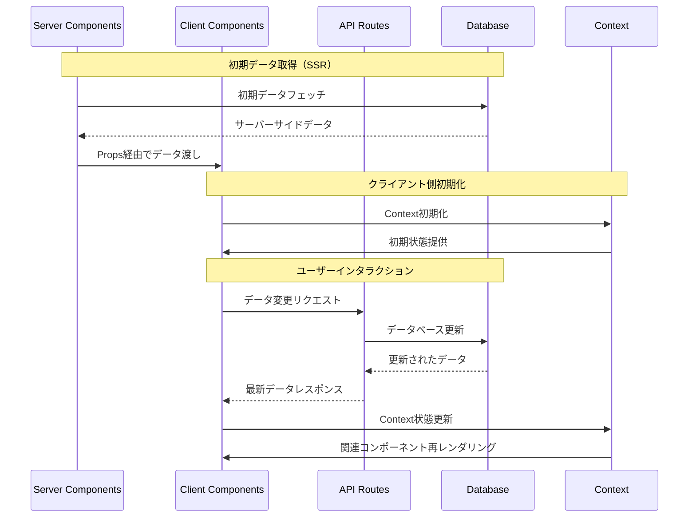

## パフォーマンス最適化フロー

### データローディング戦略

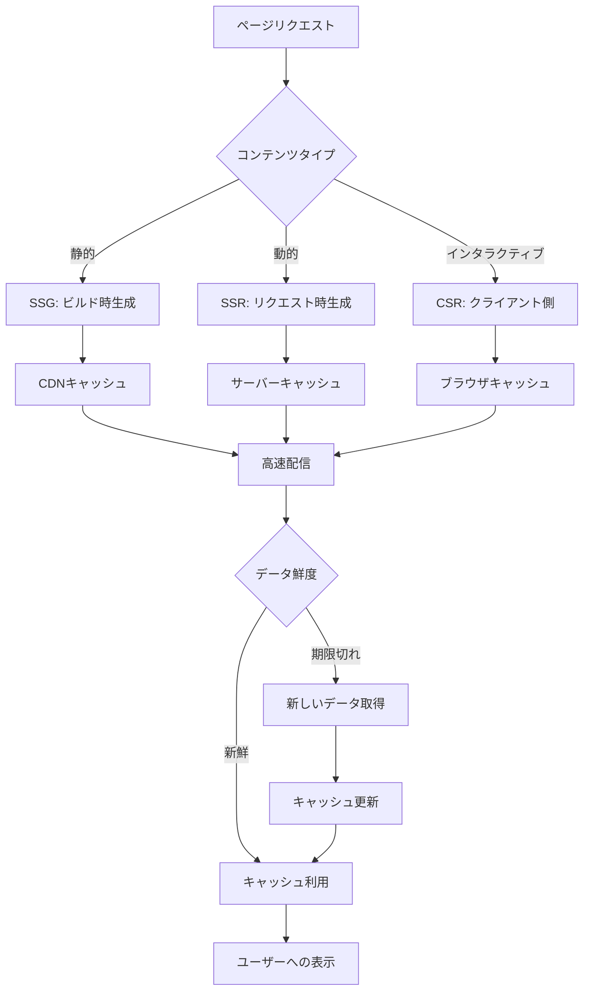

### データベースクエリ最適化

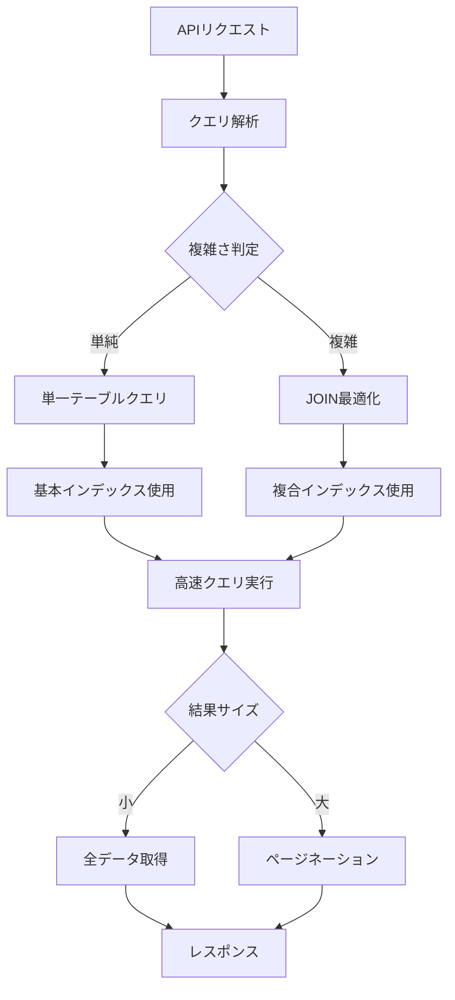

## 監視・ログフロー

### ログ収集・分析フロー（推奨実装）

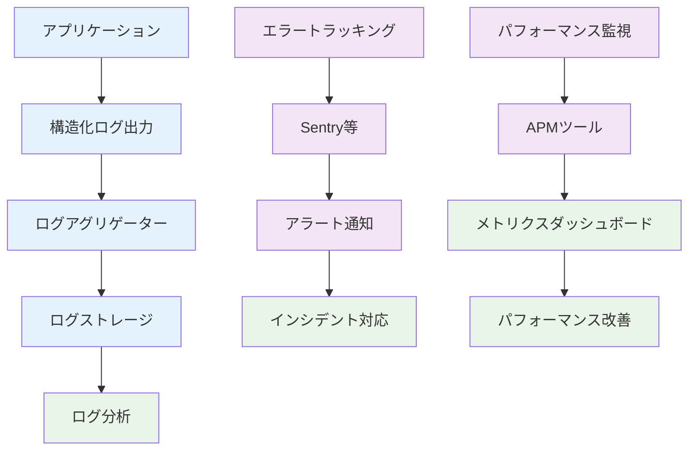

---

## データフロー設計の特徴

### 強み

1. **明確な責任分離**: 各層が明確な役割を持つ
2. **型安全性**: TypeScriptによる end-to-end型安全性
3. **リアクティブ設計**: 状態変更の自動的なUI反映
4. **セキュリティファースト**: 認証・認可の一貫した適用

### 最適化ポイント

1. **キャッシュ戦略**: 頻繁なクエリの結果キャッシュ
2. **バッチ処理**: 複数の更新の一括処理
3. **非同期処理**: 重い処理のバックグラウンド実行
4. **リアルタイム機能**: WebSocketによるイベント駆動更新

### 将来の拡張性

1. **マイクロサービス化**: API層の分離と独立スケーリング
2. **イベントソーシング**: ドメインイベントによる状態管理
3. **CQRS**: 読み取り/書き込みの最適化分離
4. **グローバル展開**: CDNとエッジコンピューティング活用