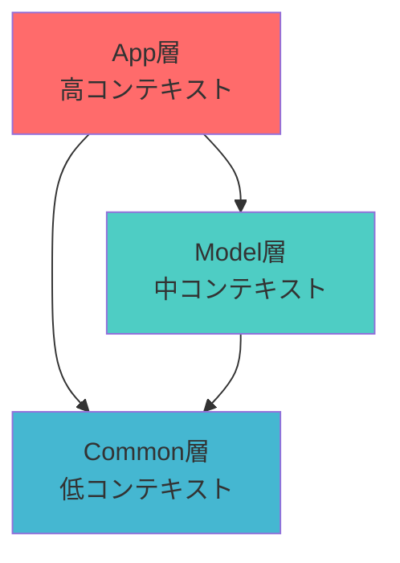

# 依存関係制約ルール

## アーキテクチャ概要

App-Common-Model 3層アーキテクチャにおける依存関係の詳細ルールを定義します。



## 基本依存関係ルール

### ✅ 許可されている依存関係

#### 1. App層 → Model層
```typescript
// ページコンポーネントからドメインコンポーネントを使用
// src/app/(authenticated)/dashboard/DashboardPage.tsx
import { UserAvatar } from '@/model/user/components/avatar/UserAvatar';
import { TodayRoutineItem } from '@/model/routine/components/item/TodayRoutineItem';
import { useCompleteRoutine } from '@/model/routine/hooks/useCompleteRoutine';
```

#### 2. App層 → Common層
```typescript
// ページコンポーネントから汎用コンポーネントを使用
// src/app/(authenticated)/routines/RoutinesPage.tsx
import { Button } from '@/common/components/ui/Button';
import { Card } from '@/common/components/ui/Card';
import { useLocalStorage } from '@/common/hooks/useLocalStorage';
```

#### 3. Model層 → Common層
```typescript
// ドメインコンポーネントから汎用コンポーネントを使用
// src/model/routine/components/form/RoutineForm.tsx
import { Input } from '@/common/components/ui/Input';
import { Select } from '@/common/components/ui/Select';
import { validateForm } from '@/common/lib/validation';
```

#### 4. 同一層内の依存
```typescript
// 同一App内
// src/app/(authenticated)/dashboard/DashboardPage.tsx
import { DashboardStats } from './_components/DashboardStats';

// 同一Model内
// src/model/routine/components/list/RoutineList.tsx
import { RoutineItem } from '../item/TodayRoutineItem';
```

### ❌ 禁止されている依存関係

#### 1. Common層 → Model層・App層
```typescript
// ❌ Commonコンポーネントからドメイン固有機能を使用
// src/common/components/ui/Button.tsx
import { useCompleteRoutine } from '@/model/routine/hooks/useCompleteRoutine'; // 禁止

// ❌ CommonコンポーネントからApp固有機能を使用
// src/common/components/layout/Header.tsx  
import { DashboardStats } from '@/app/(authenticated)/dashboard/_components/DashboardStats'; // 禁止
```

#### 2. Model層 → App層
```typescript
// ❌ Modelコンポーネントからページ固有機能を使用
// src/model/user/components/avatar/UserAvatar.tsx
import { DashboardLayout } from '@/app/(authenticated)/dashboard/_components/DashboardLayout'; // 禁止
```

#### 3. App層間の相互依存
```typescript
// ❌ 異なるページ間での直接依存
// src/app/(authenticated)/routines/RoutinesPage.tsx
import { DashboardStats } from '@/app/(authenticated)/dashboard/_components/DashboardStats'; // 禁止
```

#### 4. Model層間の相互依存
```typescript
// ❌ 異なるドメイン間での直接依存
// src/model/routine/components/form/RoutineForm.tsx
import { ChallengeProgress } from '@/model/challenge/components/ChallengeProgress'; // 禁止
```

## ESLint設定による自動検証

### アーキテクチャルール設定

```javascript
// eslint.config.mjs
{
  '@typescript-eslint/no-restricted-imports': [
    'error',
    {
      zones: [
        // Common層の制約
        {
          target: './src/common/**/*',
          from: ['./src/model/**/*', './src/app/**/*'],
          message: 'Common層はModel層・App層をimportできません。依存関係を見直してください。'
        },
        // Model層の制約
        {
          target: './src/model/**/*', 
          from: ['./src/app/**/*'],
          message: 'Model層はApp層をimportできません。共通機能はCommon層に移動してください。'
        },
        // App層間の制約
        {
          target: './src/app/(authenticated)/dashboard/**/*',
          from: ['./src/app/(authenticated)/routines/**/*', './src/app/(authenticated)/challenges/**/*'],
          message: 'App層間での直接依存は禁止されています。共通機能はModel層またはCommon層に移動してください。'
        }
      ]
    }
  ]
}
```

### 自動検証コマンド
```bash
# 依存関係ルール違反のチェック
npm run lint:architecture

# 全体的な品質チェック（依存関係チェック含む）
npm run quality
```

## 実践的なケーススタディ

### ケース1: 共通機能の抽出

**問題**: Appコンポーネント間で同じ機能を使いたい
```typescript
// ❌ 悪い例
// src/app/(authenticated)/dashboard/DashboardPage.tsx
import { formatXP } from '@/app/(authenticated)/profile/_utils/xpUtils';
```

**解決**: Common層に移動
```typescript
// ✅ 良い例  
// src/common/lib/gamification.ts
export function formatXP(xp: number): string { /* ... */ }

// 使用側
import { formatXP } from '@/common/lib/gamification';
```

### ケース2: ドメイン境界の整理

**問題**: Model層間で機能を共有したい
```typescript
// ❌ 悪い例
// src/model/routine/components/item/RoutineItem.tsx
import { calculateChallengeProgress } from '@/model/challenge/lib/progressCalculation';
```

**解決1**: Common層に抽象化
```typescript
// ✅ 良い例 - 汎用的な場合
// src/common/lib/progressCalculation.ts
export function calculateProgress(current: number, target: number): number { /* ... */ }
```

**解決2**: 適切なドメインに統合
```typescript
// ✅ 良い例 - gamificationドメインに統合
// src/model/gamification/lib/progressCalculation.ts
export function calculateProgress(current: number, target: number): number { /* ... */ }
```

### ケース3: Context・状態管理

**Context配置ルール**:
- **Common層**: 全体で使用される状態（テーマ、認証、通知）
- **Model層**: ドメイン固有の状態（ルーティン状態、チャレンジ進捗）
- **App層**: ページ固有の状態（フォーム状態、UI状態）

```typescript
// ✅ 適切な配置例
src/common/context/ThemeContext.tsx     // 全体で使用
src/common/context/AuthContext.tsx      // 全体で使用
src/model/routine/context/RoutineContext.tsx  // ルーティン関連のみ
src/app/(authenticated)/dashboard/_context/DashboardContext.tsx  // ダッシュボードのみ
```

## 依存関係違反の修正パターン

### パターン1: 機能のCommon層への移動
```typescript
// Before: App層間での依存
// src/app/(authenticated)/dashboard/utils/calculations.ts
export function calculateStreak() { /* ... */ }

// After: Common層に移動  
// src/common/lib/calculations.ts
export function calculateStreak() { /* ... */ }
```

### パターン2: インターフェース・型の分離
```typescript
// Before: Model層間での型依存
// src/model/routine/types/RoutineWithChallenge.ts
import type { Challenge } from '@/model/challenge/types/Challenge';

// After: 共通型としてCommon層に定義
// src/common/types/gamification.ts
export interface ProgressInfo {
  current: number;
  target: number;
  percentage: number;
}
```

### パターン3: 抽象化によるDecoupling
```typescript
// Before: 直接的なコンポーネント依存
// src/model/routine/components/RoutineItem.tsx
import { ChallengeModal } from '@/model/challenge/components/ChallengeModal';

// After: 抽象的なProps/Callbackによる分離
// src/model/routine/components/RoutineItem.tsx
interface RoutineItemProps {
  onChallengeClick?: (challengeId: string) => void;
}
```

## レビュー・検証プロセス

### Pull Request時のチェック項目

#### 1. 依存関係グラフの確認
```bash
# 依存関係可視化（madgeツール使用例）
npx madge --image deps.svg src/
```

#### 2. ESLintによる自動チェック
```bash
# アーキテクチャルール違反確認
npm run lint:architecture

# import順序確認  
npm run lint
```

#### 3. TypeScript型チェック
```bash
# 型安全性確認
npm run type-check
```

### コードレビューでの確認観点

1. **新しいimport文**
   - 適切な層から依存しているか
   - グループ化ルールに従っているか
   - 不要なimportがないか

2. **新しいコンポーネント・機能**
   - 適切な層に配置されているか
   - 依存関係が一方向になっているか
   - 責任分離が適切か

3. **リファクタリング**
   - 依存関係の改善になっているか
   - 循環参照が解消されているか
   - パフォーマンスへの悪影響がないか

## 継続的改善

### 定期的な依存関係レビュー
- **月次**: 依存関係グラフの確認
- **機能追加時**: アーキテクチャルールの遵守確認
- **リファクタリング時**: 依存関係の最適化検討

### 測定指標
- ESLintエラー数（依存関係ルール違反）
- 循環参照の数
- 各層のコンポーネント数バランス
- ビルド時間・バンドルサイズ

これらのルールを遵守することで、スケーラブルで保守性の高いフロントエンドアーキテクチャを維持できます。