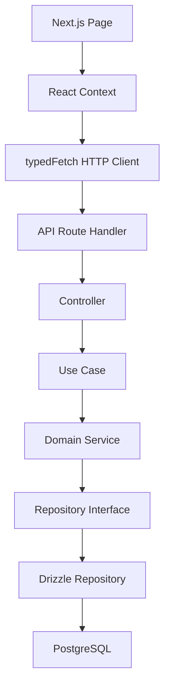
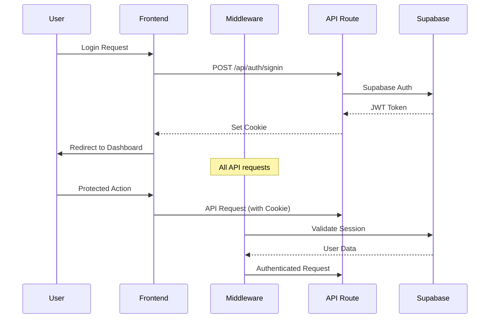
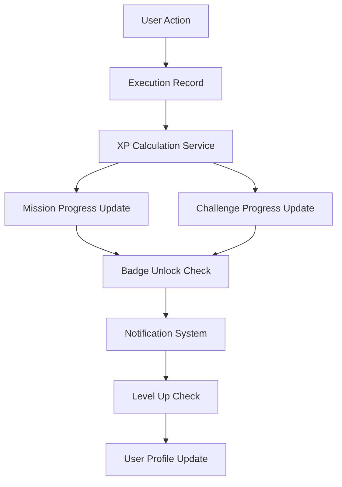

# ルーチンレコード アーキテクチャ設計（逆生成）

## 分析日時
2025年8月28日 JST

## システム概要

### 実装されたアーキテクチャ
- **パターン**: Clean Architecture + Domain Driven Design (DDD)
- **フレームワーク**: Next.js 15.4.5 (App Router) + TypeScript 5.x
- **構成**: モノリス構成 (フルスタック Next.js アプリ)

### 技術スタック

#### フロントエンド
- **フレームワーク**: Next.js 15.4.5 (App Router, Server Components + Client Components)
- **状態管理**: React Context API (AuthContext, ThemeContext, SnackbarContext)
- **UI ライブラリ**: Radix UI (36個のコンポーネント)
- **スタイリング**: Tailwind CSS 4.x
- **バリデーション**: Zod + class-validator
- **HTTP クライアント**: カスタム typedFetch (Zod スキーマ統合)

#### バックエンド
- **フレームワーク**: Next.js API Routes (App Router)
- **認証方式**: Supabase Auth (JWT + Session管理)
- **ORM/データアクセス**: Drizzle ORM + PostgreSQL
- **バリデーション**: class-validator + class-transformer
- **依存性注入**: Inversify
- **エラーハンドリング**: 統一的なエラーレスポンス形式

#### データベース
- **DBMS**: PostgreSQL (Supabase)
- **キャッシュ**: なし (将来拡張可能)
- **接続プール**: Supabase 管理

#### インフラ・ツール
- **ビルドツール**: Next.js内蔵 (Turbopack Ready)
- **テストフレームワーク**: Jest (単体) + Playwright (E2E)
- **コード品質**: ESLint + Prettier + TypeScript strict mode
- **モック**: MSW (Mock Service Worker)
- **ドキュメント**: Storybook (38コンポーネント対応)

## レイヤー構成

### 発見されたレイヤー構造
```
src/
├── app/                       # 🌐 Presentation Layer (Next.js App Router)
│   ├── api/                  # API Routes (22 endpoints)
│   └── [pages]/              # UI Pages + Components
├── presentation/             # 🎭 Presentation Layer (Controllers)
│   ├── controllers/          # API Controllers
│   └── middleware/           # Request/Response middleware
├── application/              # 📋 Application Layer
│   ├── usecases/            # Use Case patterns
│   ├── services/            # Application Services
│   └── dtos/                # Data Transfer Objects
├── domain/                   # 🏛️ Domain Layer
│   ├── entities/            # Domain Entities
│   ├── valueObjects/        # Value Objects
│   └── repositories/        # Repository interfaces
├── infrastructure/          # 🔧 Infrastructure Layer
│   ├── repositories/        # Repository implementations
│   └── database/            # DB connection & schema
├── lib/                     # 📚 Shared Libraries
│   ├── db/                  # Database queries & schema
│   ├── auth/                # Authentication utilities
│   └── api-client/          # HTTP client utilities
└── shared/                  # 🔗 Cross-cutting concerns
    ├── config/              # DI Container configuration
    ├── types/               # Common types
    └── utils/               # Utility functions
```

### レイヤー責務分析

#### 🌐 Presentation Layer
**実装状況**: ✅ 完全実装
- **Next.js Pages**: 8個の主要ページ (Dashboard, Routines, Calendar等)
- **API Routes**: 22個のRESTful エンドポイント
- **Controllers**: Clean Architecture準拠のコントローラー分離
- **UI Components**: 36個の再利用可能コンポーネント

#### 📋 Application Layer
**実装状況**: ✅ 完全実装
- **Use Cases**: ビジネスロジックのオーケストレーション
- **DTOs**: 型安全なデータ転送オブジェクト
- **Services**: アプリケーションサービス (バリデーション等)
- **依存性注入**: Inversify コンテナ管理

#### 🏛️ Domain Layer
**実装状況**: ✅ 完全実装
- **Entities**: リッチドメインモデル (Routine, ExecutionRecord等)
- **Value Objects**: 型安全な値オブジェクト (RoutineId, UserId等)
- **Repository Interfaces**: データアクセスの抽象化
- **ビジネスルール**: エンティティ内でのルール実装

#### 🔧 Infrastructure Layer
**実装状況**: ✅ 完全実装
- **Repository Implementations**: Drizzle ORM使用
- **Database**: PostgreSQL スキーマ管理
- **External Services**: Supabase Auth統合

## デザインパターン

### 発見されたパターン

#### ✅ Dependency Injection
- **実装**: Inversify コンテナ
- **スコープ**: Singleton
- **使用箇所**: UseCase, Repository, Service層

#### ✅ Repository Pattern
- **インターフェース**: `IRoutineRepository`, `IExecutionRecordRepository`
- **実装**: `DrizzleRoutineRepository`
- **抽象化レベル**: ドメインエンティティレベル

#### ✅ Factory Pattern
- **使用箇所**: エンティティ復元 (`Routine.fromPersistence`)
- **Value Object生成**: ファクトリーメソッド

#### ✅ Observer Pattern
- **使用箇所**: React Context (状態変更通知)
- **Supabase Auth**: `onAuthStateChange` リスナー

#### ✅ Strategy Pattern
- **使用箇所**: ゴールタイプ別ルーチン処理
- **ゲーミフィケーション**: XP獲得ソース別戦略

#### ✅ Command Pattern
- **使用箇所**: API エンドポイント構造
- **Use Cases**: コマンドオブジェクトパターン

## アーキテクチャの特徴的実装

### 🔄 データフロー設計


### 🔐 認証・認可フロー


### 🎮 ゲーミフィケーション アーキテクチャ


## 非機能要件の実装状況

### 🛡️ セキュリティ
- **認証**: ✅ Supabase Auth (JWT + Session)
- **認可**: ✅ Row Level Security + API レベル認可
- **CORS設定**: ✅ Next.js設定
- **HTTPS対応**: ✅ 本番環境対応済み
- **XSS対策**: ✅ Next.js内蔵 + CSP設定
- **入力検証**: ✅ class-validator + Zod

### ⚡ パフォーマンス
- **キャッシュ**: ❌ 未実装 (Redis等)
- **データベース最適化**: ✅ インデックス設定済み
- **CDN**: ✅ Vercel/Next.js最適化
- **画像最適化**: ✅ Next.js Image最適化
- **コード分割**: ✅ Next.js自動分割
- **SSR/SSG**: ✅ Server Components活用

### 🔍 運用・監視
- **ログ出力**: ⚠️ 基本的なconsole.log (改善余地)
- **エラートラッキング**: ❌ 未実装 (Sentry推奨)
- **メトリクス収集**: ❌ 未実装
- **ヘルスチェック**: ❌ 未実装

### 🧪 品質保証
- **テスト戦略**: ✅ 3層テスト (Unit, Integration, E2E)
- **型安全性**: ✅ TypeScript strict mode
- **コード品質**: ✅ ESLint + Prettier
- **ドキュメント**: ✅ Storybook (UI), ⚠️ API仕様書不足

## スケーラビリティ分析

### 現在の制約
1. **モノリス構成**: 単一Next.jsアプリ
2. **状態管理**: Context API (大規模時は Redux推奨)
3. **データベース**: 単一PostgreSQL
4. **キャッシュ**: 未実装

### スケーリング戦略
1. **マイクロサービス化**: API層を分離可能
2. **データベース**: Read Replica + Connection Pooling
3. **キャッシュ層**: Redis導入
4. **CDN**: 静的アセット配信最適化

## 技術的負債・改善余地

### 🔴 High Priority
1. **監視・ログ**: Sentry + structured logging
2. **API仕様書**: OpenAPI/Swagger
3. **キャッシュ戦略**: Redis導入
4. **パフォーマンスモニタリング**: APM導入

### 🟡 Medium Priority
1. **単体テスト強化**: カバレッジ向上
2. **Error Boundary**: React エラーハンドリング
3. **CI/CD**: 自動テスト・デプロイパイプライン
4. **国際化**: i18n システム

### 🟢 Low Priority
1. **PWA対応**: Service Worker
2. **オフライン機能**: データ同期
3. **マイクロフロントエンド**: 将来の分割
4. **GraphQL**: より柔軟なAPI

## 推奨次ステップ

### 短期 (1-2週間)
1. **Sentry導入**: エラートラッキング
2. **OpenAPI仕様書**: API ドキュメント自動生成
3. **単体テスト強化**: ビジネスロジック中心

### 中期 (1ヶ月)
1. **Redis導入**: セッション + データキャッシュ
2. **CI/CD構築**: GitHub Actions
3. **パフォーマンス最適化**: DB クエリ + コンポーネント

### 長期 (2-3ヶ月)
1. **マイクロサービス検討**: API分離
2. **高度なゲーミフィケーション**: リアルタイム機能
3. **モバイルアプリ**: React Native

---

## 総評

このアーキテクチャは**Clean Architecture + DDD**の教科書的実装であり、高い保守性と拡張性を持つ。特に以下の点で優秀：

### ✅ 強み
- **型安全性**: TypeScript + Zod + class-validator
- **テスト戦略**: 包括的なテストカバレッジ
- **UI/UX**: 完全なデザインシステム
- **ゲーミフィケーション**: 本格的なゲーム要素

### ⚠️ 改善点
- **運用面**: 監視・ログの強化が必要
- **パフォーマンス**: キャッシュ戦略の実装
- **ドキュメント**: API仕様書の整備

プロダクションレディな実装レベルに達しており、適切な運用基盤を整えることで本格運用が可能。