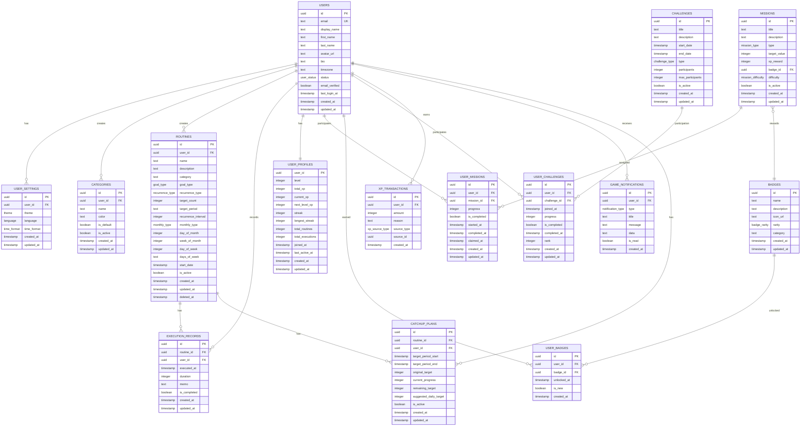

# ルーチンレコード データベース設計（逆生成）

## 分析日時
2025年8月28日 JST

## データベース概要

### 基本情報
- **DBMS**: PostgreSQL
- **ORM**: Drizzle ORM
- **ホスティング**: Supabase
- **バージョン管理**: Drizzle Kit migrations
- **接続プール**: Supabase 管理

### スキーマ統計
- **テーブル数**: 17テーブル
- **ENUM型**: 11種類
- **マイグレーション**: 5ファイル
- **外部キー制約**: 16個
- **ユニーク制約**: 3個

## ER図



## テーブル定義

### 🔐 認証・ユーザー管理

#### users テーブル
**用途**: ユーザーの基本情報（Supabase Auth連携）

```sql
CREATE TABLE "users" (
    "id" uuid PRIMARY KEY NOT NULL, -- Supabase AuthのユーザーIDと同期
    "email" text NOT NULL UNIQUE,
    "display_name" text,
    "first_name" text,
    "last_name" text,
    "avatar_url" text,
    "bio" text,
    "timezone" text DEFAULT 'Asia/Tokyo',
    "status" user_status DEFAULT 'active' NOT NULL,
    "email_verified" boolean DEFAULT false NOT NULL,
    "last_login_at" timestamp with time zone,
    "created_at" timestamp with time zone DEFAULT now() NOT NULL,
    "updated_at" timestamp with time zone DEFAULT now() NOT NULL
);
```

**主要制約**:
- Primary Key: `id`
- Unique: `email`
- Foreign Key: Supabase Authテーブルと連携

**インデックス**:
```sql
CREATE INDEX idx_users_email ON users(email);
CREATE INDEX idx_users_status ON users(status);
```

#### user_settings テーブル
**用途**: ユーザー個別設定

```sql
CREATE TABLE "user_settings" (
    "id" uuid PRIMARY KEY DEFAULT gen_random_uuid() NOT NULL,
    "user_id" uuid NOT NULL UNIQUE,
    "theme" theme DEFAULT 'auto' NOT NULL,
    "language" language DEFAULT 'ja' NOT NULL,
    "time_format" time_format DEFAULT '24h' NOT NULL,
    "created_at" timestamp with time zone DEFAULT now() NOT NULL,
    "updated_at" timestamp with time zone DEFAULT now() NOT NULL,
    
    CONSTRAINT "user_settings_user_id_users_id_fk" 
    FOREIGN KEY ("user_id") REFERENCES "users"("id") ON DELETE cascade
);
```

### 📋 ルーチン・実行管理

#### routines テーブル
**用途**: ユーザーのルーチン定義

```sql
CREATE TABLE "routines" (
    "id" uuid PRIMARY KEY DEFAULT gen_random_uuid() NOT NULL,
    "user_id" uuid NOT NULL,
    "name" text NOT NULL,
    "description" text,
    "category" text NOT NULL,
    
    -- ゴール設定
    "goal_type" goal_type DEFAULT 'schedule_based' NOT NULL,
    "target_count" integer, -- 頻度ベース用
    "target_period" text, -- 'daily', 'weekly', 'monthly'
    
    -- 繰り返しパターン
    "recurrence_type" recurrence_type DEFAULT 'daily' NOT NULL,
    "recurrence_interval" integer DEFAULT 1, -- 間隔（2日おき = 2）
    
    -- 月次パターン用
    "monthly_type" monthly_type, -- 月の何日 or 第何曜日
    "day_of_month" integer, -- 1-31
    "week_of_month" integer, -- 1-4, -1（最終週）
    "day_of_week" integer, -- 0-6（日曜=0）
    
    -- 週次パターン用（JSON配列）
    "days_of_week" text, -- [1,3,5] = 月水金
    
    -- その他
    "start_date" timestamp with time zone,
    "is_active" boolean DEFAULT true NOT NULL,
    "created_at" timestamp with time zone DEFAULT now() NOT NULL,
    "updated_at" timestamp with time zone DEFAULT now() NOT NULL,
    "deleted_at" timestamp with time zone, -- ソフトデリート
    
    CONSTRAINT "routines_user_id_users_id_fk" 
    FOREIGN KEY ("user_id") REFERENCES "users"("id") ON DELETE cascade
);
```

**インデックス**:
```sql
CREATE INDEX idx_routines_user_id ON routines(user_id);
CREATE INDEX idx_routines_category ON routines(category);
CREATE INDEX idx_routines_goal_type ON routines(goal_type);
CREATE INDEX idx_routines_is_active ON routines(is_active);
CREATE INDEX idx_routines_deleted_at ON routines(deleted_at);
```

#### execution_records テーブル
**用途**: ルーチン実行記録

```sql
CREATE TABLE "execution_records" (
    "id" uuid PRIMARY KEY DEFAULT gen_random_uuid() NOT NULL,
    "routine_id" uuid NOT NULL,
    "user_id" uuid NOT NULL,
    "executed_at" timestamp with time zone DEFAULT now() NOT NULL,
    "duration" integer, -- 分単位
    "memo" text,
    "is_completed" boolean DEFAULT false NOT NULL,
    "created_at" timestamp with time zone DEFAULT now() NOT NULL,
    "updated_at" timestamp with time zone DEFAULT now() NOT NULL,
    
    CONSTRAINT "execution_records_routine_id_routines_id_fk" 
    FOREIGN KEY ("routine_id") REFERENCES "routines"("id") ON DELETE cascade,
    CONSTRAINT "execution_records_user_id_users_id_fk" 
    FOREIGN KEY ("user_id") REFERENCES "users"("id") ON DELETE cascade
);
```

**インデックス**:
```sql
CREATE INDEX idx_execution_records_user_id ON execution_records(user_id);
CREATE INDEX idx_execution_records_routine_id ON execution_records(routine_id);
CREATE INDEX idx_execution_records_executed_at ON execution_records(executed_at);
CREATE INDEX idx_execution_records_is_completed ON execution_records(is_completed);
```

#### categories テーブル
**用途**: ルーチンカテゴリ管理

```sql
CREATE TABLE "categories" (
    "id" uuid PRIMARY KEY DEFAULT gen_random_uuid() NOT NULL,
    "user_id" uuid NOT NULL,
    "name" text NOT NULL,
    "color" text NOT NULL DEFAULT 'bg-gray-100 text-gray-800 dark:bg-gray-700 dark:text-gray-200',
    "is_default" boolean DEFAULT false NOT NULL,
    "is_active" boolean DEFAULT true NOT NULL,
    "created_at" timestamp with time zone DEFAULT now() NOT NULL,
    "updated_at" timestamp with time zone DEFAULT now() NOT NULL,
    
    CONSTRAINT "categories_user_id_users_id_fk" 
    FOREIGN KEY ("user_id") REFERENCES "users"("id") ON DELETE cascade
);
```

### 🎮 ゲーミフィケーション

#### user_profiles テーブル
**用途**: ユーザーのゲーミフィケーション情報

```sql
CREATE TABLE "user_profiles" (
    "user_id" uuid PRIMARY KEY NOT NULL,
    "level" integer DEFAULT 1 NOT NULL,
    "total_xp" integer DEFAULT 0 NOT NULL,
    "current_xp" integer DEFAULT 0 NOT NULL, -- 現在レベル内でのXP
    "next_level_xp" integer DEFAULT 100 NOT NULL, -- 次レベルまでのXP
    "streak" integer DEFAULT 0 NOT NULL, -- 現在のストリーク
    "longest_streak" integer DEFAULT 0 NOT NULL, -- 最長ストリーク
    "total_routines" integer DEFAULT 0 NOT NULL, -- 作成したルーティン数
    "total_executions" integer DEFAULT 0 NOT NULL, -- 総実行回数
    "joined_at" timestamp with time zone DEFAULT now() NOT NULL,
    "last_active_at" timestamp with time zone DEFAULT now() NOT NULL,
    "created_at" timestamp with time zone DEFAULT now() NOT NULL,
    "updated_at" timestamp with time zone DEFAULT now() NOT NULL,
    
    CONSTRAINT "user_profiles_user_id_users_id_fk" 
    FOREIGN KEY ("user_id") REFERENCES "users"("id") ON DELETE cascade
);
```

#### missions テーブル
**用途**: システム定義ミッション

```sql
CREATE TABLE "missions" (
    "id" uuid PRIMARY KEY DEFAULT gen_random_uuid() NOT NULL,
    "title" text NOT NULL,
    "description" text NOT NULL,
    "type" mission_type NOT NULL, -- 'streak', 'count', 'variety', 'consistency'
    "target_value" integer NOT NULL, -- 目標値（7日、20回など）
    "xp_reward" integer NOT NULL DEFAULT 0,
    "badge_id" uuid,
    "difficulty" mission_difficulty NOT NULL DEFAULT 'easy', -- 'easy', 'medium', 'hard', 'extreme'
    "is_active" boolean DEFAULT true NOT NULL,
    "created_at" timestamp with time zone DEFAULT now() NOT NULL,
    "updated_at" timestamp with time zone DEFAULT now() NOT NULL,
    
    CONSTRAINT "missions_badge_id_badges_id_fk" 
    FOREIGN KEY ("badge_id") REFERENCES "badges"("id")
);
```

#### user_missions テーブル
**用途**: ユーザーのミッション進捗

```sql
CREATE TABLE "user_missions" (
    "id" uuid PRIMARY KEY DEFAULT gen_random_uuid() NOT NULL,
    "user_id" uuid NOT NULL,
    "mission_id" uuid NOT NULL,
    "progress" integer DEFAULT 0 NOT NULL,
    "is_completed" boolean DEFAULT false NOT NULL,
    "started_at" timestamp with time zone DEFAULT now() NOT NULL,
    "completed_at" timestamp with time zone,
    "claimed_at" timestamp with time zone, -- 報酬受け取り日時
    "created_at" timestamp with time zone DEFAULT now() NOT NULL,
    "updated_at" timestamp with time zone DEFAULT now() NOT NULL,
    
    CONSTRAINT "user_missions_user_id_users_id_fk" 
    FOREIGN KEY ("user_id") REFERENCES "users"("id") ON DELETE cascade,
    CONSTRAINT "user_missions_mission_id_missions_id_fk" 
    FOREIGN KEY ("mission_id") REFERENCES "missions"("id") ON DELETE cascade
);
```

#### badges テーブル
**用途**: システム定義バッジ

```sql
CREATE TABLE "badges" (
    "id" uuid PRIMARY KEY DEFAULT gen_random_uuid() NOT NULL,
    "name" text NOT NULL,
    "description" text NOT NULL,
    "icon_url" text, -- バッジアイコンのURL
    "rarity" badge_rarity NOT NULL DEFAULT 'common', -- 'common', 'rare', 'epic', 'legendary'
    "category" text NOT NULL, -- '実績', 'ストリーク', 'チャレンジ'など
    "created_at" timestamp with time zone DEFAULT now() NOT NULL,
    "updated_at" timestamp with time zone DEFAULT now() NOT NULL
);
```

#### user_badges テーブル
**用途**: ユーザーが獲得したバッジ

```sql
CREATE TABLE "user_badges" (
    "id" uuid PRIMARY KEY DEFAULT gen_random_uuid() NOT NULL,
    "user_id" uuid NOT NULL,
    "badge_id" uuid NOT NULL,
    "unlocked_at" timestamp with time zone DEFAULT now() NOT NULL,
    "is_new" boolean DEFAULT true NOT NULL, -- 新着フラグ
    "created_at" timestamp with time zone DEFAULT now() NOT NULL,
    
    CONSTRAINT "user_badges_user_id_users_id_fk" 
    FOREIGN KEY ("user_id") REFERENCES "users"("id") ON DELETE cascade,
    CONSTRAINT "user_badges_badge_id_badges_id_fk" 
    FOREIGN KEY ("badge_id") REFERENCES "badges"("id") ON DELETE cascade
);
```

#### challenges テーブル
**用途**: 期間限定チャレンジ

```sql
CREATE TABLE "challenges" (
    "id" uuid PRIMARY KEY DEFAULT gen_random_uuid() NOT NULL,
    "title" text NOT NULL,
    "description" text NOT NULL,
    "start_date" timestamp with time zone NOT NULL,
    "end_date" timestamp with time zone NOT NULL,
    "type" challenge_type NOT NULL, -- 'weekly', 'monthly', 'seasonal', 'special'
    "participants" integer DEFAULT 0 NOT NULL, -- 参加者数
    "max_participants" integer, -- 最大参加者数（制限がある場合）
    "is_active" boolean DEFAULT true NOT NULL,
    "created_at" timestamp with time zone DEFAULT now() NOT NULL,
    "updated_at" timestamp with time zone DEFAULT now() NOT NULL
);
```

#### user_challenges テーブル
**用途**: ユーザーのチャレンジ参加状況

```sql
CREATE TABLE "user_challenges" (
    "id" uuid PRIMARY KEY DEFAULT gen_random_uuid() NOT NULL,
    "user_id" uuid NOT NULL,
    "challenge_id" uuid NOT NULL,
    "joined_at" timestamp with time zone DEFAULT now() NOT NULL,
    "progress" integer DEFAULT 0 NOT NULL,
    "is_completed" boolean DEFAULT false NOT NULL,
    "completed_at" timestamp with time zone,
    "rank" integer, -- 順位（完了時）
    "created_at" timestamp with time zone DEFAULT now() NOT NULL,
    "updated_at" timestamp with time zone DEFAULT now() NOT NULL,
    
    CONSTRAINT "user_challenges_user_id_users_id_fk" 
    FOREIGN KEY ("user_id") REFERENCES "users"("id") ON DELETE cascade,
    CONSTRAINT "user_challenges_challenge_id_challenges_id_fk" 
    FOREIGN KEY ("challenge_id") REFERENCES "challenges"("id") ON DELETE cascade
);
```

#### xp_transactions テーブル
**用途**: XP獲得履歴（トランザクション記録）

```sql
CREATE TABLE "xp_transactions" (
    "id" uuid PRIMARY KEY DEFAULT gen_random_uuid() NOT NULL,
    "user_id" uuid NOT NULL,
    "amount" integer NOT NULL,
    "reason" text NOT NULL, -- '朝の運動を完了', 'レベル2達成'など
    "source_type" xp_source_type NOT NULL, -- 獲得ソース種別
    "source_id" uuid, -- 関連するroutineId, missionIdなど
    "created_at" timestamp with time zone DEFAULT now() NOT NULL,
    
    CONSTRAINT "xp_transactions_user_id_users_id_fk" 
    FOREIGN KEY ("user_id") REFERENCES "users"("id") ON DELETE cascade
);
```

#### game_notifications テーブル
**用途**: ゲーミフィケーション通知

```sql
CREATE TABLE "game_notifications" (
    "id" uuid PRIMARY KEY DEFAULT gen_random_uuid() NOT NULL,
    "user_id" uuid NOT NULL,
    "type" notification_type NOT NULL, -- 通知種別
    "title" text NOT NULL,
    "message" text NOT NULL,
    "data" text, -- JSON文字列（レベル、XP、バッジIDなど）
    "is_read" boolean DEFAULT false NOT NULL,
    "created_at" timestamp with time zone DEFAULT now() NOT NULL,
    
    CONSTRAINT "game_notifications_user_id_users_id_fk" 
    FOREIGN KEY ("user_id") REFERENCES "users"("id") ON DELETE cascade
);
```

### 🔄 機能拡張テーブル

#### catchup_plans テーブル
**用途**: 挽回プラン管理

```sql
CREATE TABLE "catchup_plans" (
    "id" uuid PRIMARY KEY DEFAULT gen_random_uuid() NOT NULL,
    "routine_id" uuid NOT NULL,
    "user_id" uuid NOT NULL,
    "target_period_start" timestamp with time zone NOT NULL,
    "target_period_end" timestamp with time zone NOT NULL,
    "original_target" integer NOT NULL, -- 元の目標回数
    "current_progress" integer NOT NULL, -- 現在の進捗
    "remaining_target" integer NOT NULL, -- 残り目標回数
    "suggested_daily_target" integer NOT NULL, -- 提案する1日あたりの目標
    "is_active" boolean DEFAULT true NOT NULL,
    "created_at" timestamp with time zone DEFAULT now() NOT NULL,
    "updated_at" timestamp with time zone DEFAULT now() NOT NULL,
    
    CONSTRAINT "catchup_plans_routine_id_routines_id_fk" 
    FOREIGN KEY ("routine_id") REFERENCES "routines"("id") ON DELETE cascade,
    CONSTRAINT "catchup_plans_user_id_users_id_fk" 
    FOREIGN KEY ("user_id") REFERENCES "users"("id") ON DELETE cascade
);
```

## ENUM型定義

### 基本ENUM
```sql
-- ユーザーステータス
CREATE TYPE "user_status" AS ENUM('active', 'inactive', 'suspended');

-- テーマ設定
CREATE TYPE "theme" AS ENUM('light', 'dark', 'auto');

-- 言語設定
CREATE TYPE "language" AS ENUM('ja', 'en');

-- 時刻フォーマット
CREATE TYPE "time_format" AS ENUM('12h', '24h');

-- ゴールタイプ
CREATE TYPE "goal_type" AS ENUM('frequency_based', 'schedule_based');

-- 繰り返しタイプ
CREATE TYPE "recurrence_type" AS ENUM('daily', 'weekly', 'monthly', 'custom');

-- 月次タイプ
CREATE TYPE "monthly_type" AS ENUM('day_of_month', 'day_of_week');
```

### ゲーミフィケーションENUM
```sql
-- ミッションタイプ
CREATE TYPE "mission_type" AS ENUM('streak', 'count', 'variety', 'consistency');

-- ミッション難易度
CREATE TYPE "mission_difficulty" AS ENUM('easy', 'medium', 'hard', 'extreme');

-- バッジレアリティ
CREATE TYPE "badge_rarity" AS ENUM('common', 'rare', 'epic', 'legendary');

-- チャレンジタイプ
CREATE TYPE "challenge_type" AS ENUM('weekly', 'monthly', 'seasonal', 'special');

-- 通知タイプ
CREATE TYPE "notification_type" AS ENUM(
    'level_up', 
    'badge_unlocked', 
    'mission_completed', 
    'challenge_completed', 
    'streak_milestone', 
    'xp_milestone'
);

-- XP獲得ソース
CREATE TYPE "xp_source_type" AS ENUM(
    'routine_completion', 
    'streak_bonus', 
    'mission_completion', 
    'challenge_completion', 
    'daily_bonus', 
    'achievement_unlock'
);
```

## インデックス戦略

### パフォーマンス重要テーブル
```sql
-- ルーチン関連
CREATE INDEX idx_routines_user_id_active ON routines(user_id, is_active) WHERE deleted_at IS NULL;
CREATE INDEX idx_routines_category_active ON routines(category, is_active) WHERE deleted_at IS NULL;

-- 実行記録関連
CREATE INDEX idx_execution_records_user_date ON execution_records(user_id, executed_at);
CREATE INDEX idx_execution_records_routine_date ON execution_records(routine_id, executed_at);

-- ゲーミフィケーション関連
CREATE INDEX idx_user_missions_user_active ON user_missions(user_id, is_completed);
CREATE INDEX idx_user_badges_user_new ON user_badges(user_id, is_new);
CREATE INDEX idx_xp_transactions_user_date ON xp_transactions(user_id, created_at);

-- 通知関連
CREATE INDEX idx_game_notifications_user_unread ON game_notifications(user_id, is_read, created_at);
```

### 複合インデックス
```sql
-- 頻繁な絞り込み条件
CREATE INDEX idx_routines_user_category_active ON routines(user_id, category, is_active);
CREATE INDEX idx_execution_records_user_completed_date ON execution_records(user_id, is_completed, executed_at);
```

## Row Level Security (RLS) ポリシー

### 基本ポリシー例
```sql
-- ユーザーは自分のデータのみアクセス可能
ALTER TABLE routines ENABLE ROW LEVEL SECURITY;

CREATE POLICY "Users can view own routines" ON routines
    FOR SELECT USING (auth.uid() = user_id);

CREATE POLICY "Users can insert own routines" ON routines
    FOR INSERT WITH CHECK (auth.uid() = user_id);

CREATE POLICY "Users can update own routines" ON routines
    FOR UPDATE USING (auth.uid() = user_id);

CREATE POLICY "Users can delete own routines" ON routines
    FOR DELETE USING (auth.uid() = user_id);
```

## データアクセスパターン

### よく使用されるクエリ

#### ダッシュボード用クエリ
```sql
-- 今日のルーチンと実行状況
SELECT 
    r.*,
    er.id as execution_id,
    er.executed_at,
    er.is_completed
FROM routines r
LEFT JOIN execution_records er ON (
    r.id = er.routine_id 
    AND DATE(er.executed_at) = CURRENT_DATE
    AND er.user_id = $1
)
WHERE 
    r.user_id = $1 
    AND r.is_active = true 
    AND r.deleted_at IS NULL
ORDER BY r.created_at DESC;
```

#### ユーザー統計取得
```sql
-- ユーザーの総合統計
SELECT 
    up.*,
    COUNT(DISTINCT r.id) as active_routines,
    COUNT(DISTINCT er.id) as total_executions_this_month,
    COALESCE(AVG(er.duration), 0) as avg_duration
FROM user_profiles up
LEFT JOIN routines r ON (up.user_id = r.user_id AND r.is_active = true)
LEFT JOIN execution_records er ON (
    up.user_id = er.user_id 
    AND er.executed_at >= DATE_TRUNC('month', CURRENT_DATE)
)
WHERE up.user_id = $1
GROUP BY up.user_id;
```

#### ミッション進捗計算
```sql
-- ストリークミッションの進捗計算例
WITH streak_days AS (
    SELECT user_id, COUNT(DISTINCT DATE(executed_at)) as current_streak
    FROM execution_records
    WHERE 
        user_id = $1 
        AND executed_at >= (CURRENT_DATE - INTERVAL '30 days')
        AND is_completed = true
    GROUP BY user_id
)
UPDATE user_missions 
SET 
    progress = (SELECT COALESCE(current_streak, 0) FROM streak_days),
    updated_at = NOW()
WHERE 
    user_id = $1 
    AND mission_id IN (SELECT id FROM missions WHERE type = 'streak');
```

## データ整合性・制約

### 外部キー制約一覧
```sql
-- ユーザー関連
ALTER TABLE user_settings ADD FOREIGN KEY (user_id) REFERENCES users(id) ON DELETE CASCADE;
ALTER TABLE categories ADD FOREIGN KEY (user_id) REFERENCES users(id) ON DELETE CASCADE;
ALTER TABLE routines ADD FOREIGN KEY (user_id) REFERENCES users(id) ON DELETE CASCADE;
ALTER TABLE execution_records ADD FOREIGN KEY (user_id) REFERENCES users(id) ON DELETE CASCADE;
ALTER TABLE user_profiles ADD FOREIGN KEY (user_id) REFERENCES users(id) ON DELETE CASCADE;

-- ルーチン関連
ALTER TABLE execution_records ADD FOREIGN KEY (routine_id) REFERENCES routines(id) ON DELETE CASCADE;
ALTER TABLE catchup_plans ADD FOREIGN KEY (routine_id) REFERENCES routines(id) ON DELETE CASCADE;

-- ゲーミフィケーション関連
ALTER TABLE user_missions ADD FOREIGN KEY (user_id) REFERENCES users(id) ON DELETE CASCADE;
ALTER TABLE user_missions ADD FOREIGN KEY (mission_id) REFERENCES missions(id) ON DELETE CASCADE;
ALTER TABLE user_badges ADD FOREIGN KEY (user_id) REFERENCES users(id) ON DELETE CASCADE;
ALTER TABLE user_badges ADD FOREIGN KEY (badge_id) REFERENCES badges(id) ON DELETE CASCADE;
ALTER TABLE user_challenges ADD FOREIGN KEY (user_id) REFERENCES users(id) ON DELETE CASCADE;
ALTER TABLE user_challenges ADD FOREIGN KEY (challenge_id) REFERENCES challenges(id) ON DELETE CASCADE;
ALTER TABLE xp_transactions ADD FOREIGN KEY (user_id) REFERENCES users(id) ON DELETE CASCADE;
ALTER TABLE game_notifications ADD FOREIGN KEY (user_id) REFERENCES users(id) ON DELETE CASCADE;

-- その他
ALTER TABLE missions ADD FOREIGN KEY (badge_id) REFERENCES badges(id);
ALTER TABLE challenge_rewards ADD FOREIGN KEY (badge_id) REFERENCES badges(id);
```

### CHECK制約
```sql
-- レベル・XP関連の論理的整合性
ALTER TABLE user_profiles ADD CONSTRAINT check_level_positive CHECK (level > 0);
ALTER TABLE user_profiles ADD CONSTRAINT check_xp_non_negative CHECK (total_xp >= 0);
ALTER TABLE user_profiles ADD CONSTRAINT check_current_xp_valid CHECK (current_xp >= 0 AND current_xp < next_level_xp);

-- ミッション・チャレンジの日付整合性
ALTER TABLE challenges ADD CONSTRAINT check_challenge_dates CHECK (end_date > start_date);
ALTER TABLE user_missions ADD CONSTRAINT check_completion_dates CHECK (
    completed_at IS NULL OR completed_at >= started_at
);
```

## パフォーマンス最適化

### パーティショニング（将来実装）
```sql
-- 大量データ対応: 実行記録の月次パーティション
CREATE TABLE execution_records_y2024m01 PARTITION OF execution_records
    FOR VALUES FROM ('2024-01-01') TO ('2024-02-01');
```

### 統計情報更新
```sql
-- 定期的な統計情報更新（パフォーマンス維持）
ANALYZE routines;
ANALYZE execution_records;
ANALYZE user_profiles;
```

### クエリ最適化
```sql
-- 実行計画確認例
EXPLAIN (ANALYZE, BUFFERS) 
SELECT * FROM routines 
WHERE user_id = $1 AND is_active = true AND deleted_at IS NULL;
```

## バックアップ・メンテナンス

### 定期メンテナンスクエリ
```sql
-- 古い通知の削除（30日以上前の読了通知）
DELETE FROM game_notifications 
WHERE is_read = true AND created_at < (NOW() - INTERVAL '30 days');

-- 古いXPトランザクションのアーカイブ（1年以上前）
-- 実装時にはアーカイブテーブルに移動させる
```

### データ整合性チェック
```sql
-- orphaned execution records のチェック
SELECT COUNT(*) FROM execution_records er
LEFT JOIN routines r ON er.routine_id = r.id
WHERE r.id IS NULL;

-- ユーザープロフィールの整合性チェック
SELECT 
    up.user_id,
    up.total_executions,
    COUNT(er.id) as actual_executions
FROM user_profiles up
LEFT JOIN execution_records er ON up.user_id = er.user_id
GROUP BY up.user_id, up.total_executions
HAVING up.total_executions != COUNT(er.id);
```

---

## データベース設計の特徴

### ✅ 強み
1. **型安全性**: Drizzle ORMによる完全な型推論
2. **スケーラビリティ**: 適切なインデックス戦略
3. **データ整合性**: 包括的な外部キー制約
4. **セキュリティ**: RLSによるrow-level security
5. **拡張性**: ゲーミフィケーション機能の完全実装

### ⚠️ 改善余地
1. **パーティショニング**: 大量データ対応（将来）
2. **レプリケーション**: 読み取り専用レプリカ
3. **キャッシュ**: 頻繁なクエリのキャッシュ
4. **アーカイブ**: 古いデータのアーカイブ戦略

### 📈 スケーリング戦略
1. **Connection Pooling**: PgBouncer導入
2. **Read Replicas**: 読み取り負荷分散
3. **Sharding**: ユーザーベースの分割（将来）
4. **Data Archiving**: 履歴データの分離