# ルーチンレコード データフロー設計（逆生成）

## 分析日時
2025年8月28日 JST

## システム全体データフロー

### アプリケーション起動フロー
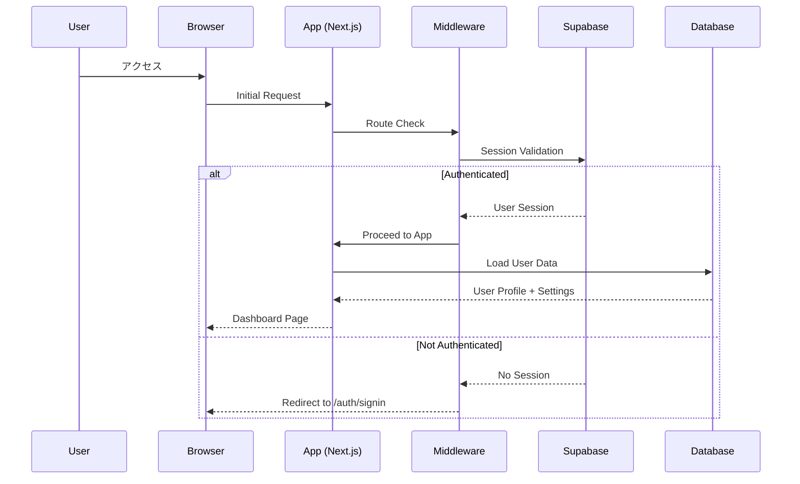
```mermaid
sequenceDiagram
    participant U as User
    participant B as Browser
    participant A as App (Next.js)
    participant M as Middleware
    participant S as Supabase
    participant D as Database

    U->>B: アクセス
    B->>A: Initial Request
    A->>M: Route Check
    M->>S: Session Validation
    
    alt Authenticated
        S-->>M: User Session
        M->>A: Proceed to App
        A->>D: Load User Data
        D-->>A: User Profile + Settings
        A-->>B: Dashboard Page
    else Not Authenticated
        S-->>M: No Session
        M-->>B: Redirect to /auth/signin
    end
```

## 認証・セッション管理フロー

### サインイン プロセス
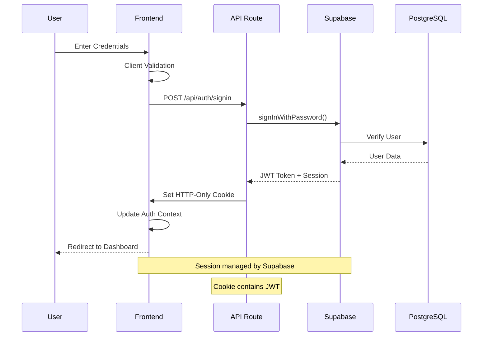
```mermaid
sequenceDiagram
    participant U as User
    participant F as Frontend
    participant API as API Route
    participant S as Supabase
    participant DB as PostgreSQL

    U->>F: Enter Credentials
    F->>F: Client Validation
    F->>API: POST /api/auth/signin
    API->>S: signInWithPassword()
    S->>DB: Verify User
    DB-->>S: User Data
    S-->>API: JWT Token + Session
    API->>F: Set HTTP-Only Cookie
    F->>F: Update Auth Context
    F-->>U: Redirect to Dashboard
    
    Note over F,S: Session managed by Supabase
    Note over API: Cookie contains JWT
```

### 認証状態の維持
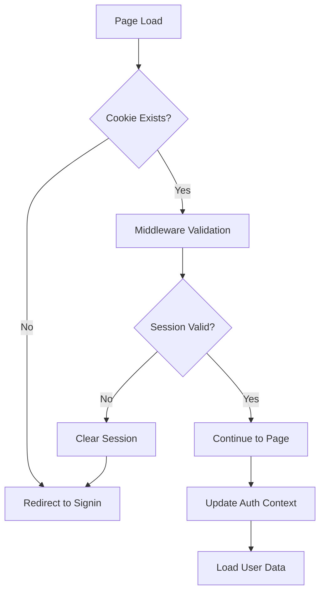
```mermaid
flowchart TD
    A[Page Load] --> B{Cookie Exists?}
    B -->|Yes| C[Middleware Validation]
    B -->|No| D[Redirect to Signin]
    C --> E{Session Valid?}
    E -->|Yes| F[Continue to Page]
    E -->|No| G[Clear Session]
    G --> D
    F --> H[Update Auth Context]
    H --> I[Load User Data]
```

## CRUD操作のデータフロー

### ルーチン作成フロー
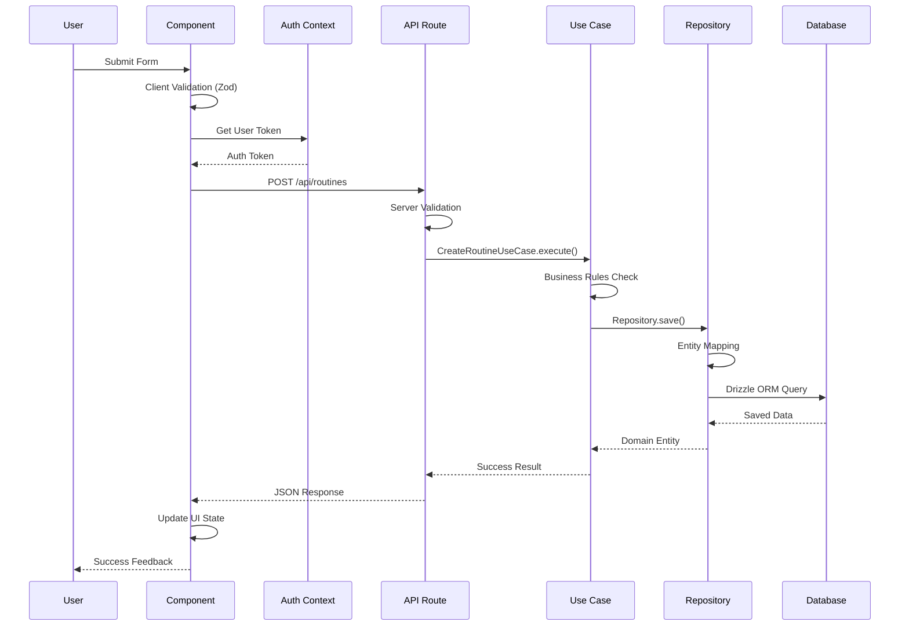
```mermaid
sequenceDiagram
    participant U as User
    participant C as Component
    participant AC as Auth Context
    participant API as API Route
    participant UC as Use Case
    participant R as Repository
    participant DB as Database

    U->>C: Submit Form
    C->>C: Client Validation (Zod)
    C->>AC: Get User Token
    AC-->>C: Auth Token
    C->>API: POST /api/routines
    API->>API: Server Validation
    API->>UC: CreateRoutineUseCase.execute()
    UC->>UC: Business Rules Check
    UC->>R: Repository.save()
    R->>R: Entity Mapping
    R->>DB: Drizzle ORM Query
    DB-->>R: Saved Data
    R-->>UC: Domain Entity
    UC-->>API: Success Result
    API-->>C: JSON Response
    C->>C: Update UI State
    C-->>U: Success Feedback
```

### データ取得フロー
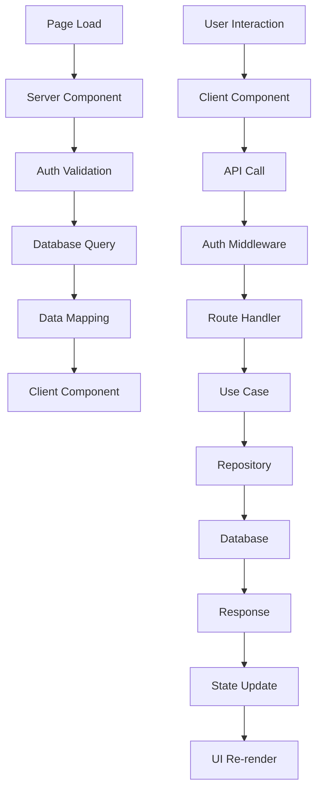
```mermaid
flowchart TD
    A[Page Load] --> B[Server Component]
    B --> C[Auth Validation]
    C --> D[Database Query]
    D --> E[Data Mapping]
    E --> F[Client Component]
    
    G[User Interaction] --> H[Client Component]
    H --> I[API Call]
    I --> J[Auth Middleware]
    J --> K[Route Handler]
    K --> L[Use Case]
    L --> M[Repository]
    M --> N[Database]
    N --> O[Response]
    O --> P[State Update]
    P --> Q[UI Re-render]
```

## ゲーミフィケーション データフロー

### ルーチン実行→XP獲得フロー
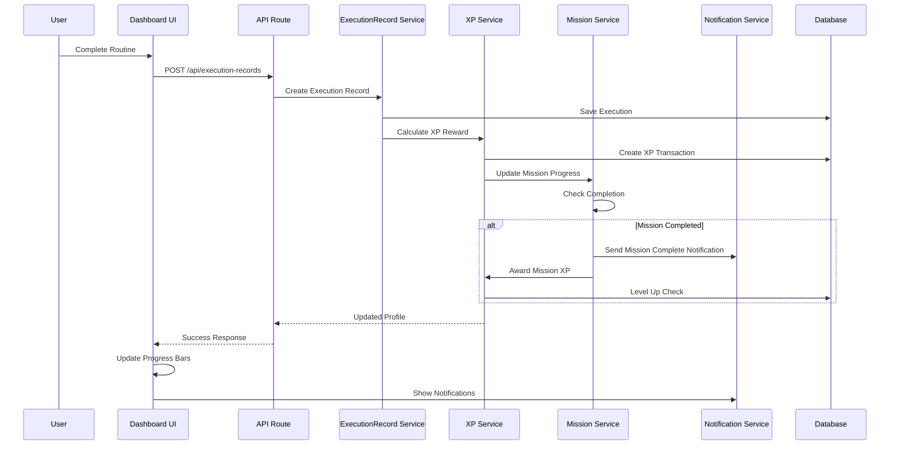
```mermaid
sequenceDiagram
    participant U as User
    participant UI as Dashboard UI
    participant API as API Route
    participant ER as ExecutionRecord Service
    participant XP as XP Service
    participant M as Mission Service
    participant N as Notification Service
    participant DB as Database

    U->>UI: Complete Routine
    UI->>API: POST /api/execution-records
    API->>ER: Create Execution Record
    ER->>DB: Save Execution
    ER->>XP: Calculate XP Reward
    XP->>DB: Create XP Transaction
    XP->>M: Update Mission Progress
    M->>M: Check Completion
    
    alt Mission Completed
        M->>N: Send Mission Complete Notification
        M->>XP: Award Mission XP
        XP->>DB: Level Up Check
    end
    
    XP-->>API: Updated Profile
    API-->>UI: Success Response
    UI->>UI: Update Progress Bars
    UI->>N: Show Notifications
```

### レベルアップフロー
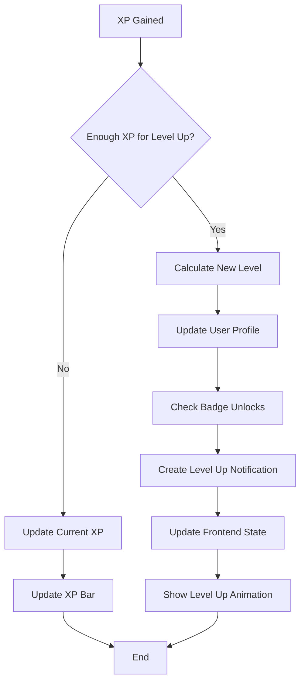
```mermaid
flowchart TD
    A[XP Gained] --> B{Enough XP for Level Up?}
    B -->|Yes| C[Calculate New Level]
    B -->|No| D[Update Current XP]
    C --> E[Update User Profile]
    E --> F[Check Badge Unlocks]
    F --> G[Create Level Up Notification]
    G --> H[Update Frontend State]
    D --> I[Update XP Bar]
    H --> J[Show Level Up Animation]
    I --> K[End]
    J --> K
```

## 状態管理フロー

### React Context State Flow
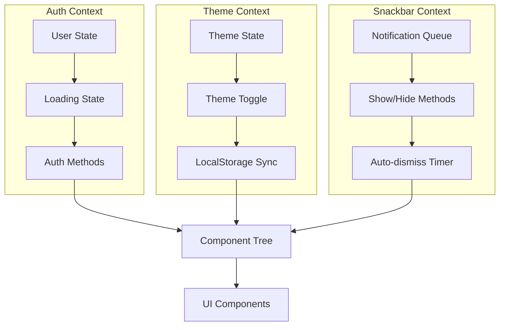
```mermaid
flowchart TD
    subgraph "Auth Context"
        A1[User State] --> A2[Loading State]
        A2 --> A3[Auth Methods]
    end
    
    subgraph "Theme Context"
        B1[Theme State] --> B2[Theme Toggle]
        B2 --> B3[LocalStorage Sync]
    end
    
    subgraph "Snackbar Context"
        C1[Notification Queue] --> C2[Show/Hide Methods]
        C2 --> C3[Auto-dismiss Timer]
    end
    
    A3 --> D[Component Tree]
    B3 --> D
    C3 --> D
    D --> E[UI Components]
```

### サーバーサイド状態とクライアントサイド状態の同期
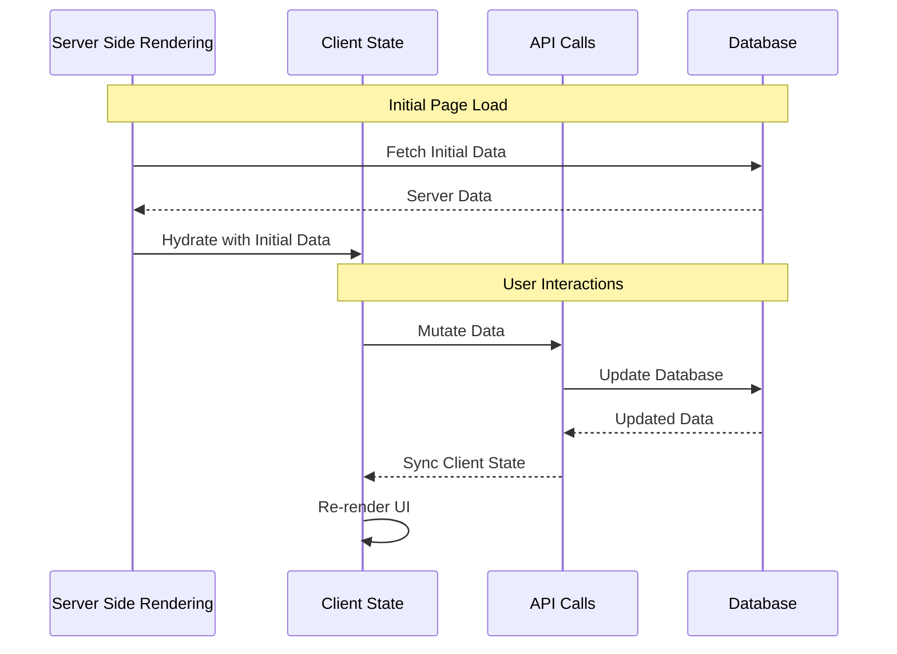
```mermaid
sequenceDiagram
    participant SSR as Server Side Rendering
    participant CS as Client State
    participant API as API Calls
    participant DB as Database

    Note over SSR,DB: Initial Page Load
    SSR->>DB: Fetch Initial Data
    DB-->>SSR: Server Data
    SSR->>CS: Hydrate with Initial Data
    
    Note over CS,DB: User Interactions
    CS->>API: Mutate Data
    API->>DB: Update Database
    DB-->>API: Updated Data
    API-->>CS: Sync Client State
    CS->>CS: Re-render UI
```

## エラーハンドリング フロー

### API エラーハンドリング
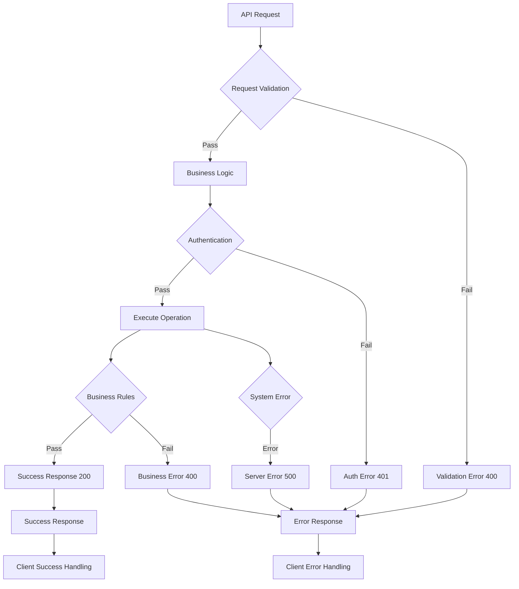
```mermaid
flowchart TD
    A[API Request] --> B{Request Validation}
    B -->|Pass| C[Business Logic]
    B -->|Fail| D[Validation Error 400]
    C --> E{Authentication}
    E -->|Pass| F[Execute Operation]
    E -->|Fail| G[Auth Error 401]
    F --> H{Business Rules}
    H -->|Pass| I[Success Response 200]
    H -->|Fail| J[Business Error 400]
    F --> K{System Error}
    K -->|Error| L[Server Error 500]
    
    D --> M[Error Response]
    G --> M
    J --> M
    L --> M
    I --> N[Success Response]
    M --> O[Client Error Handling]
    N --> P[Client Success Handling]
```

### クライアントサイド エラーハンドリング
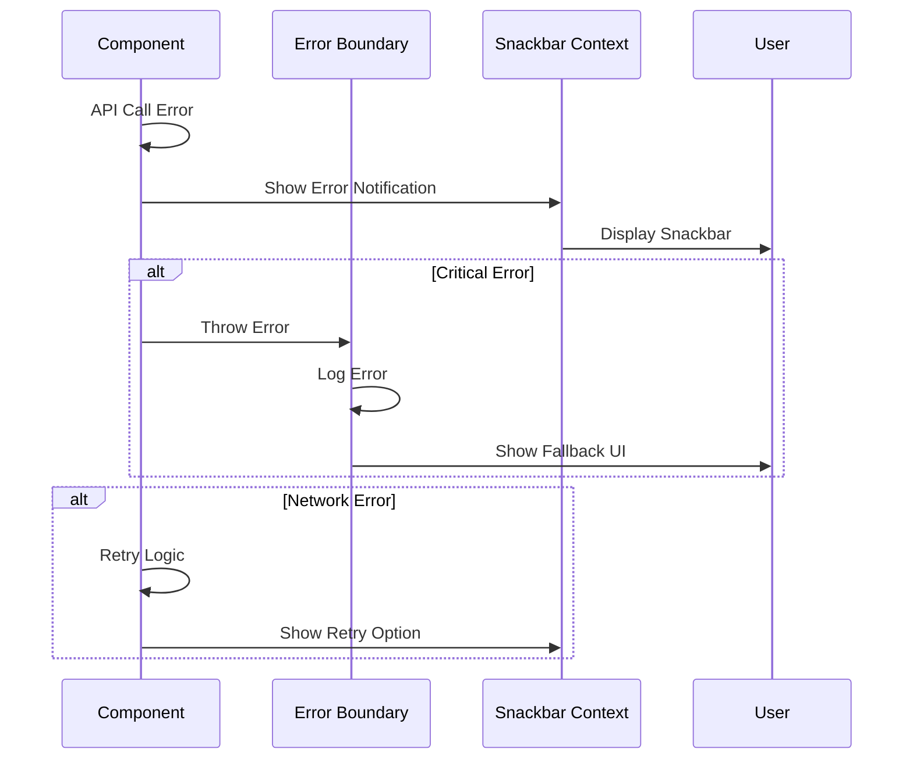
```mermaid
sequenceDiagram
    participant C as Component
    participant E as Error Boundary
    participant S as Snackbar Context
    participant U as User

    C->>C: API Call Error
    C->>S: Show Error Notification
    S->>U: Display Snackbar
    
    alt Critical Error
        C->>E: Throw Error
        E->>E: Log Error
        E->>U: Show Fallback UI
    end
    
    alt Network Error
        C->>C: Retry Logic
        C->>S: Show Retry Option
    end
```

## リアルタイム データ同期

### Supabase Realtime (将来拡張)
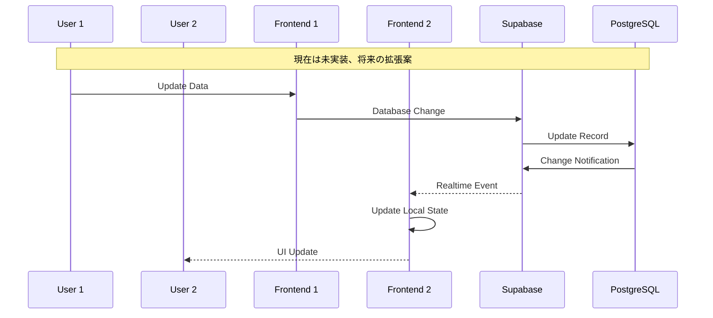
```mermaid
sequenceDiagram
    participant U1 as User 1
    participant U2 as User 2
    participant F1 as Frontend 1
    participant F2 as Frontend 2
    participant S as Supabase
    participant DB as PostgreSQL

    Note over U1,DB: 現在は未実装、将来の拡張案
    
    U1->>F1: Update Data
    F1->>S: Database Change
    S->>DB: Update Record
    DB->>S: Change Notification
    S-->>F2: Realtime Event
    F2->>F2: Update Local State
    F2-->>U2: UI Update
```

## パフォーマンス最適化フロー

### データローディング戦略
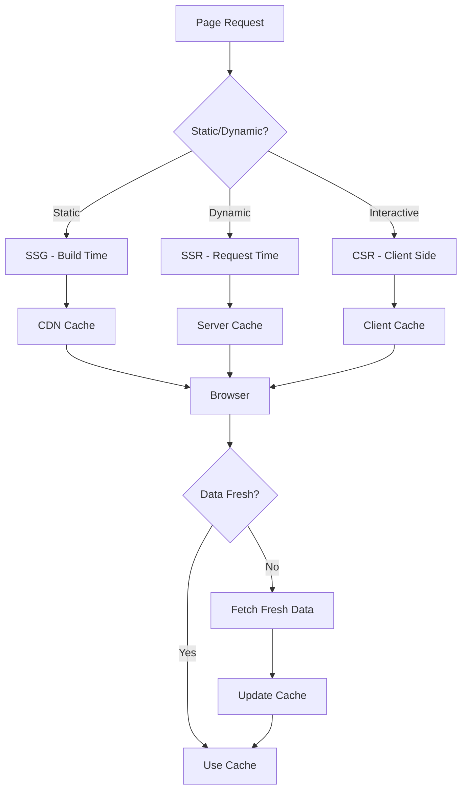
```mermaid
flowchart TD
    A[Page Request] --> B{Static/Dynamic?}
    B -->|Static| C[SSG - Build Time]
    B -->|Dynamic| D[SSR - Request Time]
    B -->|Interactive| E[CSR - Client Side]
    
    C --> F[CDN Cache]
    D --> G[Server Cache]
    E --> H[Client Cache]
    
    F --> I[Browser]
    G --> I
    H --> I
    
    I --> J{Data Fresh?}
    J -->|Yes| K[Use Cache]
    J -->|No| L[Fetch Fresh Data]
    L --> M[Update Cache]
    M --> K
```

### 画像・アセット最適化
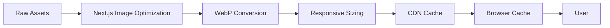
```mermaid
flowchart LR
    A[Raw Assets] --> B[Next.js Image Optimization]
    B --> C[WebP Conversion]
    C --> D[Responsive Sizing]
    D --> E[CDN Cache]
    E --> F[Browser Cache]
    F --> G[User]
```

## 開発・デプロイメント フロー

### 開発環境データフロー
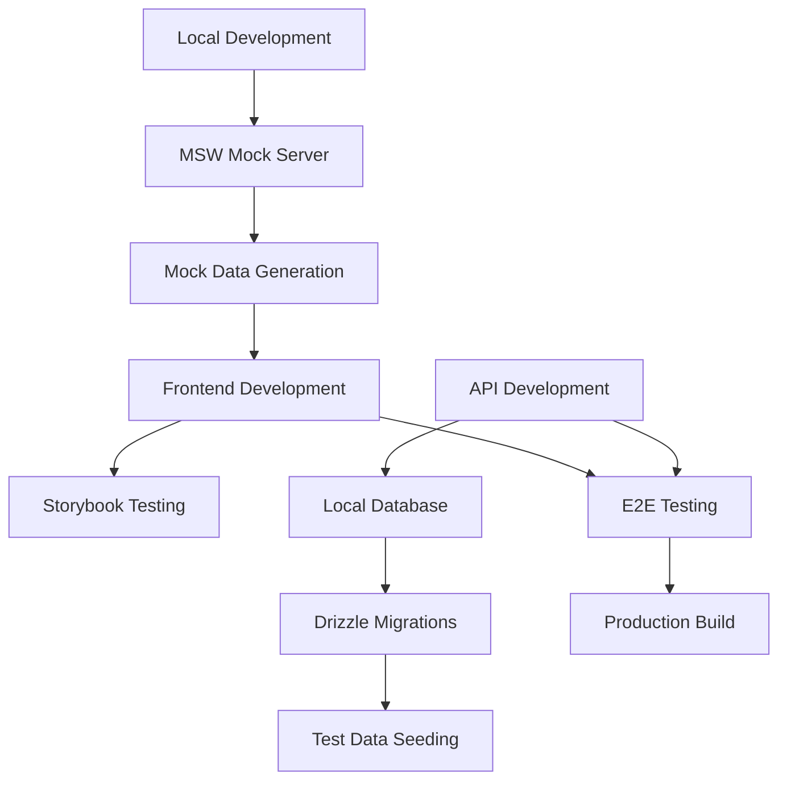
```mermaid
flowchart TD
    A[Local Development] --> B[MSW Mock Server]
    B --> C[Mock Data Generation]
    C --> D[Frontend Development]
    D --> E[Storybook Testing]
    
    F[API Development] --> G[Local Database]
    G --> H[Drizzle Migrations]
    H --> I[Test Data Seeding]
    
    D --> J[E2E Testing]
    F --> J
    J --> K[Production Build]
```

### プロダクションデプロイフロー
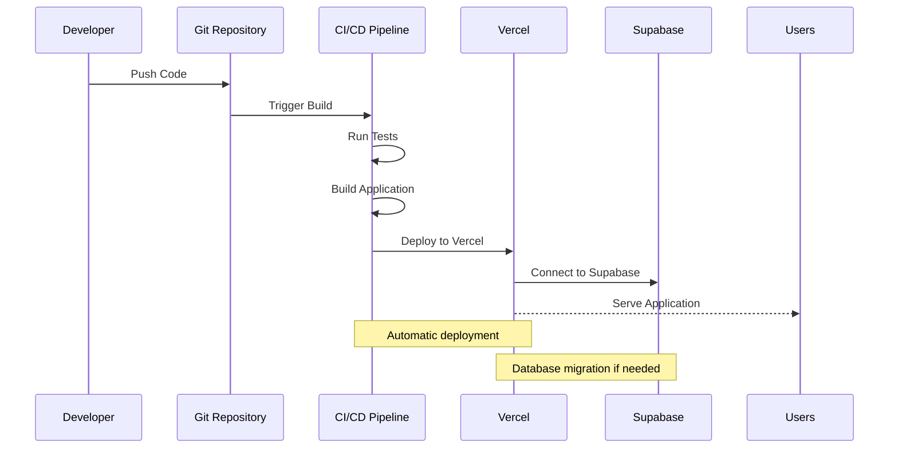
```mermaid
sequenceDiagram
    participant D as Developer
    participant G as Git Repository
    participant CI as CI/CD Pipeline
    participant V as Vercel
    participant S as Supabase
    participant U as Users

    D->>G: Push Code
    G->>CI: Trigger Build
    CI->>CI: Run Tests
    CI->>CI: Build Application
    CI->>V: Deploy to Vercel
    V->>S: Connect to Supabase
    V-->>U: Serve Application
    
    Note over CI,V: Automatic deployment
    Note over V,S: Database migration if needed
```

## データ永続化フロー

### Drizzle ORM データマッピング
```mermaid
flowchart TD
    A[Domain Entity] --> B[toPersistence()]
    B --> C[Plain Object]
    C --> D[Drizzle Query]
    D --> E[PostgreSQL]
    
    F[PostgreSQL] --> G[Drizzle Result]
    G --> H[Plain Object]
    H --> I[fromPersistence()]
    I --> J[Domain Entity]
    
    subgraph "Write Path"
        A --> B --> C --> D --> E
    end
    
    subgraph "Read Path"
        F --> G --> H --> I --> J
    end
```

### トランザクション管理
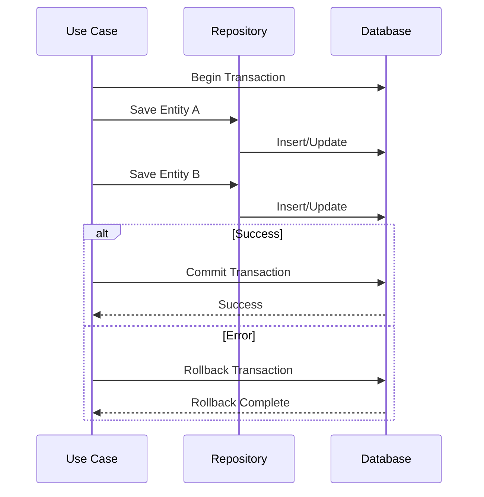
```mermaid
sequenceDiagram
    participant UC as Use Case
    participant R as Repository
    participant DB as Database

    UC->>DB: Begin Transaction
    UC->>R: Save Entity A
    R->>DB: Insert/Update
    UC->>R: Save Entity B
    R->>DB: Insert/Update
    
    alt Success
        UC->>DB: Commit Transaction
        DB-->>UC: Success
    else Error
        UC->>DB: Rollback Transaction
        DB-->>UC: Rollback Complete
    end
```

## セキュリティ データフロー

### Row Level Security (RLS)
```mermaid
flowchart TD
    A[API Request] --> B[Extract User ID]
    B --> C[Database Query]
    C --> D[RLS Policy Check]
    D --> E{User Authorized?}
    E -->|Yes| F[Return Data]
    E -->|No| G[Return Empty/Error]
    
    subgraph "PostgreSQL RLS"
        H[Policy: user_id = auth.uid()]
        I[Automatic Filtering]
        D --> H --> I --> E
    end
```

### セッション・トークン検証
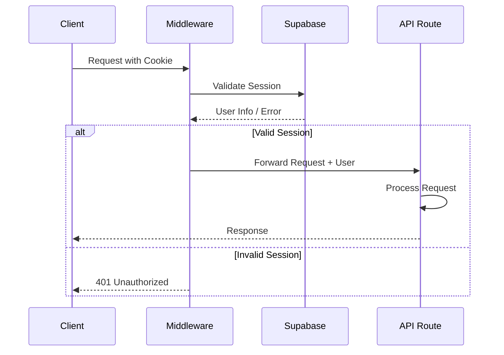
```mermaid
sequenceDiagram
    participant C as Client
    participant M as Middleware
    participant S as Supabase
    participant API as API Route

    C->>M: Request with Cookie
    M->>S: Validate Session
    S-->>M: User Info / Error
    
    alt Valid Session
        M->>API: Forward Request + User
        API->>API: Process Request
        API-->>C: Response
    else Invalid Session
        M-->>C: 401 Unauthorized
    end
```

---

## データフロー最適化の推奨事項

### 短期改善
1. **キャッシュ層追加**: Redis でセッション・頻繁なクエリをキャッシュ
2. **Connection Pooling**: データベース接続の効率化
3. **API Response Caching**: Next.js Cache API活用

### 中期改善
1. **CDN活用**: 静的アセットの配信最適化
2. **Background Jobs**: 重い処理の非同期化
3. **Real-time Features**: WebSocket/Server-Sent Events

### 長期改善
1. **Microservices**: API層の分離とスケーリング
2. **Event Sourcing**: ゲーミフィケーションイベントの追跡
3. **CQRS**: 読み取り/書き込みの分離