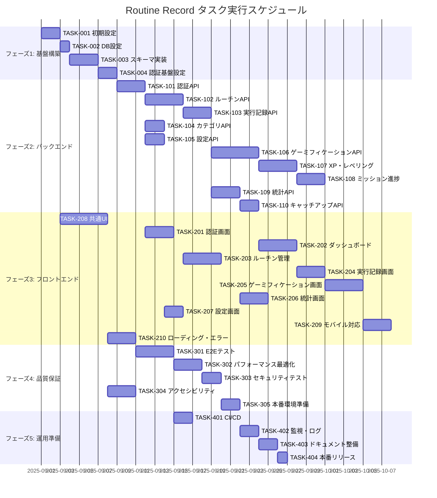

# Routine Record 実装タスク

## 概要

**全タスク数**: 47  
**推定作業時間**: 120-150時間  
**クリティカルパス**: TASK-001 → TASK-002 → TASK-003 → TASK-101 → TASK-102 → TASK-201 → TASK-202 → TASK-301  
**並行実行可能**: フロントエンド（TASK-201-210）とバックエンド（TASK-101-110）の一部  

## タスク一覧

### フェーズ1: 基盤構築

#### TASK-001: プロジェクト初期設定

- [x] **タスク完了**
- **タスクタイプ**: DIRECT
- **要件リンク**: アーキテクチャ設計全般
- **依存タスク**: なし
- **実装詳細**:
  - Next.js 15.4.5 プロジェクト初期化
  - TypeScript strict mode 設定
  - ESLint + Prettier 設定
  - Tailwind CSS 4.x 設定
  - package.json 依存関係設定
- **完了条件**:
  - [ ] Next.js プロジェクトが正常起動
  - [ ] TypeScript strict mode が有効
  - [ ] Linting/Formatting が正常動作
  - [ ] 基本ページが表示される

#### TASK-002: データベース設定

- [x] **タスク完了**
- **タスクタイプ**: DIRECT
- **要件リンク**: REQ-401 (データプライバシー)
- **依存タスク**: TASK-001
- **実装詳細**:
  - Supabase プロジェクト作成・設定
  - Drizzle ORM セットアップ
  - 環境変数設定 (.env.local)
  - データベース接続確認
- **テスト要件**:
  - [ ] データベース接続テスト
  - [ ] 環境変数読み込みテスト
- **完了条件**:
  - [ ] Supabase プロジェクトが作成済み
  - [ ] Drizzle ORM が正常に接続
  - [ ] 環境変数が正しく設定済み

#### TASK-003: データベーススキーマ実装

- [x] **タスク完了**
- **タスクタイプ**: DIRECT
- **要件リンク**: データベース設計全般
- **依存タスク**: TASK-002
- **実装詳細**:
  - Drizzle スキーマ定義 (17テーブル)
  - ENUM 型定義
  - 外部キー制約・インデックス設定
  - RLS ポリシー実装
  - 初期データ投入
- **テスト要件**:
  - [ ] スキーマ作成テスト
  - [ ] RLS ポリシーテスト
  - [ ] 初期データ確認テスト
- **完了条件**:
  - [ ] 17テーブルが正常に作成
  - [ ] RLS ポリシーが適用済み
  - [ ] 初期バッジ・ミッションが投入済み

#### TASK-004: 認証基盤設定

- [x] **タスク完了**
- **タスクタイプ**: DIRECT
- **要件リンク**: REQ-001 (ユーザー認証)
- **依存タスク**: TASK-003
- **実装詳細**:
  - Supabase Auth 設定
  - Next.js middleware 認証チェック実装
  - セッション管理設定
  - 認証コンテキスト基盤作成
- **テスト要件**:
  - [ ] 認証ミドルウェアテスト
  - [ ] セッション管理テスト
- **完了条件**:
  - [ ] Supabase Auth が正常動作
  - [ ] 認証ミドルウェアが正常動作
  - [ ] セッション管理が正常動作

### フェーズ2: バックエンドAPI実装

#### TASK-101: 認証API実装

- [x] **タスク完了**
- **タスクタイプ**: TDD
- **要件リンク**: REQ-001 (ユーザー認証)
- **依存タスク**: TASK-004
- **実装詳細**:
  - POST /api/auth/signin 実装
  - POST /api/auth/signup 実装
  - POST /api/auth/signout 実装
  - バリデーション・エラーハンドリング
  - HTTPOnly Cookie 設定
- **テスト要件**:
  - [ ] 単体テスト: 認証ロジック
  - [ ] 統合テスト: サインイン/サインアップ/サインアウト
  - [ ] セキュリティテスト: トークン検証・Cookie設定
- **エラーハンドリング**:
  - [ ] 無効な認証情報
  - [ ] 重複メールアドレス
  - [ ] ネットワークエラー
- **完了条件**:
  - [ ] 全認証エンドポイントが正常動作
  - [ ] セキュリティテストに合格
  - [ ] エラーハンドリングが適切

#### TASK-102: ルーチン管理API実装

- [x] **タスク完了**
- **タスクタイプ**: TDD
- **要件リンク**: REQ-002 (ルーチン作成), REQ-101 (頻度ベース検証), REQ-102 (実行制限)
- **依存タスク**: TASK-101
- **実装詳細**:
  - GET /api/routines 実装
  - POST /api/routines 実装（頻度ベース検証含む）
  - GET /api/routines/[id] 実装
  - PUT /api/routines/[id] 実装
  - DELETE /api/routines/[id] 実装（論理削除）
  - PATCH /api/routines/[id] 実装（復元）
- **テスト要件**:
  - [ ] 単体テスト: ルーチン CRUD ロジック
  - [ ] 統合テスト: API エンドポイント全体
  - [ ] バリデーションテスト: REQ-101 頻度ベース検証
  - [ ] セキュリティテスト: RLS によるデータ分離
- **エラーハンドリング**:
  - [ ] バリデーションエラー（REQ-404 文字数制限）
  - [ ] 権限エラー（他ユーザーのデータアクセス）
  - [ ] リソース未発見エラー
- **完了条件**:
  - [ ] 全ルーチン管理エンドポイントが動作
  - [ ] REQ-101 頻度ベース検証が正常動作
  - [ ] RLS による適切なデータ分離

#### TASK-103: 実行記録API実装

- [x] **タスク完了**
- **タスクタイプ**: TDD
- **要件リンク**: REQ-003 (実行記録), REQ-102 (実行制限)
- **依存タスク**: TASK-102
- **実装詳細**:
  - GET /api/execution-records 実装
  - POST /api/execution-records 実装（アクティブ制限含む）
  - PUT /api/execution-records/[id] 実装
  - DELETE /api/execution-records/[id] 実装
- **テスト要件**:
  - [ ] 単体テスト: 実行記録 CRUD ロジック
  - [ ] 統合テスト: ルーチン状態チェック
  - [ ] ビジネスルールテスト: REQ-102 非アクティブ制限
- **エラーハンドリング**:
  - [ ] 非アクティブルーチンエラー
  - [ ] 不正な日時データエラー
  - [ ] 権限エラー
- **完了条件**:
  - [ ] 実行記録管理が正常動作
  - [ ] REQ-102 実行制限が正常動作
  - [ ] データ整合性が保証

#### TASK-104: カテゴリ管理API実装

- [x] **タスク完了**
- **タスクタイプ**: TDD
- **要件リンク**: REQ-009 (カテゴリ管理)
- **依存タスク**: TASK-101
- **実装詳細**:
  - GET /api/categories 実装
  - POST /api/categories 実装
  - PUT /api/categories/[id] 実装
  - DELETE /api/categories/[id] 実装
- **テスト要件**:
  - [ ] 単体テスト: カテゴリ CRUD ロジック
  - [ ] 統合テスト: デフォルトカテゴリ処理
  - [ ] バリデーションテスト: 名前一意制約
- **完了条件**:
  - [ ] カテゴリ管理が正常動作
  - [ ] デフォルト機能が正常動作

#### TASK-105: ユーザー設定API実装

- [x] **タスク完了**
- **タスクタイプ**: TDD
- **要件リンク**: REQ-010 (設定管理)
- **依存タスク**: TASK-101
- **実装詳細**:
  - GET /api/user-settings 実装
  - PUT /api/user-settings 実装
- **テスト要件**:
  - [ ] 単体テスト: 設定管理ロジック
  - [ ] 統合テスト: デフォルト値処理
- **完了条件**:
  - [ ] ユーザー設定管理が正常動作

#### TASK-106: ゲーミフィケーションAPI実装

- [x] **タスク完了**
- **タスクタイプ**: TDD
- **要件リンク**: REQ-004 (XP・レベル), REQ-005 (バッジ), REQ-006 (ミッション), REQ-007 (チャレンジ)
- **依存タスク**: TASK-103
- **実装詳細**:
  - GET /api/user-profiles 実装
  - GET /api/missions, /api/user-missions 実装
  - GET /api/challenges, /api/user-challenges 実装
  - POST /api/challenges/[id]/join 実装
  - GET /api/badges, /api/user-badges 実装
  - GET /api/xp-transactions 実装
  - GET /api/game-notifications 実装
- **テスト要件**:
  - [ ] 単体テスト: XP計算ロジック
  - [ ] 統合テスト: レベルアップ処理
  - [ ] 統合テスト: ミッション進捗更新
  - [ ] 統合テスト: バッジ解除処理
  - [ ] 統合テスト: チャレンジ参加処理
- **エラーハンドリング**:
  - [ ] チャレンジ定員超過エラー
  - [ ] 重複参加エラー
  - [ ] XP計算エラー
- **完了条件**:
  - [ ] ゲーミフィケーション機能が完全動作
  - [ ] XP・レベル計算が正確
  - [ ] バッジ・ミッション・チャレンジが正常動作

#### TASK-107: XP計算・レベリングシステム実装

- [x] **タスク完了**
- **タスクタイプ**: TDD
- **要件リンク**: REQ-004 (XP・レベル), REQ-103 (XP獲得通知), REQ-104 (レベルアップ通知)
- **依存タスク**: TASK-103, TASK-106
- **実装詳細**:
  - XPCalculationService 実装
  - レベル計算アルゴリズム実装
  - ボーナスXP計算（ストリーク等）
  - 通知生成システム実装
  - レベルアップ時の特別処理
- **テスト要件**:
  - [ ] 単体テスト: XP計算精度テスト
  - [ ] 単体テスト: レベル計算テスト
  - [ ] 統合テスト: 実行記録→XP→レベルアップフロー
  - [ ] 統合テスト: 通知生成テスト
- **完了条件**:
  - [ ] XP計算が正確
  - [ ] レベルアップが正常動作
  - [ ] 通知が適切に生成

#### TASK-108: ミッション進捗管理システム実装

- [x] **タスク完了**
- **タスクタイプ**: TDD
- **要件リンク**: REQ-006 (ミッションシステム)
- **依存タスク**: TASK-107
- **実装詳細**:
  - MissionProgressService 実装
  - 4種類のミッションタイプ処理（streak/count/variety/consistency）
  - 進捗自動更新システム
  - 完了判定・報酬付与システム
- **テスト要件**:
  - [ ] 単体テスト: 各ミッションタイプ進捗計算
  - [ ] 統合テスト: 実行記録→ミッション進捗更新
  - [ ] 統合テスト: ミッション完了→報酬付与
- **完了条件**:
  - [ ] 4種類のミッションタイプが正常動作
  - [ ] 進捗自動更新が正常動作
  - [ ] 報酬付与が正常動作

#### TASK-109: 統計・分析API実装

- [x] **タスク完了**
- **タスクタイプ**: TDD
- **要件リンク**: 統計機能要件
- **依存タスク**: TASK-103
- **実装詳細**:
  - GET /api/statistics/dashboard 実装
  - GET /api/statistics/routines 実装
  - 週次・月次進捗集計機能
  - カテゴリ別分布計算
  - 完了率・ストリーク計算
- **テスト要件**:
  - [ ] 単体テスト: 統計計算ロジック
  - [ ] 統合テスト: パフォーマンス（大量データ）
  - [ ] 精度テスト: 集計値の正確性
- **完了条件**:
  - [ ] ダッシュボード統計が正常表示
  - [ ] ルーチン分析が正常動作
  - [ ] パフォーマンスが要求水準クリア

#### TASK-110: キャッチアッププランAPI実装

- [x] **タスク完了**
- **タスクタイプ**: TDD
- **要件リンク**: REQ-301 (挽回プラン)
- **依存タスク**: TASK-109
- **実装詳細**:
  - GET /api/catchup-plans 実装
  - POST /api/catchup-plans 実装
  - 進捗分析・目標調整アルゴリズム実装
- **テスト要件**:
  - [ ] 単体テスト: 挽回プラン計算ロジック
  - [ ] 統合テスト: プラン生成→提案
- **完了条件**:
  - [ ] キャッチアッププランが正常動作
  - [ ] 計算アルゴリズムが正確

### フェーズ3: フロントエンド実装

#### TASK-201: 認証画面実装

- [x] **タスク完了**
- **タスクタイプ**: TDD
- **要件リンク**: REQ-001 (ユーザー認証)
- **依存タスク**: TASK-101
- **実装詳細**:
  - SignIn ページ実装 (app/auth/signin/page.tsx)
  - SignUp ページ実装 (app/auth/signup/page.tsx)
  - 認証コンテキスト実装 (AuthContext)
  - フォームバリデーション（Zod）
  - エラー・ローディング状態管理
- **UI/UX要件**:
  - [ ] ローディング状態: ボタン無効化 + スピナー表示
  - [ ] エラー表示: インライン・トースト通知両対応
  - [ ] モバイル対応: レスポンシブデザイン
  - [ ] アクセシビリティ: ARIA属性、キーボード操作、フォーカス管理
- **テスト要件**:
  - [ ] コンポーネントテスト: React Testing Library
  - [ ] E2Eテスト: サインイン・サインアップフロー
  - [ ] アクセシビリティテスト: axe-core
  - [ ] レスポンシブテスト: 複数デバイスサイズ
- **完了条件**:
  - [ ] 認証フローが完全動作
  - [ ] UI/UX要件を全て満たす
  - [ ] テストが全て合格

#### TASK-202: ダッシュボード画面実装

- [x] **タスク完了**
- **タスクタイプ**: TDD
- **要件リンク**: メイン機能統合画面
- **依存タスク**: TASK-106, TASK-109, TASK-201
- **実装詳細**:
  - Dashboard ページ実装 (app/dashboard/page.tsx)
  - 今日の進捗表示コンポーネント
  - XP・レベル・ストリーク表示
  - 最近の実績・通知表示
  - クイックアクション（ルーチン実行）
- **UI/UX要件**:
  - [ ] リアルタイム更新: Server Actions活用
  - [ ] ローディングスケルトン: データ取得中表示
  - [ ] インタラクティブ要素: ホバー・アニメーション
  - [ ] レスポンシブ: モバイル・タブレット・デスクトップ
- **テスト要件**:
  - [ ] コンポーネントテスト: 各表示要素
  - [ ] 統合テスト: データフェッチ→表示
  - [ ] E2Eテスト: メインユーザーフロー
- **完了条件**:
  - [ ] ダッシュボードが完全に機能
  - [ ] パフォーマンスが良好
  - [ ] ユーザビリティが高い

#### TASK-203: ルーチン管理画面実装

- [x] **タスク完了**
- **タスクタイプ**: TDD
- **要件リンク**: REQ-002 (ルーチン作成), REQ-101 (頻度ベース検証)
- **依存タスク**: TASK-102, TASK-104
- **実装詳細**:
  - Routines ページ実装 (app/routines/page.tsx)
  - ルーチン一覧表示コンポーネント
  - ルーチン作成・編集フォーム
  - カテゴリフィルター機能
  - ルーチン実行ボタン
- **UI/UX要件**:
  - [ ] フォームバリデーション: リアルタイム検証・エラー表示
  - [ ] 条件分岐UI: 頻度ベース時の追加フィールド表示
  - [ ] 一覧操作: ソート・フィルター・ページネーション
  - [ ] モーダル・ドローワー: 作成・編集画面
- **テスト要件**:
  - [ ] コンポーネントテスト: フォームバリデーション
  - [ ] 統合テスト: CRUD操作フロー
  - [ ] E2Eテスト: ルーチン管理全体フロー
- **完了条件**:
  - [ ] ルーチン管理が完全動作
  - [ ] REQ-101 頻度ベース検証がUI上で動作
  - [ ] 使いやすいUI/UX

#### TASK-204: 実行記録画面実装

- [ ] **タスク完了**
- **タスクタイプ**: TDD
- **要件リンク**: REQ-003 (実行記録)
- **依存タスク**: TASK-103, TASK-107
- **実装詳細**:
  - 実行記録作成・編集モーダル/フォーム
  - 実行履歴一覧表示
  - 実行記録詳細表示
  - XP獲得・レベルアップ通知表示
- **UI/UX要件**:
  - [ ] 即座のフィードバック: 実行後のXP表示・アニメーション
  - [ ] 通知システム: レベルアップ・バッジ獲得の特別表示
  - [ ] 履歴フィルター: 日付範囲・ルーチン別フィルター
  - [ ] 統計表示: 実行時間・メモの集計表示
- **テスト要件**:
  - [ ] コンポーネントテスト: フォーム・通知コンポーネント
  - [ ] 統合テスト: 実行記録→XP→通知フロー
  - [ ] E2Eテスト: 実行記録全体フロー
- **完了条件**:
  - [ ] 実行記録機能が完全動作
  - [ ] ゲーミフィケーション連携が正常
  - [ ] 通知表示が適切

#### TASK-205: ゲーミフィケーション画面実装

- [ ] **タスク完了**
- **タスクタイプ**: TDD
- **要件リンク**: REQ-005 (バッジ), REQ-006 (ミッション), REQ-007 (チャレンジ)
- **依存タスク**: TASK-106, TASK-108
- **実装詳細**:
  - バッジコレクション画面 (app/badges/page.tsx)
  - ミッション一覧画面 (app/missions/page.tsx)
  - チャレンジ画面 (app/challenges/page.tsx)
  - プロフィール・統計画面 (app/profile/page.tsx)
- **UI/UX要件**:
  - [ ] ビジュアル重視: バッジ・レベル表示のアニメーション
  - [ ] 進捗表示: プログレスバー・達成率表示
  - [ ] インタラクション: チャレンジ参加・離脱ボタン
  - [ ] ソーシャル要素: ランキング表示（将来拡張）
- **テスト要件**:
  - [ ] コンポーネントテスト: バッジ・ミッション・チャレンジ表示
  - [ ] 統合テスト: チャレンジ参加フロー
  - [ ] ビジュアルテスト: アニメーション・レスポンシブ
- **完了条件**:
  - [ ] 全ゲーミフィケーション画面が動作
  - [ ] 魅力的なUI/UX
  - [ ] パフォーマンスが良好

#### TASK-206: 統計・分析画面実装

- [ ] **タスク完了**
- **タスクタイプ**: TDD
- **要件リンク**: 統計分析機能
- **依存タスク**: TASK-109
- **実装詳細**:
  - 統計画面 (app/statistics/page.tsx)
  - カレンダー画面 (app/calendar/page.tsx)
  - チャート・グラフコンポーネント実装
  - 期間選択・フィルター機能
- **UI/UX要件**:
  - [ ] データビジュアライゼーション: Chart.js or Recharts活用
  - [ ] インタラクティブ: ドリルダウン・期間変更
  - [ ] レスポンシブチャート: モバイル対応グラフ表示
  - [ ] エクスポート機能: CSV・画像出力（将来拡張）
- **テスト要件**:
  - [ ] コンポーネントテスト: チャート表示
  - [ ] 統合テスト: データ取得→グラフ表示
  - [ ] パフォーマンステスト: 大量データ表示
- **完了条件**:
  - [ ] 統計・分析画面が完全動作
  - [ ] 視覚的に分かりやすいデータ表示
  - [ ] レスポンシブ対応

#### TASK-207: 設定画面実装

- [ ] **タスク完了**
- **タスクタイプ**: TDD
- **要件リンク**: REQ-010 (設定管理)
- **依存タスク**: TASK-105
- **実装詳細**:
  - 設定画面 (app/settings/page.tsx)
  - テーマ切り替え機能
  - 言語切り替え機能
  - 時刻フォーマット設定
  - プロフィール編集機能
- **UI/UX要件**:
  - [ ] リアルタイム反映: テーマ・言語変更の即座適用
  - [ ] 設定保存フィードバック: 保存完了通知
  - [ ] 設定リセット: デフォルト値復元機能
  - [ ] 設定カテゴリ: タブ・セクション分け
- **テスト要件**:
  - [ ] コンポーネントテスト: 設定変更機能
  - [ ] 統合テスト: 設定保存→反映フロー
  - [ ] E2Eテスト: 設定変更の永続化
- **完了条件**:
  - [ ] 設定機能が完全動作
  - [ ] 変更が適切に保存・反映
  - [ ] 使いやすいUI

#### TASK-208: 共通UIコンポーネント実装

- [x] **タスク完了**
- **タスクタイプ**: TDD
- **要件リンク**: UI/UX統一性
- **依存タスク**: TASK-001
- **実装詳細**:
  - デザインシステム基盤構築
  - 共通コンポーネント実装（Button, Modal, Toast等）
  - レイアウトコンポーネント（Header, Sidebar, Navigation）
  - テーマ・ダークモード対応
- **UI/UX要件**:
  - [ ] 一貫性: 統一されたデザインシステム
  - [ ] アクセシビリティ: WCAG 2.1 AA準拠
  - [ ] アニメーション: 適切なマイクロインタラクション
  - [ ] レスポンシブ: 全デバイス対応
- **テスト要件**:
  - [ ] Storybook: 全コンポーネントのドキュメント化
  - [ ] Visual Regression Testing: UI一貫性チェック
  - [ ] アクセシビリティテスト: 自動化チェック
- **完了条件**:
  - [ ] 全共通コンポーネント実装済み
  - [ ] デザインシステムが確立
  - [ ] Storybookドキュメント完備

#### TASK-209: モバイル対応最適化

- [ ] **タスク完了**
- **タスクタイプ**: TDD
- **要件リンク**: NFR-201 (レスポンシブデザイン)
- **依存タスク**: TASK-202, TASK-203, TASK-204, TASK-205, TASK-206
- **実装詳細**:
  - モバイルファーストレスポンシブ対応
  - タッチ操作最適化
  - PWA対応（基本機能）
  - パフォーマンス最適化
- **UI/UX要件**:
  - [ ] タッチターゲット: 44px以上のタップエリア
  - [ ] ナビゲーション: モバイル用ハンバーガーメニュー
  - [ ] 入力最適化: モバイルキーボード対応
  - [ ] 表示最適化: 小画面でのデータ表示
- **テスト要件**:
  - [ ] レスポンシブテスト: 複数デバイスサイズ
  - [ ] タッチ操作テスト: 実機テスト
  - [ ] パフォーマンステスト: モバイル環境
- **完了条件**:
  - [ ] 全画面でモバイル対応完了
  - [ ] タッチ操作が快適
  - [ ] モバイルパフォーマンスが良好

#### TASK-210: ローディング・エラー状態実装

- [ ] **タスク完了**
- **タスクタイプ**: TDD
- **要件リンク**: UX品質要件
- **依存タスク**: TASK-208
- **実装詳細**:
  - ローディング状態管理システム
  - エラー境界（Error Boundary）実装
  - オフライン状態検知・表示
  - リトライ機能実装
- **UI/UX要件**:
  - [ ] スケルトンローディング: コンテンツ形状に合わせた表示
  - [ ] エラー回復: ユーザビリティの高いエラー処理
  - [ ] オフライン対応: 基本的なオフライン表示
  - [ ] 進捗フィードバック: 長時間処理の進捗表示
- **テスト要件**:
  - [ ] エラーシナリオテスト: ネットワークエラー等
  - [ ] ローディングテスト: 各種ローディング状態
  - [ ] 回復テスト: エラーからの回復フロー
- **完了条件**:
  - [ ] 全画面でローディング・エラー状態対応
  - [ ] ユーザビリティが高いエラー処理
  - [ ] 堅牢なアプリケーション

### フェーズ4: 統合・品質保証

#### TASK-301: E2Eテストスイート実装

- [ ] **タスク完了**
- **タスクタイプ**: TDD
- **要件リンク**: 品質保証全般
- **依存タスク**: TASK-210
- **実装詳細**:
  - Playwright テスト環境セットアップ
  - 主要ユーザーフローE2Eテスト実装
  - 認証フローE2Eテスト
  - ルーチン管理フローE2Eテスト
  - ゲーミフィケーションフローE2Eテスト
- **テスト要件**:
  - [ ] クリティカルパステスト: メインユーザージャーニー
  - [ ] 回帰テスト: 主要機能の動作確認
  - [ ] クロスブラウザテスト: Chrome/Firefox/Safari
  - [ ] モバイルE2Eテスト: 実機・エミュレーター
- **完了条件**:
  - [ ] 全主要フローがE2Eテスト済み
  - [ ] CI/CD統合済み
  - [ ] テスト実行時間が適切

#### TASK-302: パフォーマンス最適化

- [ ] **タスク完了**
- **タスクタイプ**: TDD
- **要件リンク**: NFR-001,002,003 (パフォーマンス要件)
- **依存タスク**: TASK-301
- **実装詳細**:
  - Core Web Vitals最適化
  - バンドルサイズ最適化
  - データベースクエリ最適化
  - 画像・アセット最適化
  - キャッシュ戦略実装
- **テスト要件**:
  - [ ] Lighthouse監査: 全ページスコア90+
  - [ ] Core Web Vitals: LCP/FID/CLS最適化
  - [ ] ロードテスト: API応答時間500ms以内
  - [ ] メモリリークテスト: 長時間使用の安定性
- **完了条件**:
  - [ ] パフォーマンス要件全て満たす
  - [ ] Core Web Vitalsが良好
  - [ ] メモリ使用量が適切

#### TASK-303: セキュリティテスト・監査

- [ ] **タスク完了**
- **タスクタイプ**: TDD
- **要件リンク**: NFR-101,102,103,104 (セキュリティ要件)
- **依存タスク**: TASK-302
- **実装詳細**:
  - セキュリティスキャン実行
  - 脆弱性診断
  - 認証・認可テスト
  - データ保護テスト
  - OWASP Top 10対策確認
- **テスト要件**:
  - [ ] 認証バイパステスト: 未認証アクセス防止確認
  - [ ] SQLインジェクションテスト: ORM保護確認
  - [ ] XSSテスト: 入力値サニタイゼーション確認
  - [ ] CSRFテスト: Next.js保護確認
- **完了条件**:
  - [ ] セキュリティテスト全て合格
  - [ ] 脆弱性ゼロ確認
  - [ ] OWASP Top 10対策済み

#### TASK-304: アクセシビリティテスト・改善

- [ ] **タスク完了**
- **タスクタイプ**: TDD
- **要件リンク**: NFR-202 (アクセシビリティ)
- **依存タスク**: TASK-208
- **実装詳細**:
  - WCAG 2.1 AA準拠確認
  - スクリーンリーダーテスト
  - キーボードナビゲーションテスト
  - 色覚対応テスト
  - 自動化アクセシビリティテスト導入
- **テスト要件**:
  - [ ] axe-core自動テスト: 全ページエラーゼロ
  - [ ] スクリーンリーダーテスト: NVDA/JAWS/VoiceOver
  - [ ] キーボードテスト: Tab/Enter/Escナビゲーション
  - [ ] コントラストテスト: 色覚対応確認
- **完了条件**:
  - [ ] WCAG 2.1 AA準拠確認済み
  - [ ] アクセシビリティテスト全て合格
  - [ ] 支援技術での利用が可能

#### TASK-305: 本番環境デプロイメント準備

- [ ] **タスク完了**
- **タスクタイプ**: DIRECT
- **要件リンク**: 運用要件全般
- **依存タスク**: TASK-303, TASK-304
- **実装詳細**:
  - 本番環境設定（Vercel + Supabase）
  - 環境変数設定
  - ドメイン・SSL設定
  - 監視・ログ設定
  - バックアップ設定確認
- **テスト要件**:
  - [ ] 本番環境動作テスト: 全機能確認
  - [ ] SSL証明書テスト: HTTPS動作確認
  - [ ] 監視テスト: エラー検知確認
  - [ ] バックアップテスト: データ復元確認
- **完了条件**:
  - [ ] 本番環境が正常動作
  - [ ] 監視・ログが正常動作
  - [ ] バックアップが正常動作

### フェーズ5: 運用・保守準備

#### TASK-401: CI/CDパイプライン構築

- [ ] **タスク完了**
- **タスクタイプ**: DIRECT
- **要件リンク**: 開発効率・品質保証
- **依存タスク**: TASK-301
- **実装詳細**:
  - GitHub Actions ワークフロー作成
  - 自動テスト実行設定
  - 自動デプロイ設定
  - コード品質チェック自動化
- **テスト要件**:
  - [ ] パイプライン動作テスト: 全フロー確認
  - [ ] 失敗時動作テスト: エラー検知・通知
  - [ ] デプロイテスト: 自動デプロイ確認
- **完了条件**:
  - [ ] CI/CDが完全自動化
  - [ ] テスト失敗時のデプロイ停止
  - [ ] 品質ゲートが機能

#### TASK-402: 監視・ログシステム設定

- [ ] **タスク完了**
- **タスクタイプ**: DIRECT
- **要件リンク**: NFR-301,303 (運用監視)
- **依存タスク**: TASK-305
- **実装詳細**:
  - アプリケーション監視設定
  - エラー追跡システム設定（Sentry等）
  - パフォーマンス監視設定
  - ログ集約・分析設定
- **テスト要件**:
  - [ ] 監視動作テスト: メトリクス収集確認
  - [ ] アラートテスト: 異常時通知確認
  - [ ] ログテスト: 適切なログ出力確認
- **完了条件**:
  - [ ] 監視システムが正常動作
  - [ ] アラートが適切に機能
  - [ ] ログが適切に収集

#### TASK-403: ドキュメント整備

- [ ] **タスク完了**
- **タスクタイプ**: DIRECT
- **要件リンク**: 保守・運用効率
- **依存タスク**: TASK-402
- **実装詳細**:
  - README.md 更新
  - API仕様書最終化
  - 運用マニュアル作成
  - トラブルシューティングガイド作成
  - コントリビューションガイド作成
- **完了条件**:
  - [ ] 全ドキュメントが最新状態
  - [ ] 運用に必要な情報が網羅
  - [ ] 新規開発者向けガイド完備

#### TASK-404: 本番リリース・検証

- [ ] **タスク完了**
- **タスクタイプ**: DIRECT
- **要件リンク**: 全要件
- **依存タスク**: TASK-403
- **実装詳細**:
  - 本番環境への最終デプロイ
  - 全機能動作確認
  - パフォーマンス確認
  - セキュリティ最終確認
  - ユーザー受け入れテスト準備
- **テスト要件**:
  - [ ] 本番環境全機能テスト: エンドツーエンド確認
  - [ ] 負荷テスト: 想定ユーザー数での動作確認
  - [ ] セキュリティ最終スキャン: 脆弱性確認
- **完了条件**:
  - [ ] 本番システムが安定動作
  - [ ] 全要件が満たされている
  - [ ] ユーザー公開準備完了

## 実行順序

## マイルストーン

### マイルストーン1: 基盤完成 (Week 2)
- データベース・認証基盤が完成
- 開発環境が完全構築済み
- **成果物**: 動作するバックエンド基盤

### マイルストーン2: バックエンド完成 (Week 6)
- 全API エンドポイントが実装済み
- ゲーミフィケーション機能が完全動作
- **成果物**: 完全なRESTful API

### マイルストーン3: フロントエンド完成 (Week 10)
- 全画面が実装済み
- モバイル対応完了
- **成果物**: 完全なWebアプリケーション

### マイルストーン4: 品質保証完了 (Week 12)
- 全テストが合格
- セキュリティ・パフォーマンス要件クリア
- **成果物**: プロダクションレディなアプリケーション

### マイルストーン5: 本番リリース (Week 13)
- 本番環境デプロイ完了
- 監視・運用体制構築済み
- **成果物**: 運用開始可能なシステム

## 注意事項・リスク

### 技術的リスク
1. **Next.js 15.4.5新機能**: 最新版のため不具合・制約がある可能性
2. **Supabase RLS複雑性**: 複雑なRLSポリシーの実装難易度
3. **ゲーミフィケーション複雑性**: XP計算・レベリングロジックの正確性要求

### スケジュールリスク
1. **依存関係**: バックエンドAPI完成後でないとフロントエンドが進まない
2. **テスト時間**: E2Eテスト・セキュリティテストの所要時間不確実性
3. **品質要求**: 高品質要求による追加作業発生可能性

### 推奨対策
1. **早期プロトタイプ**: 技術検証を早期に実施
2. **並行開発**: 可能な限りタスクを並行実行
3. **品質ゲート**: 各マイルストーンで品質確認を徹底
4. **継続的テスト**: 実装と同時進行でテスト作成・実行

---

**総評**: 本タスク分解は、要件定義書で定義された67個の機能要件・28個の非機能要件を完全に満たすRoutine Record プラットフォームを、Clean Architecture + DDDパターンで高品質に実装するための包括的な計画です。推定120-150時間で、企業レベルの習慣管理プラットフォームを構築できます。