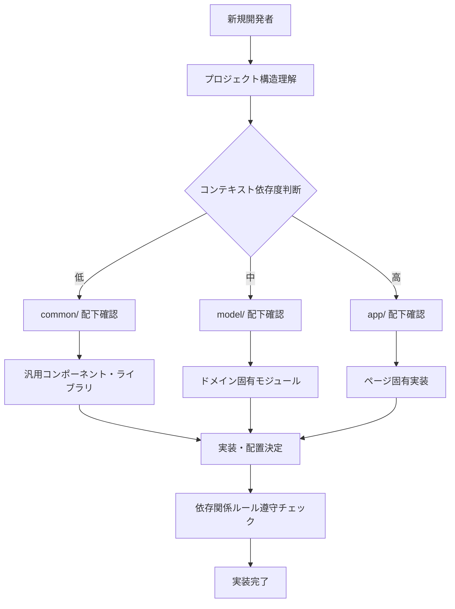
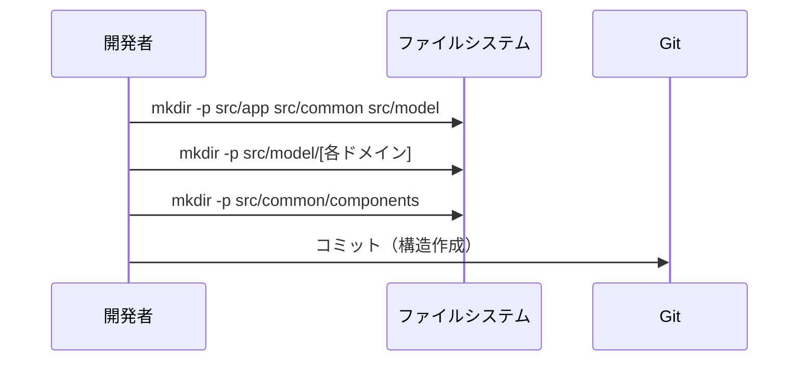
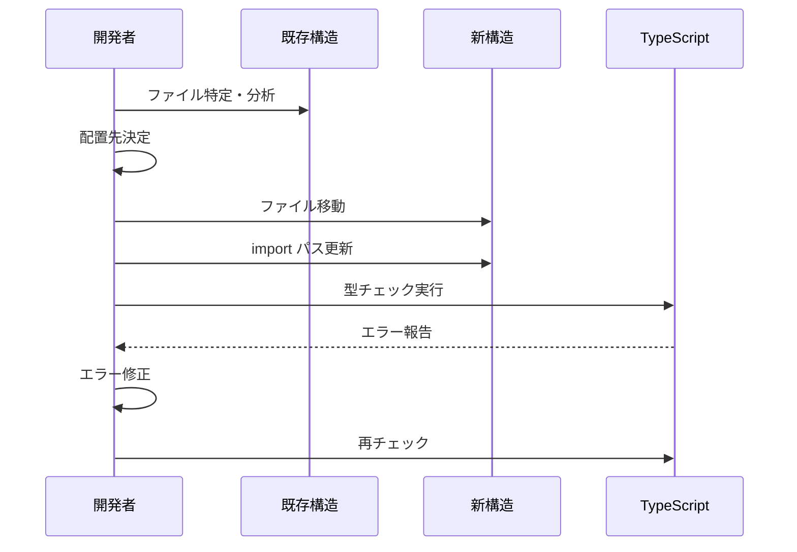
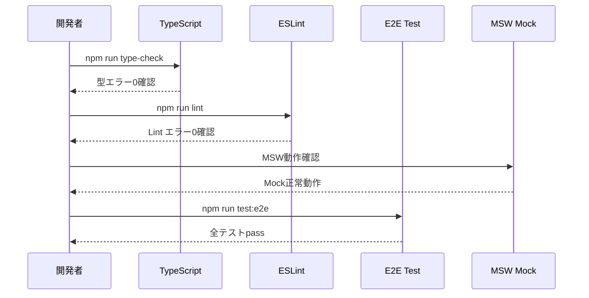
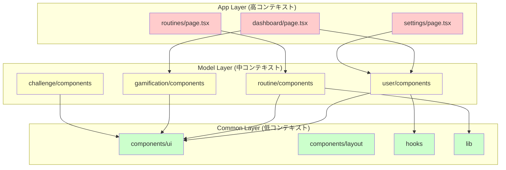
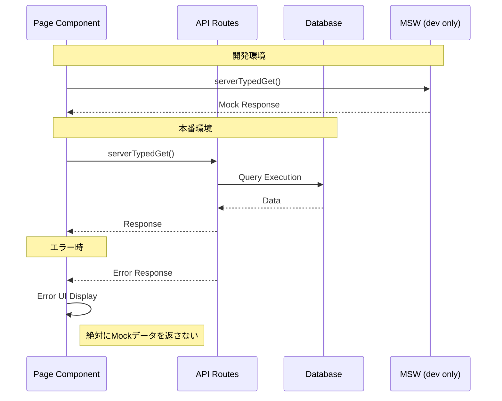
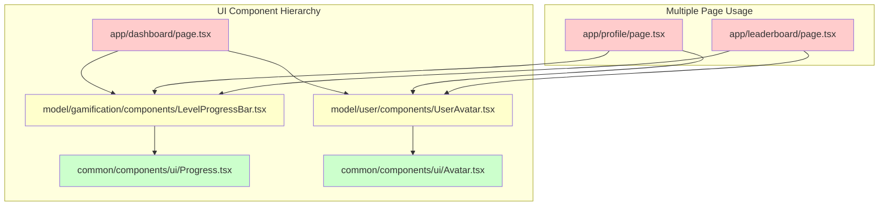
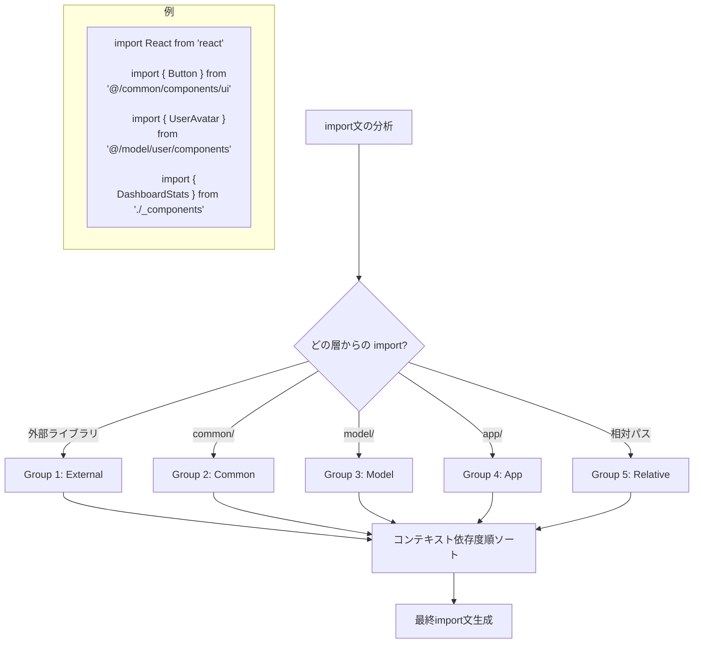
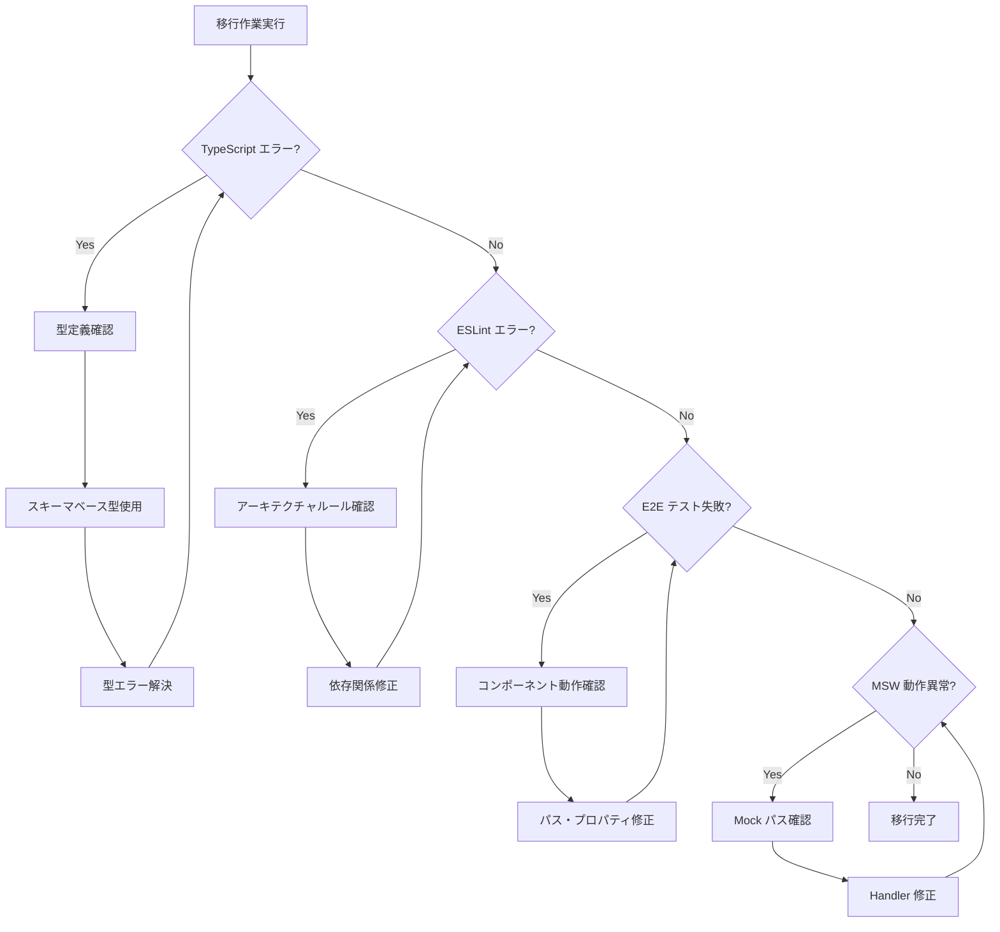

# データフロー図

## システム全体のアーキテクチャフロー



## ディレクトリ構造判断フロー

```mermaid
flowchart TD
    A[新しいモジュール作成] --> B{どこに配置すべき？}
    
    B --> C{特定のページでのみ使用？}
    C -->|Yes| D[app/[page]/_components/]
    C -->|No| E{複数ページで使用？}
    
    E -->|Yes| F{ドメインモデルに関心がある？}
    F -->|Yes| G{どのドメイン？}
    F -->|No| H[common/components/]
    
    G --> I[user] --> J[model/user/components/]
    G --> K[routine] --> L[model/routine/components/]
    G --> M[gamification] --> N[model/gamification/components/]
    G --> O[その他ドメイン] --> P[model/[domain]/components/]
    
    D --> Q[配置完了]
    H --> Q
    J --> Q
    L --> Q
    N --> Q
    P --> Q
    
    Q --> R[import パス更新]
    R --> S[依存関係ルール確認]
    S --> T[TypeScript・Lint チェック]
```

## 移行プロセスフロー

### Phase 1: ディレクトリ構造作成



### Phase 2-4: コンポーネント移行



### Phase 5: 最終検証



## 依存関係フロー



## データ取得フロー（現行維持）



## コンポーネント再利用パターン



## import 文グループ化フロー



## エラーハンドリングフロー

