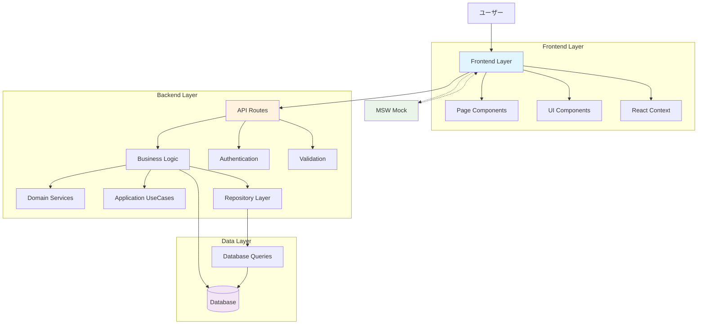
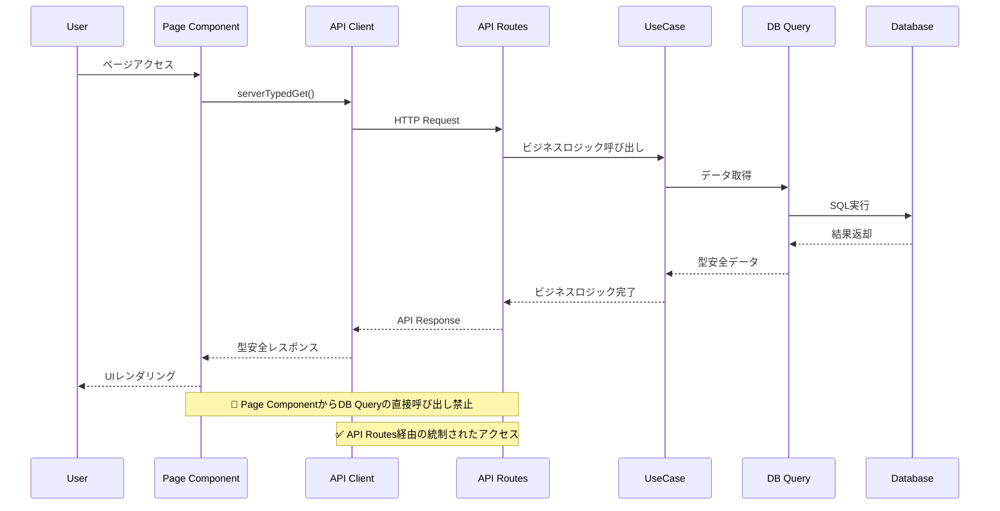
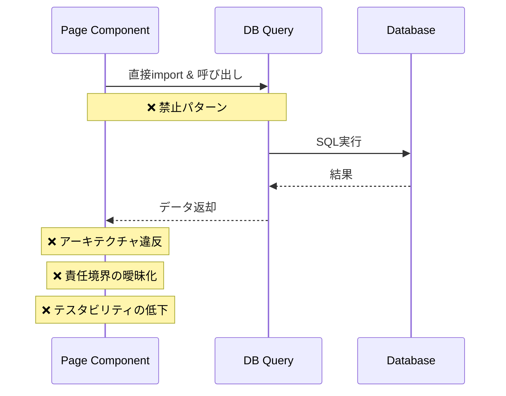
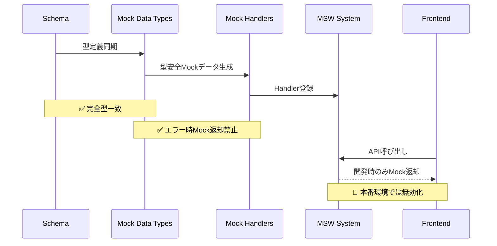
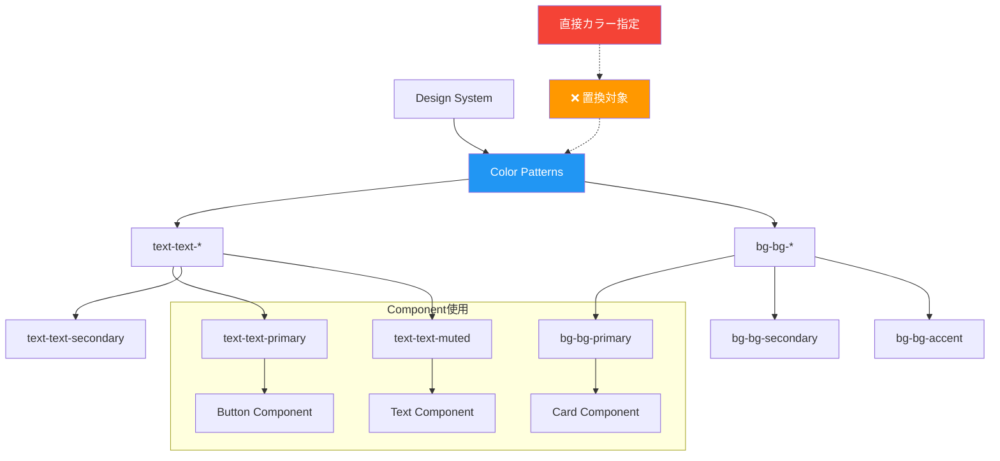
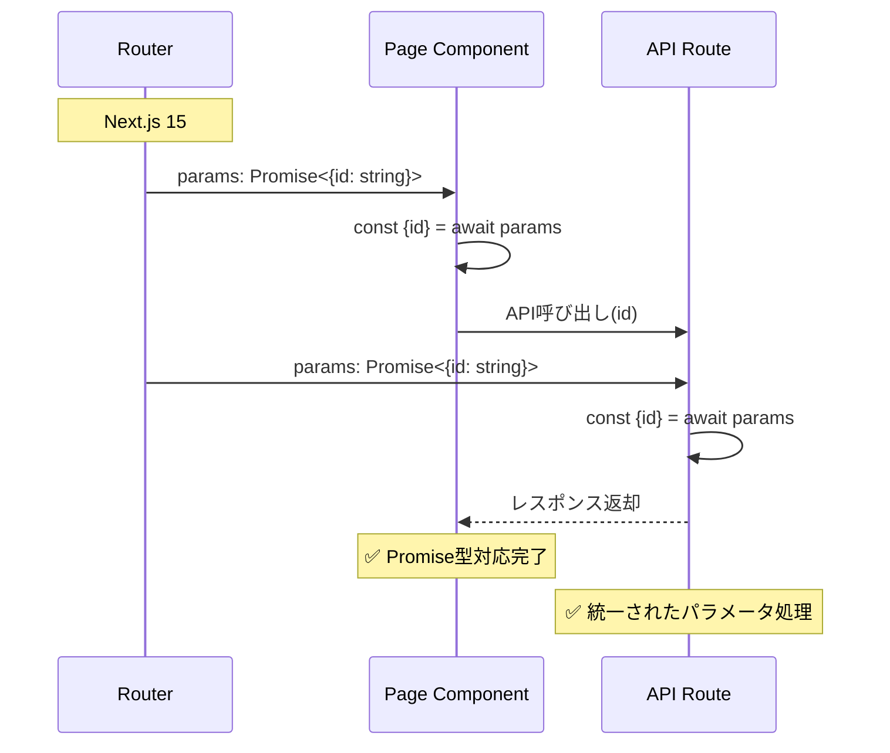
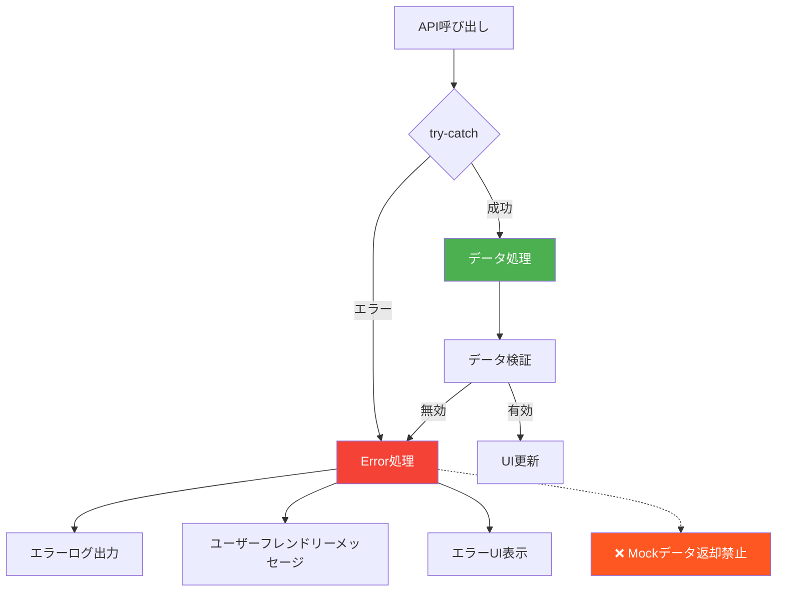
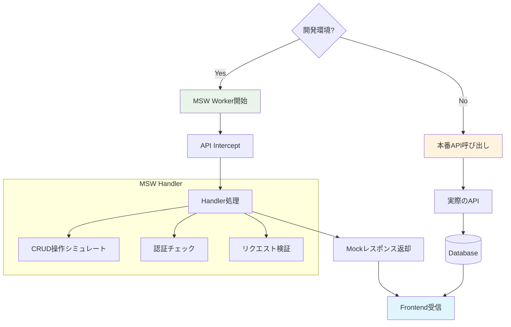
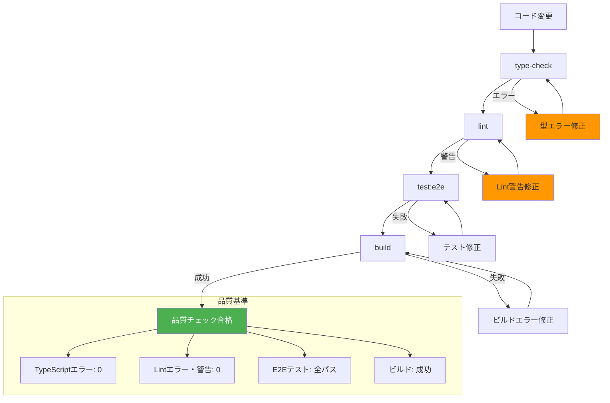

# データフロー図

## システム全体データフロー

### 高レベルアーキテクチャフロー


## レイヤー分離データフロー

### 正しいデータフローパターン


### 禁止されたデータフローパターン


## 型システム統一フロー

### Schema-First型定義フロー
```mermaid
flowchart LR
    SCH[schema.ts] --> IF[Inferred Types]
    IF --> PC[Page Components]
    IF --> AR[API Routes]
    IF --> MC[Mock Data]
    IF --> TS[Test Code]
    
    subgraph "統一型定義"
        IF --> RT[Routine]
        IF --> UP[UserProfile]
        IF --> ER[ExecutionRecord]
        IF --> IR[InsertRecord]
    end
    
    OLD[/types/* ディレクトリ] -.-> X[❌ 削除対象]
    
    style SCH fill:#4caf50,color:#fff
    style OLD fill:#f44336,color:#fff
    style X fill:#f44336,color:#fff
```

### Mock-Schema同期フロー


## スタイリング統一フロー

### Tailwindカラーパターンフロー


## Next.js 15対応フロー

### Promise型Params処理フロー


## エラーハンドリングフロー

### 適切なエラー処理フロー


## 開発時データフロー（MSW）

### MSW開発支援フロー


## コロケーションファイル配置フロー

### ディレクトリ構成配置フロー
```mermaid
flowchart TD
    ROOT[src/app] --> AUTH[/(authenticated)]
    ROOT --> PUB[/(public)]
    
    AUTH --> DASH[dashboard/]
    AUTH --> ROUT[routines/]
    
    DASH --> DPAGE[page.tsx]
    DASH --> DCOMP[_components/]
    DASH --> DHOOK[_hooks/]
    DASH --> DTYPE[_types/]
    
    ROUT --> RPAGE[page.tsx]
    ROUT --> RCREA[create/]
    ROUT --> RID[[id]/]
    ROUT --> RCOMP[_components/]
    
    RCREA --> RCPAGE[page.tsx]
    RCREA --> RCCOMP[_components/]
    
    RID --> RIDPAGE[page.tsx]
    RID --> RIDEDIT[edit/]
    RID --> RIDCOMP[_components/]
    
    style AUTH fill:#e3f2fd
    style PUB fill:#f3e5f5
    style DCOMP fill:#e8f5e8
    style RCOMP fill:#e8f5e8
```

## 品質チェックフロー

### 自動品質検証フロー


## リファクタリング実行フロー

### フェーズ別実装フロー

```mermaid
gantt
    title フロントエンド実装ルール遵守リファクタリング実行フロー
    dateFormat  X
    axisFormat  フェーズ%d
    
    section フェーズ1: アーキテクチャ再設計
    ディレクトリ構成変更        :phase1a, 0, 1
    FE/BE層分離実装             :phase1b, 0, 1
    コロケーション適用          :phase1c, 0, 1
    
    section フェーズ2: 基盤修正
    Tailwindカラーパターン統一  :phase2a, 1, 1
    型システム統一              :phase2b, 1, 1
    Page Components修正         :phase2c, 1, 1
    
    section フェーズ3: 型安全性確保
    Mock整合性修正              :phase3a, 2, 1
    Next.js 15対応              :phase3b, 2, 1
    TypeScript厳格ルール        :phase3c, 2, 1
    
    section フェーズ4: 品質保証
    ts-ignoreコメント除去       :phase4a, 3, 1
    type-check完全パス          :phase4b, 3, 1
    lint警告ゼロ達成            :phase4c, 3, 1
```


---

**データフロー設計完了日**: 2025-01-30  
**対象システム**: RoutineRecord (Next.js 15 + TypeScript)  
**フロー設計者**: Claude Code Assistant