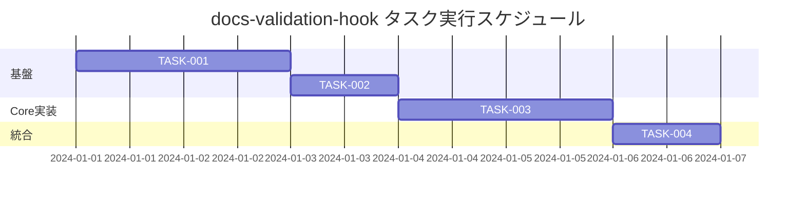

# docs-validation-hook 実装タスク

## 概要

全タスク数: 4
推定作業時間: 6時間
クリティカルパス: TASK-001 → TASK-002 → TASK-003 → TASK-004

## タスク一覧

### フェーズ1: 基盤構築

#### TASK-001: 動的ドキュメント検知機能の実装

- [x] **タスク完了**
- **タスクタイプ**: TDD
- **要件リンク**: REQ-001, REQ-101, REQ-102, REQ-404
- **依存タスク**: なし
- **実装詳細**:
  - `docs/rules`配下の全`.md`ファイルを動的検索する機能
  - ファイル構成のハッシュ生成・比較機能
  - セッション中の構成変更検知機能
- **テスト要件**:
  - [ ] 単体テスト: ファイル検索機能
  - [ ] 単体テスト: ハッシュ生成・比較
  - [ ] 統合テスト: 構成変更検知
- **完了条件**:
  - [ ] `find docs/rules -name "*.md"`で全ファイルが検知される
  - [ ] ファイル追加・削除時に構成変更が検知される
  - [ ] ハッシュ比較で変更が正しく判定される

#### TASK-002: 読込み状況管理システムの実装

- [x] **タスク完了**
- **タスクタイプ**: TDD
- **要件リンク**: REQ-004, REQ-402, REQ-403
- **依存タスク**: TASK-001
- **実装詳細**:
  - セッション内での読込み状況記録機能
  - 一時ファイル（`/tmp/.claude_docs_read_status`）による状況管理
  - 構成変更時の自動リセット機能
- **テスト要件**:
  - [ ] 単体テスト: 読込み状況記録・取得
  - [ ] 単体テスト: セッション管理
  - [ ] 統合テスト: リセット機能
- **完了条件**:
  - [ ] 読込み済みファイルが正しく記録される
  - [ ] セッション終了時にファイルが削除される
  - [ ] 構成変更時に状況がリセットされる

### フェーズ2: Core Hook実装

#### TASK-003: メインHookスクリプトの実装

- [x] **タスク完了**
- **タスクタイプ**: TDD
- **要件リンク**: REQ-001, REQ-002, REQ-003, REQ-401
- **依存タスク**: TASK-002
- **実装詳細**:
  - `.claude/docs-validation-hook.sh`の実装
  - 編集コマンド実行前のドキュメント読込み状況チェック
  - 未読ドキュメントのリスト表示機能
  - 3秒以内の実行時間制限
- **テスト要件**:
  - [ ] 単体テスト: ドキュメント読込み状況チェック
  - [ ] 単体テスト: 未読リスト生成
  - [ ] 統合テスト: エラー表示
  - [ ] パフォーマンステスト: 実行時間測定
- **UI/UX要件**:
  - [ ] エラーメッセージ: 日本語で分かりやすく表示
  - [ ] 未読ドキュメント一覧: ファイルパスを明確に表示
  - [ ] 解決方法: 読込み後の再実行方法を案内
- **エラーハンドリング**:
  - [ ] `docs/rules`ディレクトリが存在しない場合
  - [ ] 必須ドキュメントファイルが存在しない場合
  - [ ] 権限エラー時の適切な表示
- **完了条件**:
  - [ ] 未読ドキュメント存在時に編集が確実にブロックされる
  - [ ] 全ドキュメント読込み済み時に編集が許可される
  - [ ] エラーメッセージが分かりやすく表示される

### フェーズ3: 統合・設定

#### TASK-004: Claude Code設定統合

- [x] **タスク完了**
- **タスクタイプ**: DIRECT
- **要件リンク**: 全要件
- **依存タスク**: TASK-003
- **実装詳細**:
  - `.claude/settings.local.json`への新Hookの追加
  - PreToolUseフックチェーンでの実行順序調整
  - 既存`rules-validation.sh`との共存設定
- **テスト要件**:
  - [ ] 統合テスト: 既存Hookとの共存確認
  - [ ] 統合テスト: フックチェーンの実行順序
  - [ ] E2Eテスト: 実際の編集コマンドでの動作確認
- **完了条件**:
  - [ ] 設定ファイルが正しく更新されている
  - [ ] 編集コマンド実行時にHookが動作する
  - [ ] 既存の`rules-validation.sh`と併行動作する

## 実行順序



## Hookスクリプト設計仕様

### ファイル名
`.claude/docs-validation-hook.sh`

### 基本構造
```bash
#!/bin/bash

# docs-validation-hook.sh
# docs/rules配下の全ドキュメント読込み必須化Hook

PROJECT_ROOT="$(cd "$(dirname "$0")/.." && pwd)"
RULES_DIR="$PROJECT_ROOT/docs/rules"
STATUS_FILE="/tmp/.claude_docs_read_status_$$"

# 動的ドキュメント検索
get_all_rules_docs() {
    find "$RULES_DIR" -name "*.md" 2>/dev/null | sort
}

# 構成ハッシュ生成
get_rules_config_hash() {
    get_all_rules_docs | md5sum | cut -d' ' -f1
}

# 読込み状況チェック
check_read_status() {
    local required_docs=$(get_all_rules_docs)
    local unread_docs=()
    
    # 各ドキュメントの読込み状況チェック
    # ...
}

# メイン処理
main() {
    check_read_status
    if [[ ${#unread_docs[@]} -gt 0 ]]; then
        print_error_and_exit
    else
        print_success_and_continue
    fi
}
```

### 動的検知機能
- セッション開始時に`docs/rules`配下のファイル一覧とハッシュを取得
- Hook実行時に再度ハッシュを計算し、変更を検知
- 変更検知時は読込み状況をリセット

### エラーメッセージ例
```
❌ 実装ルールドキュメントが未読です

📚 以下のドキュメントを確認してから編集を行ってください:
  - docs/rules/frontend.md
  - docs/rules/styling-rule.md  
  - docs/rules/msw-mock-system.md
  - docs/rules/rule-updating.md

💡 ドキュメントを読み込んだ後、編集コマンドを再実行してください。

⚠️  実装品質を保つため、必ずルールを確認してから作業を開始してください。
```

## 実行後の確認

- 作成した全ファイルのパス表示
- 4つのタスクの完了状況確認  
- Hook動作テストの実行結果表示
- ユーザに実装品質確認の確認を促すメッセージ表示