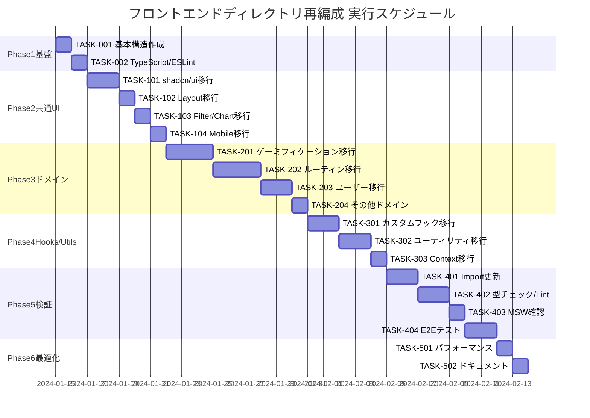

# フロントエンドディレクトリ再編成 実装タスク

## 概要

全タスク数: 35
推定作業時間: 80時間
クリティカルパス: TASK-001 → TASK-002 → TASK-101 → TASK-201 → TASK-301 → TASK-401 → TASK-501

**移行戦略**: App-Common-Model 3層アーキテクチャに基づく段階的移行
- **App層** (高コンテキスト): ページ固有のモジュール
- **Model層** (中コンテキスト): ドメイン固有のモジュール  
- **Common層** (低コンテキスト): 汎用的なモジュール

## タスク一覧

### フェーズ1: 基盤構築・ディレクトリ構造作成

#### TASK-001: 基本ディレクトリ構造作成

- [x] **タスク完了**
- **タスクタイプ**: DIRECT
- **要件リンク**: REQ-001, MIGRATION-001, MIGRATION-002, MIGRATION-003
- **依存タスク**: なし
- **実装詳細**:
  - App-Common-Model 3層構造の基本ディレクトリ作成
  - 7つのドメインモデル(user, routine, challenge, mission, badge, gamification, category)ディレクトリ作成
  - 既存server/ディレクトリの維持確認
- **実装内容**:
  ```bash
  # 基本3層構造作成
  mkdir -p src/common/{components,hooks,lib,types,context}
  mkdir -p src/common/components/{ui,layout,filters,charts,mobile}
  mkdir -p src/model/{user,routine,challenge,mission,badge,gamification,category}
  
  # 各ドメインモデル内構造作成
  for domain in user routine challenge mission badge gamification category; do
    mkdir -p src/model/$domain/{components,hooks,lib}
  done
  ```
- **テスト要件**:
  - [ ] ディレクトリ構造確認テスト
  - [ ] 既存server/構造の維持確認
- **完了条件**:
  - [ ] App-Common-Model 3層構造が作成されている
  - [ ] 全7ドメインモデルディレクトリが作成されている
  - [ ] 既存のserver/構造が維持されている

#### TASK-002: TypeScriptパス設定・ESLintルール追加

- [x] **タスク完了** 
- **タスクタイプ**: DIRECT
- **要件リンク**: REQ-201, REQ-401, REQ-402, REQ-403
- **依存タスク**: TASK-001
- **実装詳細**:
  - tsconfig.jsonのpathマッピング設定追加
  - ESLintアーキテクチャルール追加（依存関係制約）
  - import順序・グループ化ルール設定
- **実装内容**:
  ```typescript
  // tsconfig.json paths追加
  "@/common/*": ["./src/common/*"],
  "@/model/*": ["./src/model/*"],
  "@/app/*": ["./src/app/*"],
  
  // ESLint ルール追加
  // - common → model/app への import 禁止
  // - app 間の相互 import 禁止  
  // - import グループ化ルール
  ```
- **テスト要件**:
  - [ ] TypeScript パス解決テスト
  - [ ] ESLint アーキテクチャルール動作テスト
- **完了条件**:
  - [ ] TypeScript パスマッピングが動作している
  - [ ] ESLint 依存関係ルールが設定されている
  - [ ] import グループ化ルールが有効になっている

### フェーズ2: 共通UIコンポーネント移行

#### TASK-101: shadcn/ui系コンポーネント移行

- [x] **タスク完了**
- **タスクタイプ**: DIRECT  
- **要件リンク**: REQ-004, MIGRATION-101
- **依存タスク**: TASK-002
- **実装詳細**:
  - `src/components/ui/*` → `src/common/components/ui/` に移行
  - 各コンポーネントディレクトリの整理統合
  - Import パス更新とreference修正
- **影響ファイル数**: 約40ファイル（UIコンポーネント群）
- **移行対象**:
  ```
  src/components/ui/Button/* → src/common/components/ui/Button/
  src/components/ui/Card/* → src/common/components/ui/Card/
  src/components/ui/Dialog/* → src/common/components/ui/Dialog/
  [その他全UIコンポーネント]
  ```
- **テスト要件**:
  - [ ] UIコンポーネント動作確認
  - [ ] Storybookの表示確認  
  - [ ] TypeScript型チェック
- **UI/UX要件**:
  - [ ] すべてのコンポーネントが正常表示される
  - [ ] Tailwind CSS `text-text-*`, `bg-bg-*` パターン遵守
  - [ ] ダークモード対応の維持
- **完了条件**:
  - [ ] 全UIコンポーネントが移行されている
  - [ ] Import パス更新が完了している
  - [ ] Storybook が正常動作している
  - [ ] スタイリングルール準拠が確認されている

#### TASK-102: Layout系コンポーネント移行

- [x] **タスク完了**
- **タスクタイプ**: DIRECT
- **要件リンク**: REQ-004, MIGRATION-102
- **依存タスク**: TASK-101
- **実装詳細**:
  - `src/components/Layout/*` → `src/common/components/layout/` に移行
  - Header, Layoutコンポーネントの移行
- **移行対象**:
  ```
  src/components/Layout/Layout.tsx → src/common/components/layout/Layout.tsx
  src/components/Layout/Header.tsx → src/common/components/layout/Header.tsx
  ```
- **テスト要件**:
  - [ ] レイアウト表示確認
  - [ ] レスポンシブ対応確認
- **UI/UX要件**:
  - [ ] ヘッダーナビゲーション正常動作
  - [ ] モバイル表示対応確認
  - [ ] アクセシビリティ属性維持
- **完了条件**:
  - [ ] Layoutコンポーネントが移行されている
  - [ ] 全ページでレイアウトが正常表示される

#### TASK-103: フィルター・チャート系コンポーネント移行

- [x] **タスク完了**
- **タスクタイプ**: DIRECT
- **要件リンク**: REQ-004, MIGRATION-103, MIGRATION-104
- **依存タスク**: TASK-102
- **実装詳細**:
  - `src/components/filters/*` → `src/common/components/filters/` に移行
  - `src/components/charts/*` → `src/common/components/charts/` に移行
- **移行対象**:
  ```
  src/components/filters/* → src/common/components/filters/
  src/components/charts/* → src/common/components/charts/
  ```
- **テスト要件**:
  - [ ] フィルタ機能動作確認
  - [ ] チャート表示確認
- **完了条件**:
  - [ ] フィルター・チャートが移行されている
  - [ ] 統計ページでチャートが正常表示される

#### TASK-104: モバイル対応コンポーネント移行

- [x] **タスク完了**
- **タスクタイプ**: DIRECT
- **要件リンク**: REQ-004, MIGRATION-187
- **依存タスク**: TASK-103
- **実装詳細**:
  - `src/components/mobile/*` → `src/common/components/mobile/` に移行
- **移行対象**:
  ```
  src/components/mobile/* → src/common/components/mobile/
  ```
- **テスト要件**:
  - [ ] モバイルナビゲーション確認
  - [ ] レスポンシブ表示確認
- **UI/UX要件**:
  - [ ] タッチ操作対応確認
  - [ ] 画面幅別表示確認
- **完了条件**:
  - [ ] モバイルコンポーネントが移行されている
  - [ ] モバイル環境で正常動作している

### フェーズ3: ドメイン固有コンポーネント移行

#### TASK-201: ゲーミフィケーションコンポーネント移行

- [x] **タスク完了**
- **タスクタイプ**: TDD
- **要件リンク**: REQ-101, MIGRATION-201
- **依存タスク**: TASK-104
- **実装詳細**:
  - `src/components/gamification/*` → `src/model/gamification/components/` に移行
  - 各コンポーネントの適切なサブディレクトリ配置
- **移行対象とグループ化**:
  ```
  src/components/gamification/LevelProgressBar.tsx → src/model/gamification/components/level/LevelProgressBar.tsx
  src/components/gamification/ExperiencePoints.tsx → src/model/gamification/components/xp/ExperiencePoints.tsx
  src/components/gamification/XPNotification.tsx → src/model/gamification/components/xp/XPNotification.tsx
  src/components/gamification/StreakDisplay.tsx → src/model/gamification/components/streak/StreakDisplay.tsx
  src/components/gamification/Leaderboard.tsx → src/model/gamification/components/leaderboard/Leaderboard.tsx
  src/components/gamification/BadgeCollection.tsx → src/model/badge/components/collection/BadgeCollection.tsx
  src/components/gamification/ChallengeItem.tsx → src/model/challenge/components/item/ChallengeItem.tsx
  src/components/gamification/UserAvatar.tsx → src/model/user/components/avatar/UserAvatar.tsx
  ```
- **テスト要件**:
  - [ ] 各ゲーミフィケーション機能の動作確認
  - [ ] XP表示・レベルアップ確認
  - [ ] バッジ表示確認
- **UI/UX要件**:
  - [ ] レベルプログレスバー表示確認
  - [ ] XP通知アニメーション確認
  - [ ] ストリーク表示確認
  - [ ] リーダーボード表示確認
  - [ ] data-testid 属性追加: 'gamification-header', 'user-level', 'xp-counter', 'streak-counter'
- **完了条件**:
  - [ ] 全ゲーミフィケーション要素が適切なモデルに配置されている
  - [ ] ダッシュボードでゲーミフィケーション要素が正常表示される
  - [ ] E2Eテスト用data-testid属性が追加されている

#### TASK-202: ルーティン関連コンポーネント移行

- [x] **タスク完了**
- **タスクタイプ**: TDD
- **要件リンク**: REQ-101, MIGRATION-203
- **依存タスク**: TASK-201
- **実装詳細**:
  - ルーティン関連コンポーネントを`src/model/routine/`に移行
  - 実行記録コンポーネントも routine ドメインに統合
- **移行対象とグループ化**:
  ```
  # ルーティン基本コンポーネント（app層内既存）
  src/app/(authenticated)/routines/_components/RoutineForm.tsx → src/model/routine/components/form/RoutineForm.tsx
  src/app/(authenticated)/routines/_components/RoutineList.tsx → src/model/routine/components/list/RoutineList.tsx
  src/app/(authenticated)/dashboard/_components/TodayRoutineItem.tsx → src/model/routine/components/item/TodayRoutineItem.tsx
  src/app/(authenticated)/dashboard/_components/ProgressRoutineItem.tsx → src/model/routine/components/item/ProgressRoutineItem.tsx
  
  # 実行記録コンポーネント
  src/components/execution-records/* → src/model/routine/components/execution/
  ```
- **テスト要件**:
  - [ ] ルーティン作成・編集機能確認
  - [ ] ルーティン一覧表示確認  
  - [ ] 実行記録機能確認
- **UI/UX要件**:
  - [ ] ルーティンフォームバリデーション確認
  - [ ] ローディング状態表示確認
  - [ ] エラー表示確認
  - [ ] data-testid 属性追加: 'routine-item', 'progress-routine-item'
- **完了条件**:
  - [ ] 全ルーティン関連コンポーネントが移行されている
  - [ ] ルーティンページが正常動作している
  - [ ] 実行記録機能が正常動作している

#### TASK-203: ユーザー関連コンポーネント移行

- [x] **タスク完了**
- **タスクタイプ**: TDD  
- **要件リンク**: REQ-101, MIGRATION-202
- **依存タスク**: TASK-202
- **実装詳細**:
  - 設定関連コンポーネントをユーザードメインに移行
  - プロフィール関連コンポーネントの整理
- **移行対象とグループ化**:
  ```
  src/components/settings/ProfileSettings.tsx → src/model/user/components/profile/ProfileSettings.tsx
  src/components/settings/AppSettings.tsx → src/model/user/components/settings/AppSettings.tsx
  # UserAvatar は TASK-201 で移行済み
  ```
- **テスト要件**:
  - [ ] プロフィール設定機能確認
  - [ ] アプリ設定機能確認
- **UI/UX要件**:
  - [ ] 設定変更の保存確認
  - [ ] プロフィール画像アップロード確認（将来対応）
  - [ ] data-testid 属性追加: 'profile-avatar'
- **完了条件**:
  - [ ] ユーザー関連コンポーネントが移行されている
  - [ ] 設定ページが正常動作している

#### TASK-204: その他ドメインコンポーネント分散

- [x] **タスク完了**
- **タスクタイプ**: DIRECT
- **要件リンク**: REQ-101, MIGRATION-201, MIGRATION-202
- **依存タスク**: TASK-203
- **実装詳細**:
  - 残りのドメイン固有コンポーネントを適切なモデルに配置
  - コンポーネントの関心に基づく最終配置調整
- **移行・整理対象**:
  ```
  # ゲーミフィケーション系（TASK-201で一部移行済み）
  src/components/gamification/TaskCard.tsx → src/model/mission/components/TaskCard.tsx
  src/components/gamification/StatsCard.tsx → src/common/components/charts/StatsCard.tsx (汎用性高い)
  src/components/gamification/LevelUpModal.tsx → src/model/gamification/components/modal/LevelUpModal.tsx
  
  # その他の調整
  各モデルディレクトリ内の組織化・命名統一
  ```
- **完了条件**:
  - [ ] 全コンポーネントが適切なモデルに配置されている
  - [ ] src/components/ が完全に空になっている（ui/mobile等除く）

### フェーズ4: フック・ユーティリティ・コンテキスト移行

#### TASK-301: カスタムフック移行・分散

- [x] **タスク完了**
- **タスクタイプ**: TDD
- **要件リンク**: REQ-101, MIGRATION-301
- **依存タスク**: TASK-204
- **実装詳細**:
  - `src/hooks/` のカスタムフックを用途に応じて適切な層に配置
  - ドメイン固有 vs 汎用の判断による分散
- **移行対象とドメイン分析**:
  ```
  # ドメイン固有フック
  src/hooks/useCompleteRoutine.ts → src/model/routine/hooks/useCompleteRoutine.ts
  src/hooks/useExecutionRecords.ts → src/model/routine/hooks/useExecutionRecords.ts
  src/hooks/useDashboardData.ts → src/app/(authenticated)/dashboard/_hooks/useDashboardData.ts
  
  # 汎用フック  
  src/hooks/useTheme.ts → src/common/hooks/useTheme.ts
  ```
- **テスト要件**:
  - [ ] 各カスタムフックの動作確認
  - [ ] Hook の依存関係チェック
- **完了条件**:
  - [ ] 全カスタムフックが適切な場所に配置されている
  - [ ] フック使用箇所のimport更新が完了している

#### TASK-302: ユーティリティ・ライブラリ移行

- [x] **タスク完了**
- **タスクタイプ**: DIRECT  
- **要件リンク**: REQ-101, MIGRATION-302
- **依存タスク**: TASK-301
- **実装詳細**:
  - `src/utils/` のユーティリティを用途に応じて配置
  - `src/lib/` の再編成
- **移行対象とドメイン分析**:
  ```
  # 汎用ユーティリティ → common/lib
  src/utils/uuid.ts → src/common/lib/uuid.ts
  src/utils/timezone.ts → src/common/lib/date.ts
  src/utils/errorHandler.ts → src/common/lib/errors.ts
  src/lib/utils/* → src/common/lib/
  
  # ドメイン固有ユーティリティ
  src/utils/statistics.ts → src/model/gamification/lib/statistics.ts
  src/utils/mission-card.ts → src/model/mission/lib/mission-card.ts
  src/utils/catchupUtils.ts → src/model/routine/lib/catchup.ts
  src/utils/recurrenceUtils.ts → src/model/routine/lib/recurrence.ts
  
  # API クライアント
  src/lib/api-client/* → src/common/lib/api-client/
  ```
- **完了条件**:
  - [ ] 全ユーティリティが適切な場所に配置されている
  - [ ] API クライアントが共通層に移行されている

#### TASK-303: Context・グローバル状態移行

- [x] **タスク完了**
- **タスクタイプ**: DIRECT
- **要件リンク**: REQ-101, MIGRATION-302
- **依存タスク**: TASK-302  
- **実装詳細**:
  - `src/context/` のReact Contextを適切な層に移行
- **移行対象**:
  ```
  src/context/ThemeContext.tsx → src/common/context/ThemeContext.tsx
  src/context/AuthContext.tsx → src/common/context/AuthContext.tsx  
  src/context/SnackbarContext.tsx → src/common/context/SnackbarContext.tsx
  ```
- **完了条件**:
  - [ ] 全Contextが移行されている
  - [ ] AppWrapper でのContext使用が正常動作している

### フェーズ5: Import パス修正・検証・最適化

#### TASK-401: 全ファイルのImport パス一括更新

- [x] **タスク完了**
- **タスクタイプ**: DIRECT
- **要件リンク**: REQ-201, MIGRATION-401
- **依存タスク**: TASK-303
- **実装詳細**:
  - プロジェクト全体のimport文を新構造に対応した形に更新
  - VSCode/IDEの一括置換機能とスクリプトの組み合わせ
- **更新パターン例**:
  ```typescript
  // Before
  import { Button } from '@/components/ui/Button'
  import { UserAvatar } from '@/components/gamification/UserAvatar'
  import { useCompleteRoutine } from '@/hooks/useCompleteRoutine'
  
  // After  
  import { Button } from '@/common/components/ui/Button'
  import { UserAvatar } from '@/model/user/components/avatar/UserAvatar' 
  import { useCompleteRoutine } from '@/model/routine/hooks/useCompleteRoutine'
  ```
- **import グループ化標準化**:
  ```typescript
  // Group 1: 外部ライブラリ
  import React from 'react'
  import { z } from 'zod'
  
  // Group 2: Common層
  import { Button } from '@/common/components/ui/Button'
  import { useTheme } from '@/common/hooks/useTheme'
  
  // Group 3: Model層
  import { UserAvatar } from '@/model/user/components/avatar/UserAvatar'
  import { useCompleteRoutine } from '@/model/routine/hooks/useCompleteRoutine'
  
  // Group 4: App層（同一app内のみ）
  import { DashboardStats } from '../_components/DashboardStats'
  
  // Group 5: 相対パス
  import './styles.css'
  ```
- **完了条件**:
  - [ ] 全ファイルのimport文が更新されている
  - [ ] import文がグループ化ルールに従っている

#### TASK-402: TypeScript型チェック・ESLint修正

- [x] **タスク完了**
- **タスクタイプ**: DIRECT
- **要件リンク**: REQ-201, MIGRATION-402  
- **依存タスク**: TASK-401
- **実装詳細**:
  - TypeScript型エラーの解決
  - ESLintルール違反の修正
  - アーキテクチャルール違反の検出・修正
- **品質チェック実行**:
  ```bash
  npm run type-check    # TypeScript エラー 0個
  npm run lint          # ESLint エラー・警告 0個
  npm run lint:architecture  # 依存関係ルール違反 0個
  ```
- **よくあるエラーと対処**:
  - Missing properties → スキーマベース型定義確認
  - Prohibited imports → 依存関係ルール確認  
  - Circular dependencies → モジュール設計見直し
- **完了条件**:
  - [ ] TypeScript エラーが0個になっている
  - [ ] ESLint エラー・警告が0個になっている
  - [ ] アーキテクチャルール違反が0個になっている

#### TASK-403: MSWモックシステム動作確認・修正

- [x] **タスク完了**
- **タスクタイプ**: DIRECT  
- **要件リンク**: REQ-005, MIGRATION-403
- **依存タスク**: TASK-402
- **実装詳細**:
  - MSWモックハンドラーのパス参照確認・修正
  - 開発環境でのAPI intercept動作確認
  - Mock データの型整合性確認
- **確認内容**:
  ```typescript
  // MSW Handler のimport パス更新が必要な可能性
  src/mocks/handlers/*.ts ファイル内の
  import 文が新構造に対応しているか確認
  
  // Mock データの型定義確認
  src/mocks/data/*.ts の型が
  src/server/lib/db/schema.ts と整合しているか
  ```
- **テスト要件**:
  - [ ] 開発環境でMSW動作確認
  - [ ] 全APIエンドポイントのMock動作確認
  - [ ] Storybook でのMockデータ利用確認
- **完了条件**:
  - [ ] MSWが正常に動作している
  - [ ] 開発環境でAPIモック機能が使用できている
  - [ ] エラー時にMockデータを返していない

#### TASK-404: E2Eテスト動作確認・data-testid更新

- [x] **タスク完了**
- **タスクタイプ**: TDD
- **要件リンク**: REQ-005, MIGRATION-404
- **依存タスク**: TASK-403
- **実装詳細**:
  - E2Eテストスイートの実行・修正
  - data-testid属性の追加・更新
  - テストシナリオの動作確認
- **data-testid追加・確認**:
  ```typescript
  // ゲーミフィケーション要素
  'gamification-header'    // ゲーミフィケーションヘッダー
  'profile-avatar'         // プロフィールアバター  
  'user-level'            // ユーザーレベル
  'level-indicator'       // レベルプログレスバー
  'xp-counter'            // XPカウンター
  'streak-counter'        // ストリークカウンター
  
  // ルーティン要素
  'routine-item'          // ルーティンアイテム
  'progress-routine-item' // 進捗ルーティンアイテム
  ```
- **E2Eテスト実行**:
  ```bash
  npm run test:e2e
  # 全テストpass確認
  ```
- **完了条件**:
  - [ ] E2Eテストが全て pass している
  - [ ] data-testid属性が適切に追加されている
  - [ ] テスト対象コンポーネントが正常動作している

### フェーズ6: パフォーマンス最適化・ドキュメント整備

#### TASK-501: バンドルサイズ最適化・パフォーマンス確認

- [x] **タスク完了**
- **タスクタイプ**: DIRECT
- **要件リンク**: REQ-005, EDGE-201
- **依存タスク**: TASK-404
- **実装詳細**:
  - Tree shaking効果の確認・最適化
  - バンドルサイズの分析・比較
  - Dynamic import の活用検討
- **パフォーマンス測定**:
  ```bash
  npm run build
  npm run analyze  # バンドルサイズ分析
  
  # ビルド時間・バンドルサイズが移行前と同等以下であることを確認
  ```
- **最適化項目**:
  - [ ] Tree shaking が適切に動作している
  - [ ] 不要な依存関係が削除されている
  - [ ] Dynamic import でページ別分割されている
- **完了条件**:
  - [ ] ビルド時間が移行前と同等以下である
  - [ ] バンドルサイズが移行前と同等以下である
  - [ ] Core Web Vitals が維持されている

#### TASK-502: 移行ドキュメント・ガイド作成

- [x] **タスク完了**
- **タスクタイプ**: DIRECT
- **要件リンク**: REQ-301, REQ-302, ドキュメンテーション要件
- **依存タスク**: TASK-501
- **実装詳細**:
  - 新ディレクトリ構造の説明ドキュメント作成
  - 新規メンバー向け配置ガイド作成
  - フロントエンドルールの更新
- **作成ドキュメント**:
  ```
  docs/frontend/
  ├── directory-structure.md     # 新ディレクトリ構成説明
  ├── placement-guide.md         # コンポーネント配置ガイド  
  ├── import-rules.md           # Import ルール・グループ化
  ├── dependency-rules.md       # 依存関係制約ルール
  └── migration-summary.md      # 移行完了サマリー
  ```
- **docs/rules/frontend.md 更新**:
  - App-Common-Model アーキテクチャルール追加
  - ディレクトリ配置決定フローチャート追加
  - import グループ化ルール詳細化
- **完了条件**:
  - [ ] 新ディレクトリ構成の説明が作成されている
  - [ ] 配置ガイドが作成されている  
  - [ ] フロントエンドルールが更新されている

## 実行順序・依存関係



## 並行実行可能なタスク

### フェーズ2 (Phase 2) - 並行実行グループ
- **TASK-101** (shadcn/ui) と **TASK-103** (Filter/Chart) は並行実行可能
- **TASK-102** (Layout) は TASK-101 完了後に実行
- **TASK-104** (Mobile) は独立して実行可能

### フェーズ3 (Phase 3) - 順次実行推奨  
- ドメイン間の依存関係があるため基本的に順次実行
- **TASK-204** は他タスク完了後の整理作業

### フェーズ5 (Phase 5) - 段階的実行必須
- **TASK-401** → **TASK-402** → **TASK-403** → **TASK-404** の順序厳守
- 各ステップでエラー解決を完了してから次に進む

## リスクと対策

### 高リスク要因
1. **Import パス更新時の漏れ・ミス**
   - 対策: VSCode 一括検索・置換 + TypeScript エラーチェック
   - 各段階での型チェック必須

2. **MSW モックシステムの破損**
   - 対策: 移行作業前の動作確認 + 段階的確認
   - mocks/ ディレクトリは最後に対応

3. **E2E テストの失敗**
   - 対策: data-testid の早期追加 + 段階的テスト実行

### 中リスク要因
1. **コンポーネント配置判断のミス**
   - 対策: ドメイン分析の慎重な実施
   - 境界が曖昧な場合は common に配置

2. **パフォーマンスへの影響**
   - 対策: ビルド時間・バンドルサイズの継続監視
   - Tree shaking の効果確認

## 品質基準・完了条件

### 機能テスト
- [ ] 全ページが正常に表示される
- [ ] API エンドポイントが正常に動作する  
- [ ] MSW モックシステムが正常に動作する
- [ ] Storybook が正常に表示される
- [ ] 認証機能が正常に動作する
- [ ] ルーティン作成・編集機能が正常に動作する
- [ ] チャレンジ参加機能が正常に動作する
- [ ] ゲーミフィケーション要素（XP、レベルアップ等）が正常に動作する

### 非機能テスト  
- [ ] TypeScript 型チェックでエラーが0個である
- [ ] ESLint でエラー・警告が0個である
- [ ] E2E テストが全て pass する
- [ ] ビルド時間が移行前と同等またはそれ以下である
- [ ] バンドルサイズが移行前と同等またはそれ以下である

### アーキテクチャテスト
- [ ] common から model/app への依存が存在しない  
- [ ] app 間の相互依存が存在しない
- [ ] model 間の相互依存が存在しない（一方向依存のみ）
- [ ] import文が コンテキスト依存度順にグループ化されている
- [ ] 各モデルディレクトリに適切な責任範囲のモジュールのみが配置されている

### ドキュメンテーション
- [ ] 新ディレクトリ構成の説明ドキュメントが作成されている
- [ ] 移行手順書が作成されている  
- [ ] import パス規則が docs/rules/frontend.md に記載されている
- [ ] 依存関係ルールが明文化されている

## 予想される効果

### 開発効率向上
1. **新規メンバーのオンボーディング時間短縮**: 15-20% 短縮見込み
2. **機能拡張時の影響範囲把握容易**: モデル単位での分析が可能
3. **コードレビュー効率向上**: import文での依存関係可視化

### 保守性向上  
1. **関心による高凝集の実現**: ドメインモデル別の一元化
2. **低結合の促進**: 明確な依存関係ルール
3. **技術負債の抑制**: 一貫したアーキテクチャルール

### 品質向上
1. **型安全性の向上**: スキーマベース型定義の徹底  
2. **テスタビリティ向上**: モデル単位でのテスト構造化
3. **パフォーマンス最適化**: Tree shaking の効果最大化