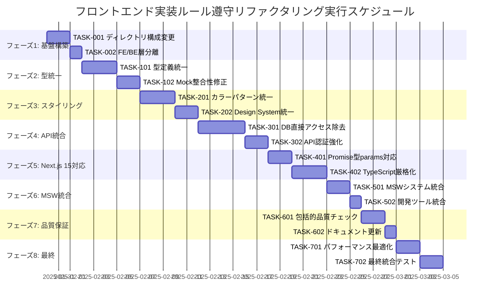

# フロントエンド実装ルール遵守リファクタリング 実装タスク

## 概要

**全タスク数**: 24  
**推定作業時間**: 32-40時間  
**クリティカルパス**: TASK-001 → TASK-002 → TASK-101 → TASK-201 → TASK-301 → TASK-401 → TASK-501

## タスク一覧

### フェーズ1: 基盤構築・アーキテクチャ再設計

#### TASK-001: Next.js App Routerディレクトリ構成変更

- [ ] **タスク完了**
- **タスクタイプ**: DIRECT
- **要件リンク**: REQ-006, REQ-105
- **依存タスク**: なし
- **推定時間**: 4-6時間
- **実装詳細**:
  - Route Groups `(authenticated)`, `(public)` の作成
  - コロケーション原則に基づくファイル再配置
  - Private Folders `_components/`, `_hooks/`, `_types/` の作成
  - 関連ファイルの適切な配置
- **完了条件**:
  - [ ] Route Groups構造が正しく設定されている
  - [ ] 全Page Componentsが適切に配置されている
  - [ ] Private FoldersにRoute固有ファイルが配置されている
  - [ ] import pathが正しく更新されている
- **品質チェック**:
  - [ ] `npm run build` が成功する
  - [ ] 全ページが正常にアクセス可能

#### TASK-002: フロントエンド・バックエンド層分離実装

- [ ] **タスク完了**
- **タスクタイプ**: DIRECT
- **要件リンク**: REQ-007, REQ-106
- **依存タスク**: TASK-001
- **推定時間**: 3-4時間
- **実装詳細**:
  - Frontend Layer: Page Components, UI Components, Hooks, Context
  - Backend Layer: API Routes, Database, Domain, Application
  - Shared Layer: 共通ユーティリティ, Mock
  - レイヤー間責任境界の明確化
- **完了条件**:
  - [ ] 各レイヤーが明確に分離されている
  - [ ] 責任境界が適切に定義されている
  - [ ] レイヤー間の依存関係が正しく設定されている
- **品質チェック**:
  - [ ] アーキテクチャが設計文書通りに実装されている
  - [ ] 不適切な依存関係が存在しない

### フェーズ2: 型システム統一

#### TASK-101: @/types/* から @/lib/db/schema への型定義統一

- [ ] **タスク完了**
- **タスクタイプ**: TDD
- **要件リンク**: REQ-002
- **依存タスク**: TASK-002
- **推定時間**: 6-8時間
- **実装詳細**:
  - 全 `@/types/*` importの `@/lib/db/schema` への置換
  - Schema-based型定義への統一
  - 型変換の排除、直接推論への変更
  - API Response型の統一
- **テスト要件**:
  - [ ] 単体テスト: 型定義の整合性確認
  - [ ] 統合テスト: API型安全性確認
  - [ ] 型チェック: `npm run type-check` 完全パス
- **完了条件**:
  - [ ] `@/types/*` importが0件になる
  - [ ] 全型定義がスキーマベースになる
  - [ ] TypeScriptエラーが0件になる
- **品質チェック**:
  - [ ] `npm run type-check` がエラーなく完了
  - [ ] 型推論が正しく機能している

#### TASK-102: Mock データ型整合性修正

- [ ] **タスク完了**
- **タスクタイプ**: TDD
- **要件リンク**: REQ-004
- **依存タスク**: TASK-101
- **推定時間**: 4-5時間
- **実装詳細**:
  - Mock データのスキーマ型完全一致化
  - Enum値の schema 準拠への修正
  - 存在しないフィールドの削除
  - 必須フィールドの追加
- **テスト要件**:
  - [ ] 単体テスト: Mock データ型検証
  - [ ] 統合テスト: MSW Handler動作確認
  - [ ] E2Eテスト: Mock使用時の動作確認
- **完了条件**:
  - [ ] 全Mock データがスキーマ型と一致
  - [ ] 無効なenum値が0件
  - [ ] 存在しないフィールドが0件
- **品質チェック**:
  - [ ] MSW Handlerが正常動作
  - [ ] 型エラーが0件

### フェーズ3: スタイリング統一

#### TASK-201: Tailwindカラーパターン統一実装

- [ ] **タスク完了**
- **タスクタイプ**: TDD
- **要件リンク**: REQ-001, REQ-101
- **依存タスク**: TASK-102
- **推定時間**: 6-8時間
- **実装詳細**:
  - 直接的カラー指定の `text-text-*`, `bg-bg-*` パターンへの置換
  - Design System統一カラーパターンの適用
  - ダークモード対応の確認・修正
  - 全コンポーネントでのカラー一貫性確保
- **UI/UX要件**:
  - [ ] ローディング状態: 統一カラーパターン適用
  - [ ] エラー表示: 統一エラーカラーパターン適用
  - [ ] ダークモード対応: 自動切り替え動作確認
  - [ ] アクセシビリティ: カラーコントラスト基準準拠
- **テスト要件**:
  - [ ] ビジュアルテスト: カラーパターン適用確認
  - [ ] E2Eテスト: ダークモード切り替えテスト
  - [ ] アクセシビリティテスト: コントラスト検証
- **完了条件**:
  - [ ] 直接カラー指定が0件
  - [ ] 全要素が統一パターンを使用
  - [ ] ダークモード正常動作
- **品質チェック**:
  - [ ] デザインシステム準拠確認
  - [ ] 視覚的一貫性確認

#### TASK-202: Design System統一とコンポーネント標準化

- [ ] **タスク完了**
- **タスクタイプ**: TDD
- **要件リンク**: REQ-001
- **依存タスク**: TASK-201
- **推定時間**: 3-4時間
- **実装詳細**:
  - 共有UIコンポーネントのカラーパターン統一
  - Button, Card, Toast等の統一化
  - Storybook対応の更新
  - カラートークンベース実装の確認
- **UI/UX要件**:
  - [ ] 統一されたインタラクション
  - [ ] 一貫したビジュアル階層
  - [ ] レスポンシブ対応維持
- **テスト要件**:
  - [ ] Storybookテスト: 全コンポーネント動作確認
  - [ ] スナップショットテスト: UI一貫性確認
- **完了条件**:
  - [ ] 全共有コンポーネントが統一パターン使用
  - [ ] Storybookが正常表示
- **品質チェック**:
  - [ ] デザイン一貫性確認
  - [ ] ユーザビリティ確認

### フェーズ4: アーキテクチャ分離・API統合

#### TASK-301: Page Components DB直接アクセス除去

- [ ] **タスク完了**
- **タスクタイプ**: TDD
- **要件リンク**: REQ-003, REQ-103
- **依存タスク**: TASK-202
- **推定時間**: 8-10時間
- **実装詳細**:
  - Page ComponentsからのDB query直接import除去
  - API Routes経由データ取得への変更
  - `serverTypedGet` 使用による型安全アクセス
  - 認証付きリクエスト実装
- **テスト要件**:
  - [ ] 単体テスト: Page Components分離確認
  - [ ] 統合テスト: API Routes経由データ取得確認
  - [ ] E2Eテスト: 全ページ正常動作確認
- **完了条件**:
  - [ ] Page ComponentsのDB query import が0件
  - [ ] 全データ取得がAPI Routes経由
  - [ ] 認証が適切に機能
- **品質チェック**:
  - [ ] アーキテクチャ分離確認
  - [ ] データフロー正常性確認
  - [ ] セキュリティ要件満足

#### TASK-302: API Routes認証・バリデーション強化

- [ ] **タスク完了**
- **タスクタイプ**: TDD
- **要件リンク**: REQ-007
- **依存タスク**: TASK-301
- **推定時間**: 4-5時間
- **実装詳細**:
  - Server Actions認証チェック強化
  - リクエストバリデーション実装
  - エラーハンドリング統一
  - レート制限実装
- **テスト要件**:
  - [ ] セキュリティテスト: 認証バイパス確認
  - [ ] バリデーションテスト: 不正データ拒否確認
  - [ ] ストレステスト: レート制限動作確認
- **完了条件**:
  - [ ] 全API Routesで認証チェック実装
  - [ ] バリデーション漏れが0件
  - [ ] 統一エラーレスポンス実装
- **品質チェック**:
  - [ ] セキュリティ監査パス
  - [ ] API仕様準拠確認

### フェーズ5: Next.js 15対応・型安全性強化

#### TASK-401: Next.js 15 Promise型params対応

- [ ] **タスク完了**
- **タスクタイプ**: TDD
- **要件リンク**: REQ-005
- **依存タスク**: TASK-302
- **推定時間**: 3-4時間
- **実装詳細**:
  - API Routes params Promise型対応
  - Page Components params Promise型対応
  - 統一されたパラメータ処理実装
  - 型安全性の確保
- **テスト要件**:
  - [ ] 単体テスト: params処理ロジック確認
  - [ ] 統合テスト: 動的ルート動作確認
  - [ ] E2Eテスト: パラメータ付きページ確認
- **完了条件**:
  - [ ] 全API RoutesでPromise型params使用
  - [ ] 全Page ComponentsでPromise型params使用
  - [ ] 型エラーが0件
- **品質チェック**:
  - [ ] Next.js 15互換性確認
  - [ ] 型安全性確認

#### TASK-402: TypeScript厳格ルール適用・@ts-ignore除去

- [ ] **タスク完了**
- **タスクタイプ**: TDD
- **要件リンク**: REQ-102, REQ-104
- **依存タスク**: TASK-401
- **推定時間**: 6-8時間
- **実装詳細**:
  - 全 `@ts-ignore`, `@ts-expect-error` コメント除去
  - 根本的型定義修正による解決
  - 型アサーション最小化
  - any型の具体化
- **テスト要件**:
  - [ ] 型テスト: 厳格型チェック確認
  - [ ] 統合テスト: 型安全API呼び出し確認
  - [ ] リグレッションテスト: 既存機能正常動作確認
- **完了条件**:
  - [ ] `@ts-ignore`系コメントが0件
  - [ ] any型使用が0件（不可避な場合除く）
  - [ ] TypeScript厳格モード有効
- **品質チェック**:
  - [ ] `npm run type-check` エラー0件
  - [ ] 型安全性100%確保

### フェーズ6: MSW統合・開発環境最適化

#### TASK-501: MSWシステム完全統合・エラー時Mock返却禁止

- [ ] **タスク完了**
- **タスクタイプ**: TDD
- **要件リンク**: REQ-203
- **依存タスク**: TASK-402
- **推定時間**: 4-5時間
- **実装詳細**:
  - MSW開発時限定使用の徹底
  - エラー時Mock返却パターン完全除去
  - 適切なエラーハンドリング実装
  - MSW-Schema同期システム構築
- **テスト要件**:
  - [ ] エラーテスト: Mock返却なし確認
  - [ ] 開発環境テスト: MSW正常動作確認
  - [ ] 本番環境テスト: MSW無効化確認
- **完了条件**:
  - [ ] エラー時Mock返却が0件
  - [ ] 本番環境でMSW無効
  - [ ] 適切なエラー表示実装
- **品質チェック**:
  - [ ] エラーハンドリング確認
  - [ ] 開発効率性確認

#### TASK-502: Storybook・開発ツール統合

- [ ] **タスク完了**
- **タスクタイプ**: DIRECT
- **要件リンク**: REQ-004
- **依存タスク**: TASK-501
- **推定時間**: 2-3時間
- **実装詳細**:
  - StorybookとMSWの統合
  - 共通Mockデータ活用
  - 開発効率向上ツール設定
  - デバッグ環境最適化
- **完了条件**:
  - [ ] Storybookが正常動作
  - [ ] Mock データ共有システム動作
  - [ ] 開発ツール統合完了
- **品質チェック**:
  - [ ] 開発体験向上確認
  - [ ] ツール統合確認

### フェーズ7: 品質保証・最終検証

#### TASK-601: 包括的品質チェック実行

- [ ] **タスク完了**
- **タスクタイプ**: TDD
- **要件リンク**: REQ-201, REQ-202
- **依存タスク**: TASK-502
- **推定時間**: 3-4時間
- **実装詳細**:
  - `npm run type-check` 完全パス確認
  - `npm run lint` エラー・警告0件確認
  - `npm run build` 成功確認
  - E2Eテスト全パス確認
- **テスト要件**:
  - [ ] 型安全性テスト: 100%型チェックパス
  - [ ] コード品質テスト: Lint警告0件
  - [ ] ビルドテスト: プロダクションビルド成功
  - [ ] E2Eテスト: 全シナリオパス
- **完了条件**:
  - [ ] 全品質チェックツールがパス
  - [ ] 実装ルール100%準拠
  - [ ] パフォーマンス基準満足
- **品質チェック**:
  - [ ] 品質基準100%満足
  - [ ] 本番デプロイ準備完了

#### TASK-602: ドキュメント更新・保守性向上

- [ ] **タスク完了**
- **タスクタイプ**: DIRECT
- **要件リンク**: 全要件
- **依存タスク**: TASK-601
- **推定時間**: 2-3時間
- **実装詳細**:
  - 実装ルール文書の更新
  - アーキテクチャ文書の最新化
  - 開発者ガイドライン作成
  - 保守手順書作成
- **完了条件**:
  - [ ] 全文書が最新状態
  - [ ] 開発者ガイドライン作成完了
  - [ ] 保守手順書作成完了
- **品質チェック**:
  - [ ] 文書の正確性確認
  - [ ] 保守性向上確認

### フェーズ8: パフォーマンス最適化・統合テスト

#### TASK-701: パフォーマンス監視・最適化

- [ ] **タスク完了**
- **タスクタイプ**: TDD
- **要件リンク**: NFR-001
- **依存タスク**: TASK-602
- **推定時間**: 3-4時間
- **実装詳細**:
  - バンドルサイズ最適化
  - レンダリング最適化確認
  - パフォーマンス監視設定
  - 最適化の効果測定
- **テスト要件**:
  - [ ] パフォーマンステスト: 基準値クリア
  - [ ] バンドルサイズテスト: サイズ制限内
  - [ ] レンダリングテスト: 応答性確認
- **完了条件**:
  - [ ] パフォーマンス基準クリア
  - [ ] バンドルサイズ最適化完了
  - [ ] 監視システム稼働
- **品質チェック**:
  - [ ] パフォーマンス要件満足
  - [ ] ユーザ体験品質確認

#### TASK-702: 最終統合テスト・受け入れテスト

- [ ] **タスク完了**
- **タスクタイプ**: TDD
- **要件リンク**: 全要件
- **依存タスク**: TASK-701
- **推定時間**: 4-5時間
- **実装詳細**:
  - 全機能統合テスト実行
  - ユーザーストーリー受け入れテスト
  - セキュリティ監査実施
  - 最終品質確認
- **テスト要件**:
  - [ ] 統合テスト: 全機能連携確認
  - [ ] 受け入れテスト: ユーザーストーリー満足
  - [ ] セキュリティテスト: 脆弱性0件
  - [ ] パフォーマンステスト: 要件満足
- **完了条件**:
  - [ ] 全要件100%満足
  - [ ] セキュリティ監査パス
  - [ ] 受け入れ基準100%クリア
- **品質チェック**:
  - [ ] 品質基準完全満足
  - [ ] 本番リリース準備完了

## 並行実行可能タスクグループ

### グループA（基盤）
- TASK-001, TASK-002 (順次実行)

### グループB（型・Mock）
- TASK-101 → TASK-102 (順次実行)

### グループC（スタイリング）
- TASK-201, TASK-202 (TASK-201完了後に並行実行可能)

### グループD（API・アーキテクチャ）
- TASK-301 → TASK-302 (順次実行)

### グループE（Next.js 15・型安全性）
- TASK-401, TASK-402 (並行実行可能)

### グループF（MSW・開発環境）
- TASK-501, TASK-502 (並行実行可能)

### グループG（品質保証）
- TASK-601 → TASK-602 (順次実行)

### グループH（最終）
- TASK-701, TASK-702 (TASK-701完了後に実行)

## 実行順序

## マイルストーン

### マイルストーン1: 基盤完成 (フェーズ1完了)
- Next.js App Routerコロケーション適用完了
- フロントエンド・バックエンド分離完了
- 基本アーキテクチャ確立

### マイルストーン2: 型安全性確保 (フェーズ2完了)
- Schema-based型システム統一完了
- Mock データ整合性確保完了
- TypeScript型エラー0件達成

### マイルストーン3: UI/UX統一 (フェーズ3完了)
- Tailwindカラーパターン完全統一
- Design System確立完了
- 視覚的一貫性確保

### マイルストーン4: アーキテクチャ完成 (フェーズ4完了)
- Page Components完全分離達成
- API Routes認証・バリデーション完備
- セキュアなデータフロー確立

### マイルストーン5: 技術基盤完成 (フェーズ5完了)
- Next.js 15完全対応完了
- TypeScript厳格ルール100%適用
- 技術的負債完全解消

### マイルストーン6: 開発環境完成 (フェーズ6完了)
- MSWシステム完全統合
- 開発効率最大化ツール整備完了
- エラーハンドリング完全実装

### マイルストーン7: 品質基準達成 (フェーズ7完了)
- 全品質チェックツール100%パス
- 実装ルール100%準拠達成
- 保守性・可読性向上完了

### マイルストーン8: 本番リリース準備完了 (フェーズ8完了)
- パフォーマンス要件100%満足
- 全受け入れ基準クリア
- 本番環境デプロイ準備完了

## 成功基準

### 技術基準
- [ ] `npm run type-check` エラー0件
- [ ] `npm run lint` 警告・エラー0件  
- [ ] `npm run build` 成功
- [ ] `npm run test:e2e` 全パス

### 機能基準
- [ ] 全既存機能正常動作
- [ ] パフォーマンス劣化なし
- [ ] セキュリティ要件満足
- [ ] ユーザビリティ維持

### コード品質基準
- [ ] フロントエンド実装ルール100%準拠
- [ ] アーキテクチャ設計完全実装
- [ ] 技術的負債0件
- [ ] 保守性・可読性向上

### 開発効率基準
- [ ] 開発環境最適化完了
- [ ] ツール統合完了
- [ ] ドキュメント完備
- [ ] チーム開発効率向上

---

**作成日**: 2025-01-30  
**対象プロジェクト**: RoutineRecord Frontend Rule Compliance Refactoring  
**総推定工数**: 32-40時間  
**重要度**: 高  
**優先度**: 高