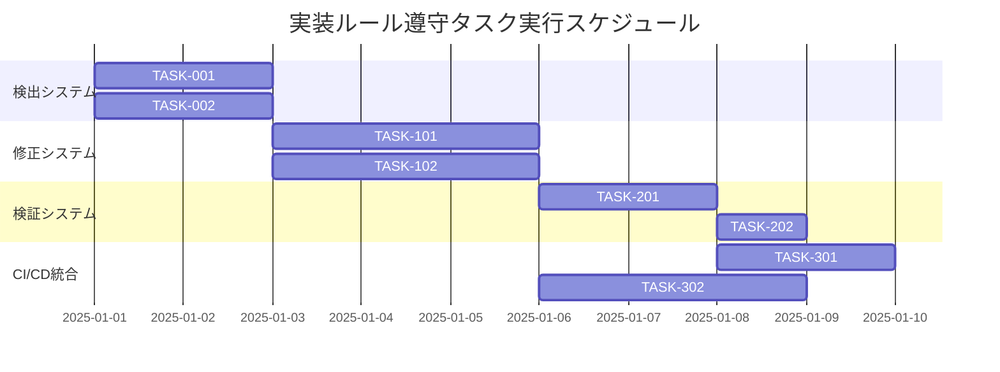

# 実装ルール遵守 実装タスク

## 概要

全タスク数: 8
推定作業時間: 16時間
クリティカルパス: TASK-001 → TASK-002 → TASK-101 → TASK-201

## タスク一覧

### フェーズ1: 違反検出・分析

#### TASK-001: 未定義カラー使用検出スクリプト作成

- [ ] **タスク完了**
- **タスクタイプ**: TDD
- **要件リンク**: REQ-003
- **依存タスク**: なし
- **実装詳細**:
  - tailwind.config.ts解析機能
  - TSXファイルのカラークラス抽出
  - 未定義カラー使用箇所の特定
- **テスト要件**:
  - [ ] 単体テスト: カラー定義解析
  - [ ] 単体テスト: 未定義カラー検出
  - [ ] 統合テスト: 実ファイルでの検証
- **完了条件**:
  - [ ] 127箇所の違反を正確に検出
  - [ ] false positiveが0件

#### TASK-002: colocation違反検出スクリプト作成

- [ ] **タスク完了**
- **タスクタイプ**: TDD  
- **要件リンク**: REQ-004
- **依存タスク**: なし
- **実装詳細**:
  - Next.js colocationルール定義
  - コンポーネント配置パターン検証
  - 違反ファイルの特定
- **テスト要件**:
  - [ ] 単体テスト: colocation検証ロジック
  - [ ] 統合テスト: 実コンポーネントでの検証
- **完了条件**:
  - [ ] UIコンポーネントの配置違反を検出
  - [ ] 適切な構造提案を生成

### フェーズ2: 自動修正機能

#### TASK-101: 未定義カラー自動修正

- [ ] **タスク完了**
- **タスクタイプ**: TDD
- **要件リンク**: REQ-005
- **依存タスク**: TASK-001
- **実装詳細**:
  - カラークラスマッピング作成
  - AST操作による自動置換
  - バックアップ機能
- **テスト要件**:
  - [ ] 単体テスト: カラーマッピング
  - [ ] 統合テスト: ファイル修正
  - [ ] リグレッションテスト: 修正後の動作
- **エラーハンドリング**:
  - [ ] 曖昧なマッピングの手動確認
  - [ ] 修正失敗時のロールバック
- **UI/UX要件**:
  - [ ] 進行状況表示
  - [ ] 修正内容のプレビュー

#### TASK-102: colocation自動修正

- [ ] **タスク完了**
- **タスクタイプ**: TDD
- **要件リンク**: REQ-005
- **依存タスク**: TASK-002
- **実装詳細**:
  - ファイル移動ロジック
  - import文の自動更新
  - テストファイルの連動移動
- **テスト要件**:
  - [ ] 単体テスト: ファイル移動ロジック
  - [ ] 統合テスト: import更新
  - [ ] E2Eテスト: アプリケーション動作確認
- **UI/UX要件**:
  - [ ] 移動計画のプレビュー
  - [ ] 影響範囲の表示

### フェーズ3: 検証システム構築

#### TASK-201: ESLintルール作成

- [ ] **タスク完了**
- **タスクタイプ**: TDD
- **要件リンク**: REQ-101, REQ-102
- **依存タスク**: TASK-001, TASK-002
- **実装詳細**:
  - カスタムESLintルール開発
  - tailwind.config.ts連携
  - IDE統合設定
- **テスト要件**:
  - [ ] ルール単体テスト
  - [ ] ESLint統合テスト
  - [ ] VS Code拡張機能テスト
- **UI/UX要件**:
  - [ ] IDE内リアルタイム警告
  - [ ] 具体的な修正提案表示

#### TASK-202: pre-commitフック設定

- [ ] **タスク完了**
- **タスクタイプ**: DIRECT
- **要件リンク**: REQ-104
- **依存タスク**: TASK-201
- **実装詳細**:
  - huskyとlint-staged設定
  - 実装ルール検証の組み込み
  - コミット拒否設定
- **テスト要件**:
  - [ ] フック動作テスト
  - [ ] 違反時のコミット拒否テスト
- **完了条件**:
  - [ ] 違反コードでコミットが拒否される
  - [ ] 正常コードでコミットが成功する

### フェーズ4: CI/CD統合

#### TASK-301: GitHub Actions設定

- [ ] **タスク完了**
- **タスクタイプ**: DIRECT
- **要件リンク**: REQ-103, REQ-202
- **依存タスク**: TASK-201
- **実装詳細**:
  - 実装ルール検証ワークフロー
  - PR時の自動チェック
  - 違反時のビルド失敗設定
- **テスト要件**:
  - [ ] ワークフロー動作テスト
  - [ ] PR時の自動実行テスト
- **完了条件**:
  - [ ] PRで違反時にビルドが失敗する
  - [ ] 検証結果がコメントで表示される

#### TASK-302: 既存コードベース修正

- [ ] **タスク完了**
- **タスクタイプ**: TDD
- **要件リンク**: REQ-001, REQ-002
- **依存タスク**: TASK-101, TASK-102
- **実装詳細**:
  - 127箇所の未定義カラー修正
  - colocation違反コンポーネントの移動
  - import文の更新
- **テスト要件**:
  - [ ] 修正後の機能テスト
  - [ ] ビジュアルリグレッションテスト
  - [ ] E2Eテスト全般
- **UI/UX要件**:
  - [ ] 修正前後での表示差異確認
  - [ ] モバイル表示確認
  - [ ] アクセシビリティ確認

## 実行順序

## 並行実行可能タスク

- **グループ1**: TASK-001, TASK-002 (検出システム)
- **グループ2**: TASK-101, TASK-102 (修正システム)  
- **グループ3**: TASK-201, TASK-301 (検証・CI/CD)

## マイルストーン

1. **M1**: 違反検出完了 (TASK-001, TASK-002)
2. **M2**: 自動修正完了 (TASK-101, TASK-102)
3. **M3**: 検証システム完了 (TASK-201, TASK-202)
4. **M4**: 全体統合完了 (TASK-301, TASK-302)

## リスク要因

- **高リスク**: 既存コード修正時の機能破壊
- **中リスク**: ESLintルール作成の複雑性
- **低リスク**: CI/CD統合時のパフォーマンス影響